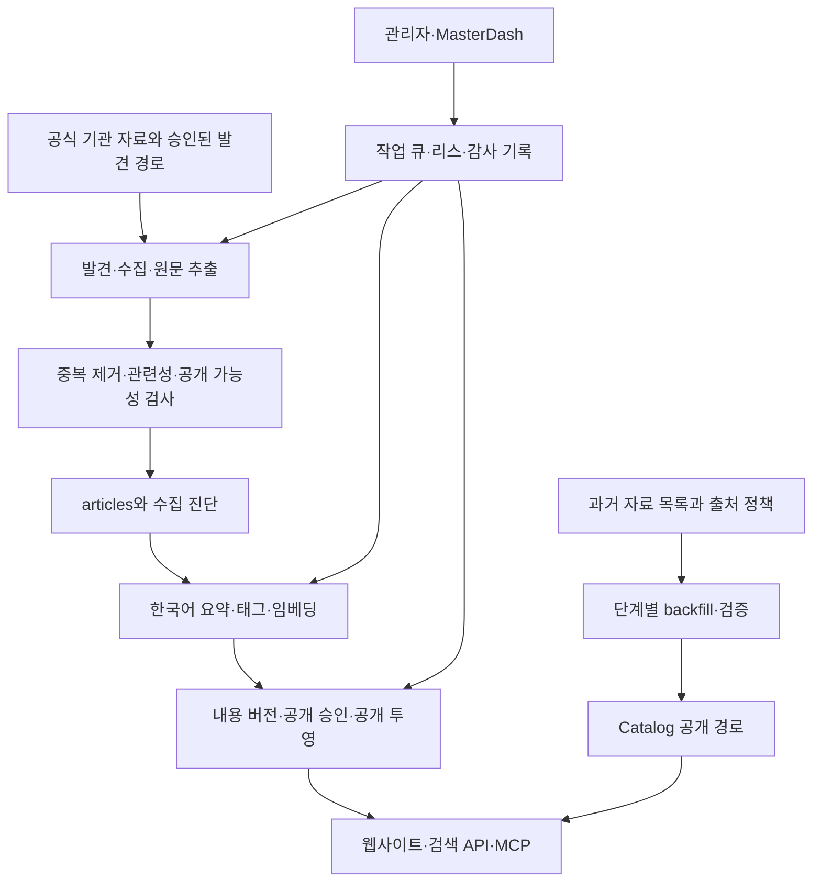

# WorldCons 프로젝트 상세 분석 보고서

분석일: 2026-09-05, Asia/Seoul. 운영·DB 관측은 이날 09:49~09:54 전후의 시점 자료다.

분석 기준 커밋: `f6fa71f9ef8e8c2860dcaa13696d4264d25f8263`. 분석 시작 시 Git 작업 트리는 깨끗했다. 애플리케이션 코드, DB 데이터, 배포 설정은 변경하지 않았다. 이 보고서와 로컬 검사 로그만 생성했다.

**1. 종합 판단**

WorldCons는 독일·미국·프랑스·스페인의 헌법재판 자료를 수집하고 한국어 요약·검색·공식 원문 조회를 제공하는 운영 중인 서비스다. Next.js 웹사이트에 수집기, AI 처리, 작업 큐, 공개 승인 원장, 외부 검색 API가 결합된 구조다.

현재 공개 서비스의 기본 동작은 양호하다. 공개 자료 1,258건이 확인되고 운영 health와 MCP health가 정상이며, 배포 커밋도 분석 대상과 일치했다. 타입 검사, 린트, 저장소 검사, 일반 테스트, 프로덕션 빌드가 통과했다.

다만 일상 수집·요약 서비스의 안정성과 과거 판례 전체 확보는 별개다. 새 Catalog 공개 건수는 0건이고, 독일 2024년 자료는 비공개 시험 수집·검증 단계다. 중요한 개선 과제는 긴 원문의 요약 범위, 장기 재시도 후보 정리, SQL 통합 검증 자동화, 기존·신규 처리 경로의 수렴이다.

**2. 규모와 기술 구성**

Git 추적 파일을 기준으로 집계했다. 줄 수는 빈 줄과 SQL·테스트를 포함한 물리적 줄 수이며 제품 코드만의 규모는 아니다.

| 항목 | 확인 결과 |
|---|---:|
| 전체 추적 파일 | 578개 |
| TypeScript·TSX·SQL 파일 | 492개 |
| 위 파일의 총 줄 수 | 88,118줄 |
| 페이지 파일 | 28개 |
| API Route Handler 파일 | 43개 |
| DB 마이그레이션 | 70개 |
| 테스트 파일 | 41개 |
| UI 컴포넌트 폴더의 추적 파일 | 51개 |
| 운영 스크립트 폴더의 추적 파일 | 40개 |
| GitHub Actions 워크플로 | 8개 |

| 계층 | 확인한 구성 |
|---|---|
| 웹 | Next.js App Router, React, TypeScript strict |
| UI | Tailwind CSS, 공통 카드·필터·목록·상세 컴포넌트 |
| 저장소 | Supabase PostgreSQL, 서버 측 service-role 접근 |
| 검색 | PostgreSQL 전문 검색·trigram·pgvector, 사건번호·법률 개념 정규화 |
| 수집 | Crawlee, Cheerio, Playwright, Readability, PDF 텍스트 추출 |
| AI | OpenAI·Anthropic·Gemini·OpenAI 호환 요약 공급자, Gemini 임베딩 |
| 실행 | Vercel 웹/API + GitHub Actions 및 CLI 작업자 |
| 외부 소비 | cclrag2, cclmetasearch, WorldLaws 포털, MCP |

로컬 설치 버전은 Next.js 15.5.18, React 19.2.6, TypeScript 5.9.3, Supabase JS 2.105.3, Crawlee 3.16.0, Playwright 1.59.1이다. 이는 조사한 설치 환경의 버전이며 각 패키지의 최신 버전이라는 의미는 아니다. `package.json`의 범위 선언과 실제 설치 버전을 구분해야 한다.

근거: [package.json](F:/dev/worldcons/package.json), [tsconfig.json](F:/dev/worldcons/tsconfig.json), [next.config.ts](F:/dev/worldcons/next.config.ts).

**3. 사용자 기능과 제품 범위**

홈페이지는 국가별 진입점, 국가별 최신 판례, 헌법 쟁점 태그와 검색창을 제공한다. 목록은 국가·기관·기간·유형·태그 등으로 좁힐 수 있다. 검색에는 혼합 검색, 정확히 찾기, 의미로 찾기가 있다.

상세 화면은 한국어 제목·요약, 사건 배경과 구조, 시사점, 실무 참고, 참조 조문과 태그, 공식 원문 링크, 보존 원문을 중심으로 구성된다. 인쇄 화면, 관련 자료, 목록 복귀 위치 복원도 구현돼 있다. 용어사전·기관 목록·태그 허브·RSS·사이트맵·검색엔진 메타데이터까지 갖췄다.

관리자 영역에는 자료 검토·요약 편집, 수집 후보, 작업 큐, 수집 실행 기록, 감사 기록, 운영 상태, AI 공급자 설정이 있다. 회원별 개인 서재나 협업 주석 같은 일반 사용자 계정 제품보다 운영자가 관리하는 공개 자료실에 가깝다.

근거: [홈페이지](F:/dev/worldcons/app/page.tsx), [검색 페이지](F:/dev/worldcons/app/search/page.tsx), [컴포넌트 폴더](F:/dev/worldcons/components), [관리자 영역](F:/dev/worldcons/app/admin).

**4. 전체 실행 구조**

웹/API와 배치 작업자가 같은 코드·DB를 공유하는 모듈형 단일 저장소다. 디렉터리는 기능별로 나뉘지만 독립 배포 서비스로 완전히 분리된 구조는 아니다. 중복 로직을 공유하기 좋고 공개 상태를 한곳에서 관리할 수 있으나, 수집 예외 처리와 DB 마이그레이션의 변화가 검색·관리자 화면에도 영향을 줄 수 있다.

특히 DB는 단순 저장소 이상의 역할을 한다. 공개 상태 전이, 작업 소유권, 재시도, 데이터 버전, 검색 순위와 접근 권한의 중요한 규칙이 SQL 함수·제약조건·뷰에 들어 있다. 이 프로젝트를 이해하거나 변경하려면 TypeScript와 마이그레이션을 함께 읽어야 한다.

**5. 수집·요약 파이프라인**

일상 수집의 기본 흐름은 URL 발견 → 공식 원문 취득 → 텍스트 정리 → 중복·관련성 판단 → 저장 → 요약 → 임베딩·태그 반영이다. 기관별 어댑터는 독일 BVerfG, 미국 SCOTUS, 프랑스 Conseil constitutionnel, 스페인 Tribunal Constitucional의 네 개다. 프랑스 QPC360 같은 보조 경로와 국가별 과거 자료 수집기는 별도 구현이 존재한다.

수집 품질을 지키는 장치는 다음과 같다.

- robots 정책, 요청 지연, 타임아웃, 재시도, 차단 감지와 회로 차단.
- canonical URL, 본문 해시, 사건번호 등을 활용한 중복 판단.
- 공식 본문 확인 실패·메타데이터만 존재·robots 차단·타임아웃을 별도 상태로 저장.
- 기본 본문 길이 기준 500자와 국가별 더 엄격한 정책을 통한 요약 자격 검사.
- seed 자료를 실제 원문 확보 성공으로 취급하지 않는 구분.
- 오래 멈춘 요약 상태 복구, 미수집 후보 추적, 요약·임베딩 후속 처리.

요약은 JSON 스키마 검증을 거치며 실패하면 한 번 보정 요청을 한다. 국가·기관 용어를 정규화하고 법률 참조의 신뢰도와 위험 플래그를 담을 수 있다. 저장된 AI 메타데이터에는 공급자·모델·생성 시점이 포함된다.

임베딩은 Gemini 전용이며 1,536차원을 고정한다. 공급자·모델·차원·입력 해시·생성 시점을 추적하고, 공개 버전에 필요한 임베딩 산출물 누락을 별도 health 지표로 확인한다. 요약 성공 후 임베딩 실패는 후속 보충 대상으로 넘길 수 있다.

근거: [수집 실행](F:/dev/worldcons/lib/ingest/run.ts), [수집 자격 검사](F:/dev/worldcons/lib/ingest/publishability.ts), [출처 어댑터](F:/dev/worldcons/lib/sources/index.ts), [요약](F:/dev/worldcons/lib/ai/summarize.ts), [임베딩](F:/dev/worldcons/lib/ai/embeddings.ts).

**6. 데이터 모델과 공개 통제**

| 영역 | 주요 데이터 | 의미 |
|---|---|---|
| 기본 자료 | articles, sources, tags, article_tags | 원문·요약·기관·분류 |
| 수집 운영 | ingestion_runs, source_url_candidates | 실행 결과와 미수집 후보 |
| 작업 제어 P0/P1 | admin_commands, runs, attempts, events | 중복 명령 방지, 재시도, 리스·소유권 검증 |
| 상태 관리 P2 | lifecycle 상태·이벤트·이상 기록 | 수집·처리·검토 상태 분리 |
| 공개 P3 | 내용 버전, publication, history, quarantine, outbox | 특정 버전의 공개 권한과 감사 추적 |
| 관리 P4/P5 | 운영 큐, 관측·검증 증거·보존 hold | 운영 화면과 기존 경로 종료 판단 |
| 과거 자료 | source policy, inventory, backfill item, fetch/normalization artifact | 출처 정책과 단계별 증거 |
| Catalog | case metadata, identifiers, publications, aliases | 요약 유무와 독립적인 판례 식별·공개·검색 |

P2는 수집·처리·검토·주의 상태를 나누고 revision을 검사한다. P3는 draft, in_review, published, withdrawn을 구분하며 내용 버전과 공개 이력을 별도로 남긴다. 공개 변경 후 캐시 갱신은 outbox와 리스를 통해 재시도할 수 있다. 이는 원문 또는 요약 변경이 곧바로 사용자에게 무분별하게 노출되는 일을 줄이는 설계다.

반면 기존 `articles` 경로와 P2/P3·Catalog 경로가 공존한다. 공개 조회는 중앙 함수가 기존 테이블과 P3 공개 투영을 선택한다. Catalog 공개는 P3 읽기 플래그를 전제로 하고, 검색·플러그인 플래그도 순서 의존성이 있다. 코드가 존재한다는 사실만으로 운영에서 켜졌다고 판단하면 안 된다.

로컬 `.env`에는 조사한 P2/P3·Catalog·신규 큐의 `*_ENABLED` 플래그가 없었다. 다른 환경 주입이 없다면 기본 경로가 선택된다. 운영 플래그의 실제 값은 이번에 직접 조회하지 않았으며, 공개 API·DB 자료와 로컬 실행의 차이를 구분했다.

근거: [작업 제어 타입](F:/dev/worldcons/lib/admin/command-control-plane/types.ts), [생명주기 타입](F:/dev/worldcons/lib/article-lifecycle/types.ts), [공개 타입](F:/dev/worldcons/lib/article-publication/types.ts), [공개 읽기 선택](F:/dev/worldcons/lib/article-publication/public-read-authority.ts), [Catalog 플래그](F:/dev/worldcons/lib/case-catalog/flags.ts).

**7. 검색 구조와 외부 연동**

기존 공개 검색은 사건번호 정확 일치, 전문 검색, 의미 검색과 두 순위의 결합을 제공한다. DB 순위·페이지 RPC를 우선 사용하고 일부 실패·특수 조건에서는 제한된 후보를 앱에서 재정렬한다. 혼합 검색은 Reciprocal Rank Fusion을 사용하며 정확한 제목 일치도 우선 처리한다. 법률 용어·국가·기관·사건번호 정규화가 별도로 들어 있다.

Catalog 검색은 `worldcons_case_search_page_v2`의 순위·커서 계약을 사용한다. 순위 기준 변경이나 검색 조건 불일치 시 기존 커서를 거부하고 처음부터 검색하도록 한다. 읽어온 ID와 실제 공개 자료의 수가 맞지 않으면 오류로 처리해 조용한 누락을 방지한다.

다만 기존 혼합 검색과 Catalog 혼합 검색이 동일한 내부 알고리즘은 아니다. `hybridSearch`는 Catalog 플래그가 켜지면 바로 Catalog 검색으로 분기하며, 이 함수에서는 임베딩을 만들지 않는다. 검색 모드 이름만으로 두 경로의 결과가 동일할 것이라고 가정해서는 안 된다.

| 연동 | 경계와 역할 |
|---|---|
| cclrag2 | `/api/cclrag2`, 계약 2.0, 공개 읽기 전용, 검색·상세·원문 페이지·출처 |
| cclmetasearch | 토큰 기반 검색, 최대 limit 20·offset 10,000, 별도 응답 계약 |
| WorldLaws 포털 | 최신 자료·국가별 최신 자료와 정규화된 카드 형식 |
| MasterDash | 운영 관리자 SSO, health, 수집 pause/resume 제어 |
| MCP | search, fetch, search_cases, list_sources, fetch_source_text의 5개 읽기 도구 |

cclrag2는 요청 ID, 응답 크기 제한, upstream timeout, 실제 검색 모드와 degraded 정보를 제공한다. DB 자격증명을 소비자에게 넘기지 않고 WorldCons 서버가 공개 자료만 반환한다. 관련 프로젝트 목록에 이름이 있다는 사실과 실제 런타임 연동은 구분해야 한다. 이번 조사에서 명확하게 확인한 외부 접점은 위 표이며, 다른 관련 저장소 내부는 분석하지 않았다.

근거: [검색 구현](F:/dev/worldcons/lib/search/vector.ts), [Catalog 검색](F:/dev/worldcons/lib/search/case-catalog.ts), [cclrag2 구현](F:/dev/worldcons/lib/integrations/cclrag2/provider-handler.ts), [연동 문서](F:/dev/worldcons/docs/integrations), [MCP 도구](F:/dev/worldcons/lib/chatgpt-plugin/server.ts).

**8. 실제 운영 데이터와 진행 상태**

연결된 Supabase에서 읽기 전용 조회를 수행했고, 공개 API의 총건수와 일치함을 확인했다.

| 공개 출처 | 건수 | 저장된 최신 원문 발행일 |
|---|---:|---|
| 미국 SCOTUS | 133 | 2026-08-31 |
| 독일 BVerfG | 320 | 2026-08-14 |
| 프랑스 Conseil constitutionnel | 382 | 2026-08-14 |
| 스페인 Tribunal Constitucional | 423 | 2026-07-21 |
| 합계 | 1,258 | — |

`articles`, P3 공개 투영, 통합 상세 투영은 각각 1,258건이다. 상태 집계에서도 위 네 출처의 summarized 합계가 1,258건이었다. 최신 발행일은 DB 값이며 공식 기관 사이트를 전수 대조한 최신성 증명은 아니다.

운영 health 관측 결과는 다음과 같다.

- MasterDash: HTTP 200, `healthy`, 배포 버전 `f6fa71f9ef8e`.
- MCP: HTTP 200, `ready`, database/search 모두 `ok`, 전체 커밋 일치.
- 요약 backlog 0, 임베딩 누락 0, 공개 임베딩 버전 1,258, 공개 버전 산출물 누락 0.
- 대기 관리자 작업 0, 미수집 후보 7, 모두 재시도 가능으로 집계.
- 수집 중단 상태 false, stalled workflows 없음.
- 마지막 성공 수집 시각 2026-09-04 12:20 KST 전후. 마지막 실행의 신규 추가 건수 0.

신규 추가 0건만으로 수집 실패라고 판단할 수 없다. 기존 자료 재확인이나 새 공식 자료 부재일 수 있으며, health의 정상 판정도 전체 판례 수집 완료를 뜻하지 않는다.

장기 후보 7건은 모두 독일 자료이며 5건은 `BVERFG_OFFICIAL_VARIANTS_404`, 2건은 `BVERFG_OFFICIAL_DETAIL_UNVERIFIED`였다. 시도 횟수는 5~37회이고 가장 오래된 open 후보 시각은 2026-07-10이다. 단순 재시도 외에 후보의 유효성을 재분류할 근거가 충분한 상태다.

과거 자료 확장 현황은 공개 1,258건과 별개다.

| 항목 | 관측 값 |
|---|---:|
| 승인 출처 정책 | 독일 정책 1개 |
| inventory snapshot | 2개: 기존 288건은 superseded, 교체본 287건은 closed |
| 전체 backfill item | 575개: 두 snapshot의 합계 |
| fetch artifact | 230개 |
| normalization artifact | 7개 |
| Catalog publication | 0개 |
| 미국 Conan candidate | 0개 |

독일 2024년 교체 snapshot의 287개 항목은 관측 시점에 verified 7, fetched 223, fetching 1, discovered 56이었다. 현재 fetch 산출물 연결은 230개, 정규화·검증 연결은 각각 7개, 공개 연결은 0개였다. 이 수치는 작업 진행에 따라 바뀔 수 있다. `closed`는 발견 목록이 봉인됐다는 의미이며 모든 후속 처리가 완료됐다는 의미가 아니다.

해당 inventory의 coverage는 `external_index_assisted`이고 expected_count가 없어 전체 공식 판례 대비 수집률을 계산할 수 없다. 230/287 같은 내부 처리 비율을 전체 판례 확보율로 표시하면 안 된다.

관측 출처: [운영 health](https://worldcons.vercel.app/api/masterdash/health), [MCP health](https://worldcons.vercel.app/api/mcp/health), [공개 목록](https://worldcons.vercel.app/api/articles?pageSize=1), 연결 Supabase의 읽기 전용 집계. 정책 맥락: [독일 출처 정책 검토](F:/dev/worldcons/docs/germany-bverfg-source-policy-review-20260904.md).

**9. 배포·운영·접근 통제**

Vercel 리전 설정은 `icn1`이다. 일상 수집은 매일 00:00 UTC, 임베딩 보충은 01:30 UTC, 요약 보충은 03:30·09:30·15:30·21:30 UTC에 실행되도록 작성돼 있다. 한국 시각으로 수집은 09:00, 임베딩은 10:30, 요약은 00:30·06:30·12:30·18:30이다.

관리자 작업자와 watchdog의 GitHub 일정은 15분 간격이다. 별도로 Vercel watchdog이 03:00·15:00 UTC에 실행되도록 설정돼 있다. 저장소 운영 문서는 GitHub 예약 실행을 best-effort로 취급하고 watchdog의 12시간 보조 주기에 근거해 30시간 stale 경계를 사용한다. 예약 설정과 실제 시작 시간을 동일시하지 않는 설계다.

접근 통제에는 production 관리자 SSO 진입, HMAC 서명 세션·CSRF, 서비스 자격증명의 서버 전용 사용, LLM 키 AES-256-GCM 암호화, rate limit, 감사 로그의 민감 정보 제거가 있다. 공통 헤더는 CSP·HSTS·nosniff·프레임 제한 등을 설정한다. 실제 운영 `/admin/login` GET은 404였다.

여기서 주의할 점은 장애 시 동작이다. 분산 rate-limit DB 호출이 실패하면 프로세스 로컬 제한으로 전환한다. 가용성은 유지하지만 여러 인스턴스를 합친 전역 제한과 같지 않다. 또한 CSP의 script-src에는 unsafe-inline과 https:가 포함돼 있어 nonce 기반의 엄격한 스크립트 허용 정책은 아니다. 이는 현재 설정의 범위 설명이며 악용 가능성을 검증한 보안 취약점 판정은 아니다.

근거: [Vercel 설정](F:/dev/worldcons/vercel.json), [워크플로](F:/dev/worldcons/.github/workflows), [인증](F:/dev/worldcons/lib/utils/auth.ts), [rate limit](F:/dev/worldcons/lib/security/rate-limit.ts), [LLM 설정 암호화](F:/dev/worldcons/lib/ai/llm-settings.ts).

**10. 직접 수행한 검증**

| 검사 | 결과 |
|---|---|
| pnpm typecheck | 통과 |
| pnpm lint | 통과 |
| pnpm check | All checks passed, 종료 코드 0 |
| tests의 전체 *.test.ts 실행 | 345개 중 통과 338, 실패 0, skip 7 |
| pnpm plugin:validate | 정상 |
| pnpm build | 종료 코드 0, 컴파일 및 정적 페이지 11/11 생성 성공 |
| 공개 목록 API | HTTP 200, 총 1,258건 |
| 일반 fulltext 검색 API | HTTP 200, 요청한 3건 반환 |
| cclrag2 fulltext 검색 API | HTTP 200, 요청한 3건 반환 |
| 운영·MCP health | 정상 |
| production 직접 관리자 로그인 화면 | HTTP 404 |

검색어는 “표현의 자유”였고 두 검색 API의 첫 제목도 같았다. `total=4, totalIsExact=false`였으므로 이를 검색 결과 전체가 정확히 4건이라고 해석하지 않았다. 단일 요청의 왕복 시간은 일반 검색 약 4.1초, provider 검색 약 1.7초였지만 네트워크·캐시·cold start를 분리하지 않은 1회 관측이므로 성능 비교나 SLO로 사용할 수 없다.

빌드 출력의 공통 First Load JS는 약 102 kB, 홈 약 107 kB, 검색 약 135 kB였다. 이는 빌드 도구의 표시이며 실제 브라우저의 LCP·INP·CLS 측정이 아니다.

skip된 7개는 P0, P1, P2, P3, P5, Backfill Gate1, Catalog Gate2 PostgreSQL 통합 테스트다. 전용 테스트 DB 환경변수가 없어서 실행되지 않았다. 이 테스트들은 실제 DB에 테스트 구조를 만들기 때문에 운영 DB로 대신 실행하지 않았다. 이번 결과를 DB 통합 검증까지 완료한 전체 release gate 통과로 표기하지 않는다.

브라우저 클릭 흐름, 로그인된 관리자 작업, 실제 AI 요약 생성, 대규모 부하, 공식 기관 대비 누락률은 이번 검증 범위에 포함하지 않았다.

로그: [전체 테스트](F:/dev/worldcons/.cache/project-analysis-tests-20260905.log), [프로덕션 빌드](F:/dev/worldcons/.cache/project-analysis-build-20260905.log).

**11. 개선이 필요한 지점과 우선순위**

| 우선순위 | 확인된 지점 | 영향과 권장 조치 |
|---|---|---|
| 높음 | 요약 입력이 원문 앞 40,000자로 절단됨 | 긴 판결의 후반 판단·별개의견이 모델 입력에서 제외될 수 있다. 입력 전체 길이·전달 길이·절단 여부를 기록하고 긴 문서의 구간별 요약 또는 분할 전략을 마련한다. |
| 높음 | 독일 후보가 최대 37회까지 재시도 상태 | 404와 원문 미검증을 나눠 공식 식별자 재확인·수동 검토·명시적 제외 판단으로 전환한다. |
| 높음 | SQL 통합 테스트가 환경변수 부재 시 skip됨 | DB 함수·ACL·리스가 핵심이므로 일회용 PostgreSQL/pgvector를 사용하는 자동 검증을 고정한다. skip를 릴리스 통과와 구분한다. |
| 높음 | 저장소 내 8개 workflow에 PR/push 검증 트리거가 없음 | 현재 강력한 로컬 검증 명령을 PR 필수 검사로 연결할 필요가 있다. 외부 branch protection·별도 CI 존재 여부는 미확인이다. |
| 중간 | 기존·P2/P3·Catalog 경로가 동시 존재 | 운영에서 사용하는 플래그 조합을 별도 테스트 행렬로 고정하고, parity·관측·보존 근거가 갖춰진 범위부터 기존 경로를 단계적으로 줄인다. |
| 중간 | 의미 검색 실패가 일반 검색으로 조용히 대체될 수 있음 | `/api/search`는 요청 mode를 반환하지만 내부 fallback 후 실제 모드를 별도로 표현하지 않는다. cclrag2의 requestedMode/effectiveMode/degraded 패턴을 웹에도 일관되게 적용한다. |
| 중간 | 일부 fallback 전문 검색 DB 오류가 빈 결과로 변환됨 | 장애와 진짜 0건 검색을 관측 지표·응답 상태에서 구분한다. 영향은 해당 fallback 경로에 한정되며 현재 운영 장애가 확인된 것은 아니다. |
| 중간 | 긴 핵심 모듈에 여러 책임 집중 | ingest/run.ts 2,073줄, provider-handler.ts 1,227줄, db/queries.ts 1,038줄이다. 국가별 수집 정책·저장·요약 전이·외부 계약 매핑을 경계별로 분리한다. |
| 중간 | 테스트 일부가 소스 문자열·정규식 존재 여부 검사 | 변경 방지에는 유효하지만 클릭·네트워크·SQL 실행을 증명하지 못한다. 핵심 사용자 흐름과 장애 시 응답을 실행 기반으로 보완한다. |
| 낮음 | README·progress 기록과 현재 구조에 시차 | README 도입은 3개국 중심이고 실제 어댑터는 4개국이다. 옛 운영 숫자와 현재 숫자가 섞이지 않도록 현황 문서의 기준일·커밋을 명시한다. |

40,000자 절단 근거: [prompts.ts:47](F:/dev/worldcons/lib/ai/prompts.ts:47). 스키마 검증은 출력 형식을 확인할 수 있지만 원문 전체가 읽혔는지나 법적 의미가 정확한지를 보증하지 않는다. 이번에는 실제 긴 문서의 요약 누락률을 측정하지 않았다.

검색 fallback 근거: [vector.ts](F:/dev/worldcons/lib/search/vector.ts), [검색 API](F:/dev/worldcons/app/api/search/route.ts), [queries.ts](F:/dev/worldcons/lib/db/queries.ts). 테스트 한계의 사례: [홈 회귀 테스트](F:/dev/worldcons/tests/homepage-regression.test.ts).

**12. 권장 실행 순서와 완료 기준**

1. **운영 현황을 재현 가능한 수치로 고정한다.** 국가별 공개 건수·공식 최신일·미수집 사유·단계별 backfill 수를 함께 보여준다. 단순 healthy와 수집 완전성을 분리하는 것이 완료 기준이다.
2. **독일 과거 자료 시험을 현재 승인 범위에서 마무리한다.** 교체 snapshot 287건의 fetch→normalize→verify→reconcile 증거를 정리한다. 공개·AI 전송은 별도 정책 경계이며 현재 fetching 1건을 실패로 가정하거나 작업자를 임의로 재시작하지 않는다.
3. **긴 문서 요약의 범위를 계측한다.** 절단 건수, 입력 비율, 후반부 쟁점 누락을 검토할 표본을 마련한다. 저장된 요약에 처리 범위와 원문 버전이 연결돼야 한다.
4. **PR 필수 검증을 구성한다.** 타입·린트·실행 테스트·실제 PostgreSQL 통합 검증·빌드가 재현되고 DB skip가 승인 없이 통과하지 않는 상태를 목표로 한다.
5. **검색 품질 평가 집합을 만든다.** 한국어 법률 개념, 원문 언어, 정확 사건번호, 국가별 쿼리와 페이지 이동을 고정하고 결과 적합성·지연·fallback 비율을 함께 비교한다.
6. **그 근거로 기존 경로를 줄인다.** 플래그를 일괄 켜거나 호환 코드를 즉시 삭제하지 않는다. 외부 응답 계약을 바꾸는 구현은 cclrag2·cclmetasearch·WorldLaws의 관련 작업과 조율한다.

이번 분석에서는 위 개선안을 구현하거나 운영 작업을 제출하지 않았다. 현재 서비스는 공개 열람과 검색을 계속 제공할 수 있는 상태이며, 다음 개발의 중심은 기능 추가보다 수집 범위 증명·요약 범위 투명성·검증 자동화에 두는 것이 타당하다.
