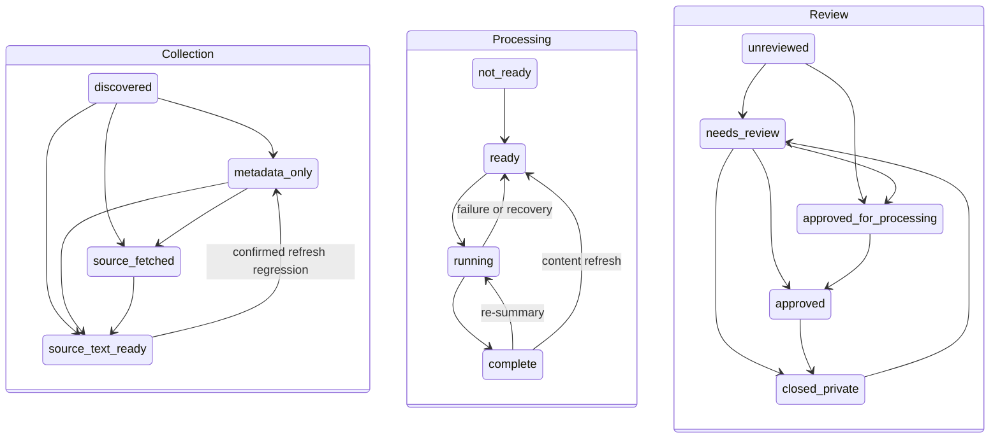

# Article Lifecycle P2 Runbook

Stage P2 adds orthogonal lifecycle evidence beside the legacy article model. It does not add publication state, change `articles.status`, change `source_metadata.collection.publishable`, change any public query, or authorize queue completion to publish. P2 reads and shadow writes are false by default.

## State Dictionary

| Axis | State | Meaning |
| --- | --- | --- |
| Collection | `discovered` | Identity/metadata was discovered; acquisition has not completed. |
| Collection | `metadata_only` | Metadata exists but usable source text does not. Current failure detail belongs on the attention axis. |
| Collection | `source_fetched` | A source response was acquired but text is not yet ready for summary processing. |
| Collection | `source_text_ready` | Verified usable source text is available. |
| Processing | `not_ready` | Summary processing cannot start. |
| Processing | `ready` | Summary processing may start or retry. |
| Processing | `running` | Summary generation or re-summary is active. |
| Processing | `complete` | A summary result exists. This is not publication. |
| Review | `unreviewed` | No review decision is represented. |
| Review | `needs_review` | Human attention is required. This survives unrelated error recovery. |
| Review | `approved_for_processing` | Human review approved summary processing. |
| Review | `approved` | Human review approved the legacy outcome. It is deliberately not named `published`. |
| Review | `closed_private` | Human review closed the item as private. |
| Attention | `clear` | No current structured lifecycle error. Historical clears remain in immutable events. |
| Attention | `active` | A current bounded structured error exists. |
| Attention | `anomaly` | Legacy evidence is contradictory or insufficient and must be reviewed, not guessed. |

Attention uses only a bounded code, retryability, `low`/`medium`/`high` severity, source axis, raised time, and cleared time. It never stores messages, raw source text, URLs, provider payloads, prompts, or secrets. Recovery supplies an allowlist of exact codes it resolves; a nonmatching active code remains unchanged.



## Legacy Mapping

| Legacy `articles.status` | Collection | Processing | Default attention |
| --- | --- | --- | --- |
| `discovered` | `discovered` | `not_ready` | clear |
| `metadata_only` | `metadata_only` | `not_ready` | `collection.metadata_only` |
| `robots_disallowed` | `metadata_only` | `not_ready` | `crawl.robots_disallowed` |
| `blocked` | `metadata_only` | `not_ready` | `crawl.blocked` |
| `timeout` | `metadata_only` | `not_ready` | `crawl.timeout` |
| `fetched` | `source_fetched` | `not_ready` | clear |
| `cleaned` | `source_text_ready` | `ready` | clear |
| `summarizing` | `source_text_ready` | `running` | clear unless structured legacy error exists |
| `summarized` | `source_text_ready` | `complete` | clear |
| `failed_fetch` | `metadata_only` | `not_ready` | `crawl.fetch_failed` |
| `failed_summary` | `source_text_ready` | `ready` | legacy `error_class`, else `summary.failed` |
| `needs_review` | explicit `collection.sourceTextAvailable` decides | `complete`, `ready`, or `not_ready` from summary/text evidence | review axis only unless structured legacy error exists |

`needs_review` without an explicit source-text signal is quarantined. Contradictory source-text signals, summarized rows without summary JSON, invalid error codes, and approval with nonpublishable metadata are also anomalies. Existing review decisions map as follows: `closed_private` to `closed_private`, `published`/`approved` to `approved`, `approved_for_summary` to `approved_for_processing`, and `needs_review`/`needs_triage`/`retry_later` to `needs_review`. Workflow labels such as `manual_summary_edit`, `manual_resummarized`, and `summarized` do not fabricate a human review decision.

## Transition Authority

All application mutations go through `articleLifecycleService` and `article_lifecycle_transition_p2`. The RPC locks the article, checks expected revision, checks `(article_id, idempotency_key)` replay, validates the transition matrix and cross-axis invariants, updates timestamps/revision, and appends an immutable event. A database trigger rejects direct writes to new columns.

| Actor | Owned transitions | Source examples |
| --- | --- | --- |
| Ingestion | Collection acquisition, content-refresh processing reset, collection error/recovery | `ingestion.insert`, `ingestion.refresh` |
| Candidate retry | Newly persisted exact-candidate collection result only | `candidate.insert` |
| Summary worker | `ready`/`running`/`complete`, summary failure and exact recovery | `summary.generate`, `summary.resummary`, `summary.recovery` |
| Admin | Review decisions and confirmed manual summary edits | `admin.review`, `admin.bulk_review`, `admin.summary_edit` |
| Backfill | Legacy mapping, anomaly quarantine, aggregate reconciliation | `backfill.reconcile` |
| Compatibility | Adapter identity only; it has no independent business authority | shadow adapter |

The shadow adapter first reads the current P2 revision, derives an idempotency key from article/revision/source/reason, and submits with that expected revision. A stale revision, absent migration, invalid mapping, or RPC failure is logged with bounded codes and cannot change the legacy HTTP or business result.

## Flags and Exact Evidence

| Variable | Default | Rule |
| --- | --- | --- |
| `ARTICLE_LIFECYCLE_P2_SHADOW_WRITE_ENABLED` | `false` | Only case-insensitive `true` enables shadow evaluation. |
| `ARTICLE_LIFECYCLE_P2_SHADOW_COHORTS` | empty | Required comma-separated subset of `collection,summary,review,candidate`; empty means no cohort writes. |
| `ARTICLE_LIFECYCLE_P2_READ_ENABLED` | `false` | Reserved for accepted post-Gate-3 reads. P2 application/public reads do not consult it. |

Shadow evidence is allowed only after these confirmed legacy outcomes:

| Path | Success predicate | No-op/skip predicate |
| --- | --- | --- |
| Insert/refresh | Article insert/update returned no database error and an article ID is known | dedupe/unchanged/skipped/nonconstitutional/no database |
| Candidate | Exact candidate produced a newly persisted article through the insert path | existing duplicate, already fetched, failed, unsafe, or not persisted |
| Summary start | Legacy article update returned no database error | ineligible/not found/no database/update error |
| Summary success/failure | Corresponding legacy article update returned no database error | thrown/aborted/update error; optional triage state mirrors only when its update confirms |
| Stale recovery | Bounded legacy update succeeded for concrete article IDs | no stale IDs or update error |
| Review/bulk/edit | Corresponding legacy article update succeeded; optional triage-derived review state requires triage success | validation skip, not found, no changes, partial bulk miss, or database error |

An already matching P2 target records an immutable no-op event (`applied=false`) and does not increment revision. Replaying the same key returns the event snapshot with `idempotent=true`.

## Backfill and Checkpoints

Do not apply migrations or run backfill from an application deploy. Apply `20260712170000_article_lifecycle_p2.sql`, then run `20260712171000_article_lifecycle_p2_indexes.sql` outside a transaction because it uses `CREATE INDEX CONCURRENTLY`. Reapply both in a production-shaped rehearsal before production approval.

Evidence only:

```bash
pnpm admin:lifecycle:p2
```

One bounded batch, starting from the beginning:

```bash
pnpm admin:lifecycle:p2 --backfill --limit=500
```

Continue from the exact aggregate `checkpoint.next_after_id`:

```bash
pnpm admin:lifecycle:p2 --backfill --limit=500 --after=<uuid>
```

Store only: invocation time, cohort, limit, `selected_count`, `mapped_count`, `anomaly_count`, `unchanged_count`, `next_after_id`, and `batch_complete`. Never export row payloads. Restarting at `null` is safe: matching states become no-ops, idempotent events replay, and changed legacy evidence reconciles at the current revision. Review unresolved anomaly aggregates by code/status; inspect individual rows only in the protected administrator/database workflow.

## Parity and Rollout

`article_lifecycle_evidence_p2()` returns aggregate counts and SHA-256 identity digests only. Acceptance requires:

- `uninitializedCount = 0` outside explicitly quarantined rows
- every anomaly explained and assigned; no guessed mappings
- `legacyPublicCount = compatibilityPublicCount`
- `legacyOnlyCount = 0` and `compatibilityOnlyCount = 0`
- identical legacy/compatibility identity digests
- no unexpected active-attention growth by code/severity/source
- shadow failure and stale-revision rates within the approved Gate 3 threshold

Roll out cohorts in order: backfill-only rehearsal, `collection`, `candidate`, `summary`, then `review`. Hold each cohort for the approved observation window and compare aggregate parity before adding the next. Keep reads off throughout P2.

The compatibility public set intentionally combines P2 collection/processing readiness with the unchanged legacy `collection.publishable = true` evidence. Processing completion alone is never public eligibility. The production public predicate remains exactly legacy `status = 'summarized'` plus `collection.publishable = true`.

## Rollback and Gate 3

Rollback is immediate and data-preserving:

1. Set `ARTICLE_LIFECYCLE_P2_SHADOW_WRITE_ENABLED=false` and leave cohorts empty.
2. Keep `ARTICLE_LIFECYCLE_P2_READ_ENABLED=false`.
3. Leave additive columns, events, anomalies, functions, and indexes in place.
4. Continue legacy ingestion, review, summaries, queues, and public reads unchanged.
5. Reconcile later from a recorded checkpoint; do not delete P2 evidence or reverse legacy content.

Gate 3 cannot begin until the migration/index rerun rehearsal, full backfill, anomaly disposition, identity parity, concurrency/replay tests, cohort observation, rollback rehearsal, actor ownership review, and security review all pass. Gate 3 must separately design publication/version/outbox authority. P2 completion, queue success, summary completion, or review approval must not be treated as that authority.
