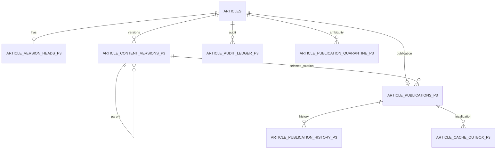
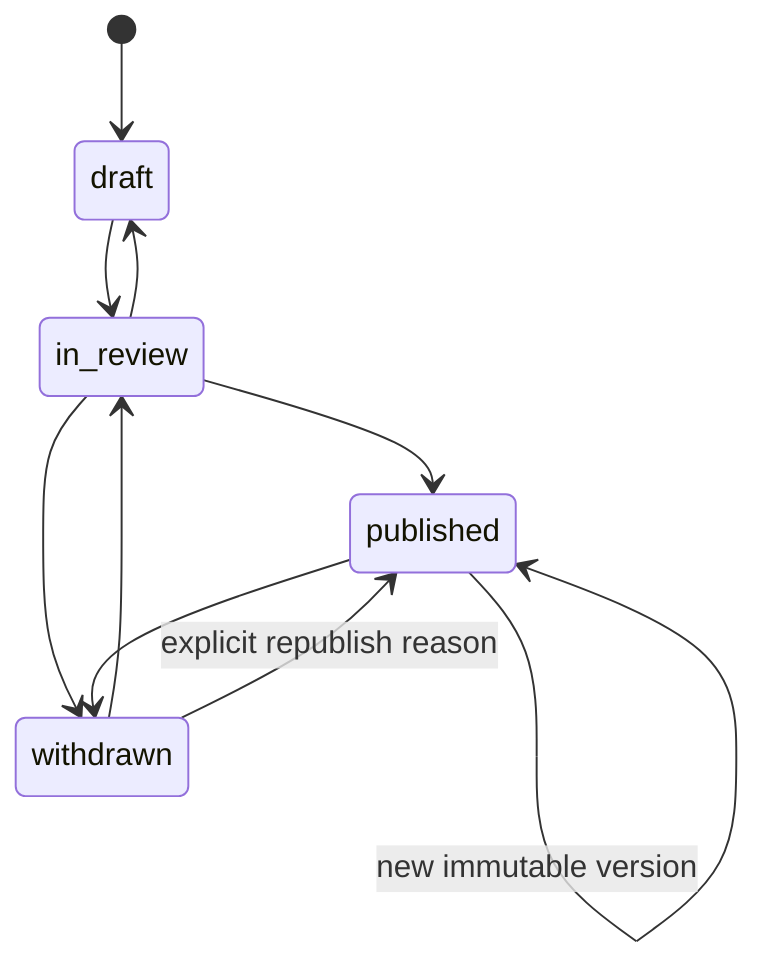

# Article Publication P3 Runbook

Stage P3 adds immutable article content versions, explicit publication authority, an append-only audit ledger, and a transactional cache outbox. It is additive. Legacy article fields, status, publication metadata, public reads, cache revalidation, and P0-P2 rollback paths remain present. All P3 flags default to false, and P3 must stay disabled until Gate 3 is accepted.

## Contract



`article_content_versions_p3` stores a deterministic version ID, monotonic per-article revision, parent version, canonical SHA-256 content hash, bounded human/LLM/import provenance, timestamps, and the public detail/list/search fields. The mutable `article_version_heads_p3` row names the latest captured version without changing old versions. Database triggers reject version, publication-history, request, quarantine, and audit-ledger updates or deletes.

The canonical hash covers the persisted user-visible article snapshot, not operational identity, revision, or timestamps generated by P3. `(article_id, content_hash)` and deterministic IDs make a repeated capture idempotent. Version metadata is allowlisted to public collection policy, resolution/case fields, Spain BOE display fields, and bounded error classification fields; review notes, diagnostic messages, and provider responses are excluded. Metadata with secret-like keys is rejected before capture. Audit records contain IDs, bounded reasons, actor/request/correlation fields, hashes, and small safe metadata only; they never contain source text, summaries, URLs, prompts, credentials, or provider payloads.

`public_article_projection_p3` exposes exactly the immutable version selected by a current `published` publication. It carries article tags in the same bounded query and exposes the stored search vector and embedding. `public_tag_projection_p3`, `public_jurisdiction_article_counts_p3`, and `match_public_article_versions_p3` use that same identity set. There is no application-side publication predicate when P3 reads are enabled.

## Publication State



Compatibility and backfill may create a directly published row only to reproduce a confirmed legacy public outcome. A human cannot use `draft -> published`; normal explicit publication passes through `in_review`. `withdrawn -> published` requires an explicit bounded reason. A published article may remain published while moving to a new immutable version, which creates a new publication revision, history event, ledger entry, and outbox event.

Publish eligibility is checked inside `article_publication_transition_p3` while the article, version head, and publication are locked:

- P2 collection is `source_text_ready`, processing is `complete`, review is `unreviewed` or `approved`, and attention is `clear`.
- Title, source, jurisdiction, institution, language, URLs, summary JSON, and at least 500 trimmed cleaned-text characters are present.
- Source policy says publishable, source text available, and source URL verified; robots disallow and seed strategy are absent.
- The selected immutable version belongs to the article and both expected revisions match.

Queue completion, lifecycle completion, summary completion, and an outbox worker cannot publish. Only the service-role publication RPC can change publication state. `system` is rejected as a publishing actor.

## Authority Matrix

| Action | Authority | Version provenance | Publication effect |
| --- | --- | --- | --- |
| Ingestion insert/official refresh | Confirmed legacy write, shadow adapter | `import` | Capture version; mirror only persisted legacy visibility |
| Summary/re-summary | Confirmed legacy write, shadow adapter | `llm`, bounded model reference | Capture version; mirror the exact legacy public/private outcome |
| Manual summary edit | Confirmed admin write, shadow adapter | `human` | Capture version; update published version only if legacy remained public |
| Review publish/close/bulk review | Confirmed admin write, shadow adapter | `human` | Publish, withdraw, or retain private state from persisted legacy outcome |
| Explicit P3 decision | `articlePublicationService` | Existing immutable version | Legal state transition only |
| Backfill | `article_publication_backfill_batch_p3` calling the same authority | `llm` or `import` from bounded evidence | Exact legacy outcome or quarantine |
| P0/P1 job completion | None | None | Never publishes |
| P2 lifecycle transition | None | None | Never publishes |
| Outbox delivery | Cache worker only | None | Never publishes |

Shadow adapters run only after a confirmed successful legacy write. False, unchanged, skipped, partial, and thrown outcomes do not shadow. A shadow error is returned as bounded evidence and never changes or throws over the legacy result.

## Flags

| Flag | Default | Effect | Rollback |
| --- | --- | --- | --- |
| `ADMIN_PUBLICATION_V4_SHADOW_WRITE_ENABLED` | `false` | Capture confirmed legacy mutations and visibility outcomes | Stop new P3 evidence; legacy behavior continues |
| `ADMIN_PUBLICATION_V4_READ_ENABLED` | `false` | Use P3 projection for home/list/detail/search/tags/sources/portal/RSS/sitemap | Restore every public read to the legacy predicate without data rollback |
| `ADMIN_PUBLICATION_V4_OUTBOX_PROCESSOR_ENABLED` | `false` | Claim and deliver cache outbox events | Stop claims; pending events remain durable |

Only case-insensitive `true` enables a flag. Admin and other `includeUnpublished` reads always use legacy `articles` during P3. Flag changes are server-side environment changes and require the existing public cache revalidation endpoint after the deployment changes direction.

## Migration Rehearsal

The migrations are additive and rerunnable:

1. `20260712200000_article_publication_p3.sql`: tables, constraints, immutable guards, authority, projection, search/count RPCs, outbox lease RPCs, RLS, and ACLs.
2. `20260712201000_article_publication_p3_indexes.sql`: indexes on new empty tables only. It does not scan or lock legacy article rows.
3. `20260712202000_article_publication_p3_reconciliation.sql`: bounded backfill and aggregate evidence functions. It does not run the backfill automatically.

Rehearse on a production-shaped copy before any target migration:

1. Capture the live legacy public count and identity digest in one repeatable-read snapshot. Gate 0 recorded 1,174 public rows, but live evidence at execution is authoritative.
2. Apply all three files twice. Confirm the second application changes no contract and that legacy columns, indexes, readers, and writers still exist.
3. Record migration duration, longest lock wait, table/index growth, and query plans for projection list/detail/search/count queries.
4. Run the P3 PostgreSQL suite against a disposable database whose name contains `p3`: `P3_TEST_DATABASE_URL=... pnpm test:p3`.
5. Verify direct DML rejection, RPC `SECURITY DEFINER`, fixed `search_path`, PUBLIC/anon/authenticated revocation, and service-role-only mutation execution.
6. Keep every flag false after schema application.

Do not apply these migrations from this repository task to production. Production application, deployment, and acceptance remain separate operator actions.

## Backfill

Run bounded batches and persist only the returned checkpoint outside the database:

```bash
pnpm admin:publication:p3 -- --backfill --limit=500
pnpm admin:publication:p3 -- --backfill --limit=500 --after=<next_after_id>
pnpm admin:publication:p3
```

Each checkpoint contains selected, mapped, quarantined, unchanged, next cursor, and completion values only. A restart repeats the last batch safely. Version IDs and hashes are deterministic, publication requests are idempotent, and existing contradictory P3 state is quarantined instead of overwritten.

Backfill creates a version and publication row for unambiguous articles. Missing lifecycle, active/anomalous attention, short/missing public content, invalid source policy, secret-like metadata, authority rejection, and existing-state conflicts are quarantined. It does not infer an ambiguous public outcome. Quarantine rows are append-only and contain article ID, a bounded code, and the legacy-public boolean only.

## Gate 3

`article_publication_evidence_p3()` returns aggregate counts and SHA-256 identity digests only. It never returns article payloads, source text, URLs, or metadata. Gate 3 requires:

- `articleCount = versionedArticleCount = publicationCount` except explicitly documented secret-metadata quarantine that cannot be snapshotted.
- `legacyPublicCount = projectionPublicCount`; the historical expectation is 1,174, while the live baseline is controlling.
- `legacyOnlyCount = 0`, `projectionOnlyCount = 0`, and legacy/projection identity digests are equal.
- Quarantine is zero, or every row has a separately approved adjudication and parity remains exact.
- A deterministic sample by article-ID hash matches slug, titles, summary hash, cleaned-text hash/length, tags, source policy, source snapshot behavior, search inclusion, RSS item, portal item, and sitemap identity. Store sample aggregates and hashes, not content.
- Home, list, detail, full-text, semantic/hybrid search, tags, sources, portal, RSS, sitemap, print, source-text, jurisdiction counts, and top-viewed queries all pass with the read flag both off and on.
- Projection query plans are bounded, indexed, and no slower than the accepted legacy baseline at p95.

Any unexplained count, identity, content-hash, tag, source-policy, or performance difference keeps `ADMIN_PUBLICATION_V4_READ_ENABLED=false`.

## Outbox

Every applied publication revision inserts one unique logical `publication.changed` event in the same transaction as publication history and audit. Claiming happens in a later transaction with `FOR UPDATE SKIP LOCKED`, a worker ID, random lease token, bounded lease, attempt count, exponential backoff, and maximum attempts. HTTP cache revalidation never occurs while the publication transaction or claim transaction is open.

`pnpm admin:publication:p3 -- --outbox --worker=<bounded-id> --limit=20 --lease-seconds=120` first runs the existing tag-count refresh once for the batch, then calls the existing authenticated public-content revalidation endpoint once, and finally marks each lease delivered. Repeated tag refresh and cache revalidation are idempotent. A crash after invalidation but before delivery intentionally produces at-least-once delivery; the logical event remains exactly once.

Operational targets:

- Pending-event oldest age under 5 minutes while enabled; alert at 5 minutes, page at 15 minutes.
- Processing lease age under the configured 120 seconds; stale leases are reclaimed automatically and recorded as `lease.expired`.
- Dead-letter count zero; alert immediately on any new dead letter.
- Delivery success at least 99.9% over 24 hours; alert when retry rate exceeds 1% for 15 minutes.
- Observe counts, ages, attempts, state, and bounded error code only. Never log payloads, cache URLs, response bodies, source URLs, content, or secrets.

P3 retains delivered and dead-letter rows indefinitely through P5 acceptance. No cleanup job is introduced in P3. Investigate dead letters, fix the handler/configuration, document the event IDs and aggregate impact, then use a separately reviewed forward-fix/requeue procedure. Never delete audit, history, versions, or outbox evidence to recover service.

## Rollout And Rollback

Rollout cohorts are operational environments, not hidden per-row predicates:

1. Schema-only rehearsal with all flags false.
2. Staging shadow writes, backfill, outbox processor, and both read directions.
3. Production shadow writes with read and processor flags false; observe compatibility failures by bounded code.
4. Complete backfill and Gate 3 parity on live evidence.
5. Enable the processor for a single bounded worker, then normal worker cadence after SLO acceptance.
6. Enable P3 reads in a canary deployment/environment, compare all public surfaces and caches, then promote only after approval.

Rollback order:

1. Set `ADMIN_PUBLICATION_V4_READ_ENABLED=false` and invoke existing public cache revalidation. Public surfaces immediately return to legacy reads.
2. If delivery is unhealthy, set `ADMIN_PUBLICATION_V4_OUTBOX_PROCESSOR_ENABLED=false`. Do not delete pending or leased records.
3. If shadow capture is unhealthy, set `ADMIN_PUBLICATION_V4_SHADOW_WRITE_ENABLED=false`. Legacy writes and publication behavior continue unchanged.
4. Preserve all P3 rows for diagnosis. Use additive forward fixes; do not reverse the migration by dropping data.

P3 acceptance does not authorize P4 UI work, P5 retirement, production migration, deployment, or removal of any legacy path.
