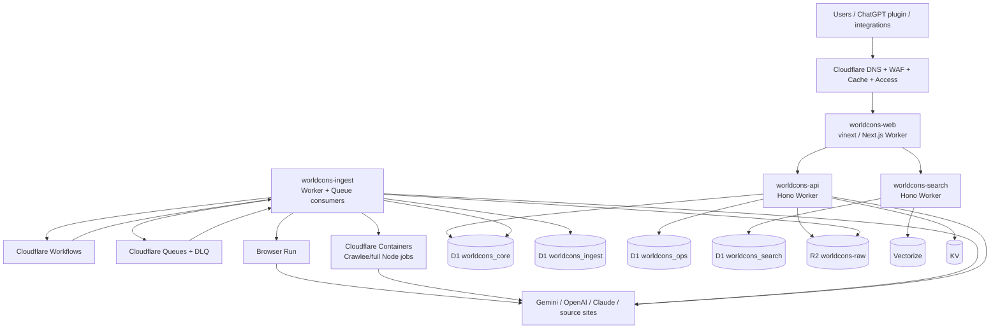

# WorldCons Full Cloudflare Migration Plan

Date: 2026-09-20
Status: Verified planning baseline; no production cutover authorized by this document
Owner direction: Evaluate and implement a full Cloudflare target for frontend, backend, database, object storage, search/vector, async jobs, crawler execution, security and observability.

## 1. Executive decision

The strategic target is **Track A: full Cloudflare consolidation**. The migration must be staged and reversible; it must not be implemented as a one-shot Vercel/Supabase replacement.

Target:

- Next.js UI/SSR/RSC: Cloudflare Workers using **vinext first**
- HTTP/API service layer: Workers; Hono for service-oriented APIs where it reduces coupling
- Relational metadata/state: multiple **D1** databases
- Object/raw storage: **R2**
- Full-text search: D1 **FTS5** projection
- Vector search: **Vectorize**
- Queueing: **Cloudflare Queues**
- Durable orchestration: **Workflows**
- Scheduling: **Cron Triggers / Workflow schedules**
- Browser-required crawling: **Browser Run** where compatible
- Existing Crawlee/Playwright/full-filesystem jobs: **Cloudflare Containers** if Browser Run rewrite is not economical
- Small configuration/cache data: **KV**
- Admin perimeter: **Cloudflare Access**
- Inter-service communication: Worker **Service Bindings**
- Observability: Workers Logs/Analytics, Queue/Workflow observability, structured operation events

**Track B: Postgres-retained hybrid** (external PostgreSQL + Hyperdrive) is a fallback only. It is selected only if D1 migration parity fails an explicit GO/NO-GO gate. It is not the default target because it leaves the database outside Cloudflare and therefore does not satisfy the owner’s consolidation objective.

The most urgent work remains storage risk. The current Vercel Blob store is suspended and existing Blob-only objects are not readable, while the Supabase database is approximately 534 MB. Therefore the migration starts with R2 and storage safety before runtime or D1 cutover.

## 2. Verification corrections to earlier proposals

Two earlier planning conclusions are superseded:

1. Current Cloudflare documentation recommends **vinext** as the default migration/deployment path for Next.js on Workers. OpenNext remains an alternate path for compatibility gaps and must not be assumed as the primary path.
2. Existing repository text that declared Cloudflare Workers/D1/R2 out of scope was an earlier architecture policy. The current owner instruction explicitly requests a full Cloudflare migration assessment and therefore supersedes that previous non-goal for this project.

The statement that Workers cannot run Next.js RSC/SSR is also obsolete. Current Cloudflare Next.js guidance supports SSR, RSC, Route Handlers and Server Actions through the supported Next.js-on-Workers path, subject to compatibility checks.

## 3. Current-state inventory

Repository evidence verified during planning:

- Next.js 15 App Router application
- 43 API route handlers under `app/api/**/route.ts`
- 15 admin pages
- 92 Supabase/PostgreSQL migrations
- 66 test files
- 87 application/script files contain Supabase `.from()` and/or `.rpc()` usage
- 29 files invoke `getSupabaseAdmin()`
- 36 files contain explicit `.rpc()` calls
- 62 migration files contain one or more PostgreSQL-specific constructs such as PL/pgSQL functions, `SECURITY DEFINER`, RLS/policies, `jsonb`, `tsvector`, pgvector, triggers or generated-column behavior

Important runtime-specific dependencies and code:

- `node:crypto` / Buffer-based hashing
- `node:fs`, `node:path`
- `node:dns/promises`, `node:net`, `node:tls`, `node:http`, `node:https`
- Crawlee
- Playwright
- jsdom
- pdf-parse
- got-scraping
- Next.js revalidation APIs

Current major DB domains include:

- public article/catalog: `articles`, `article_tags`, `tags`, `sources`, `case_identifiers_v1`, `case_metadata_v1`, catalog/publication tables
- article version/lifecycle: `article_content_versions_p3`, version/revision heads, lifecycle and publication tables
- search/vector: `article_embedding_artifacts`, PostgreSQL full-text/vector logic
- ingestion/backfill: `ingestion_runs`, `source_backfill_*`, inventory tables, source request governor/permits
- artifact/raw: `source_fetch_artifacts`, `source_normalization_artifacts`, externalization ledgers/permits, article raw ledgers/permits
- admin/ops: `admin_*`, `ops_workflow_heartbeats`, `llm_settings`, MasterDash tables
- analytics: `site_events`, `article_view_counts`
- glossary/legal concepts and US candidate review tables

Current critical storage state:

- Supabase database: about 534 MB
- `article_content_versions_p3`: about 227 MB total
- `articles`: about 141 MB total
- Vercel Blob store: suspended
- already externalized Vercel-only sample reads: failed while suspended
- France fetch artifacts currently include a substantial Blob-only population and a remaining inline population

No further broad inline clear is allowed until the replacement object store is verified.

## 4. Target architecture

### 4.1 Service boundaries



### 4.2 Why multiple Workers

Do not put all functionality into one Worker.

- `worldcons-web`: presentation, SSR/RSC, public/admin pages
- `worldcons-api`: authoritative application APIs and mutations
- `worldcons-search`: read-heavy FTS5 + Vectorize query path
- `worldcons-ingest`: scheduled/queue/workflow control plane
- crawler execution is Browser Run or Container-backed

Use Service Bindings instead of public HTTP for internal Worker-to-Worker calls.

This separates release risk, CPU limits and permissions, and prevents public search load from competing directly with ingest/admin writes.

## 5. D1 data architecture

### 5.1 worldcons_core

Authoritative public/legal metadata and publication state.

Candidate ownership:

- `articles` after raw payload extraction
- `sources`
- `tags`, `article_tags`
- `case_identifiers_v1`
- `case_metadata_v1`
- `article_revision_heads_v4`
- `article_version_heads_p3`
- publication/lifecycle metadata that must be transactionally coupled to article state
- `glossary_terms`
- `legal_concepts_v1`, aliases/alias sets
- source corpus policy metadata

Large raw/version bodies do not remain in D1. Version metadata remains in D1 and the body is addressed by R2 key/hash.

### 5.2 worldcons_ingest

High-write operational ingestion state:

- `ingestion_runs`
- `source_backfill_runs`
- `source_backfill_items`
- `source_backfill_item_events`
- inventory snapshots/supersessions/enumeration metadata
- request governor state/permits
- artifact externalization ledgers and permits
- article raw externalization ledgers/permits
- source URL candidates
- normalized crawl job state

This DB is intentionally separated from public traffic.

### 5.3 worldcons_ops

Administrative and operational state:

- `admin_commands`
- `admin_command_runs`
- `admin_command_attempts`
- `admin_command_events`
- `admin_jobs`, `admin_job_events`
- `admin_audit_logs`
- governance/compatibility/retention evidence
- `admin_ops_events`
- `ops_workflow_heartbeats`
- `llm_settings`
- MasterDash control/SSO state
- rate-limit state if it remains relational; hot rate limiting should prefer Cloudflare-native controls/Durable Object where appropriate

### 5.4 worldcons_search

Disposable/rebuildable search projection:

- denormalized `search_documents`
- exact case-number keys
- jurisdiction/source/language/content-type/date fields
- display title and short searchable text
- FTS5 virtual tables
- projection version and checksum

This DB is not source-of-truth. It is rebuilt from `worldcons_core` + R2 if necessary.

Use an outbox/event projection pipeline from core to search. Because D1 has no cross-database foreign keys or transactions, cross-DB consistency is achieved through:

1. stable IDs
2. idempotent event IDs
3. outbox rows in the owning DB
4. Queue delivery
5. projection checksum/version
6. repair/rebuild commands

### 5.5 D1 scaling assumptions

Use Workers Paid for production.

Current verified platform characteristics:

- maximum D1 DB size on Workers Paid: 10 GB per database
- Free: 500 MB per DB, 5 GB account storage
- each D1 database primary is inherently single-threaded
- D1 is designed for horizontal separation into multiple databases
- read replication is available through the Sessions API; writes still go to the primary
- `D1Database.batch()` provides transactional batch semantics
- Time Travel is always available; Paid retains 30 days

The DB split above is therefore an operational requirement, not merely organizational style.

## 6. PostgreSQL-to-D1 rewrite rules

This is an application migration, not SQL translation.

### 6.1 Type mapping

| PostgreSQL | D1/SQLite target |
| --- | --- |
| `uuid` | `TEXT`; generate UUID in application code |
| `timestamptz` | normalized UTC ISO-8601 `TEXT` unless a hot query justifies INTEGER epoch |
| `jsonb` | canonical JSON `TEXT`; queried paths promoted to generated/indexed columns |
| `boolean` | INTEGER 0/1 |
| enums | TEXT + CHECK |
| arrays | normalized join table or canonical JSON TEXT according to access pattern |
| `bigint` | INTEGER only when guaranteed JS-safe; otherwise decimal TEXT |
| `tsvector` | FTS5 projection |
| `extensions.vector(1536)` | Vectorize |
| generated columns | D1 generated columns where deterministic/compatible, otherwise app-maintained values |

### 6.2 PL/pgSQL/RPC

Do not mechanically reproduce database RPCs.

Classify each function into:

- pure read/query -> prepared D1 query in repository/service
- transactional mutation -> TypeScript service using D1 `batch()`
- lease/claim -> atomic conditional UPDATE + returned state
- audit append -> service method included in the same owner DB transaction
- cross-domain projection -> owning DB commit + outbox + Queue
- search ranking -> search Worker/FTS5/Vectorize

Maintain a migration ledger:

```text
postgres_function
current_call_sites
target_service_method
target_db
transaction_semantics
parity_tests
status
```

No RPC is retired until all call sites and parity tests are accounted for.

### 6.3 RLS and service role

The current application primarily uses server-side privileged access. D1 does not provide PostgreSQL RLS semantics.

Replacement:

- public read authorization at API/service layer
- Access identity for admin
- service-binding identity for internal calls
- explicit role/permission checks in Hono middleware/service methods
- no client-side direct D1 credentials

The Supabase service-role dependency disappears at final cutover.

### 6.4 Full-text and vector

Postgres `tsvector`, text search and `pg_trgm` ranking become:

- FTS5 BM25 or explicit ranking components in `worldcons_search`
- exact identifier/title/source/date boosts in application ranking
- Vectorize semantic candidates
- deterministic merge/re-rank layer

The current search result set becomes the parity oracle; scores need not be numerically identical, but required documents, filters, exact case-number behavior and ordering thresholds must pass a fixed regression corpus.

## 7. R2 storage architecture

### 7.1 Buckets

Start with one private Standard-class bucket:

`worldcons-raw`

Key layout:

```text
artifacts/fetch/{sourceKey}/{sha256}.json
artifacts/normalization/{sourceKey}/{sha256}.json
articles/raw/{sourceKey}/{sha256}.json
snapshots/{sourceKey}/{yyyy}/{mm}/{sha256}.{ext}
exports/{dataset}/{timestamp}/{part}
```

Keep keys content-addressed where possible.

### 7.2 Metadata integrity

Every object metadata row records:

- provider = r2
- object key
- SHA-256
- byte size
- content type
- contract version
- created/externalized timestamp
- verification timestamp/version

No signed URL, credential, token or provider secret goes into a DB ref.

### 7.3 Non-negotiable clear gate

Inline content may be cleared only after:

1. R2 PUT succeeded
2. R2 GET succeeded
3. byte size matches
4. SHA-256 matches
5. decoded document validates
6. metadata/ledger commit is complete
7. a restore rehearsal has succeeded for that storage class

No Vercel object deletion is authorized during the migration.

### 7.4 Suspended Vercel store

Existing Vercel-only objects are treated as temporarily stranded, not lost.

- do not rewrite their refs to claim R2 ownership
- when Vercel access resumes, copy object -> R2 -> verify size/hash/document -> record R2 provider -> only then remove Vercel dependency
- if Vercel remains inaccessible, retain DB metadata and recovery inventory permanently until another recovery path exists

New writes must move to R2 after canary verification.

### 7.5 Capacity

Current R2 Standard free allocation verified on 2026-09-20:

- 10 GB-month storage
- 1 million Class A operations/month
- 10 million Class B operations/month
- egress free

This is several orders of magnitude more suitable for the current corpus than the exhausted Vercel Blob Hobby operation budget.

## 8. Frontend migration: Vercel -> Workers

### 8.1 Primary path: vinext

Migrate non-destructively:

1. run `vinext check`
2. inventory every compatibility failure
3. initialize a Cloudflare Workers build alongside the existing Vercel build
4. keep `next dev` operational during the migration
5. deploy only to a non-production Workers hostname initially

Do not switch production DNS in this milestone.

### 8.2 OpenNext fallback

Use OpenNext only if:

- vinext has a confirmed blocking compatibility gap
- the gap cannot be fixed by a bounded Next.js upgrade/refactor
- OpenNext supports the exact required feature

OpenNext is not the default architecture.

### 8.3 Runtime blocker classification

- `node:crypto` / Buffer: test under `nodejs_compat`; likely retained
- `node:fs/path`: remove from request-time code; use R2/KV/D1 or isolate in Container
- low-level DNS/TCP/TLS diagnostics: move to Container or dedicated diagnostic service
- standard Playwright: migrate browser work to Browser Run or Container
- Crawlee: do not assume Workers compatibility; either rewrite the crawl adapter or retain Crawlee inside Container
- jsdom/pdf-parse: benchmark memory/CPU; move heavy extraction to Container if Workers limits are not comfortable
- Next cache/revalidation: replace platform-specific assumptions with Workers-compatible cache/invalidation strategy

## 9. Backend/API migration

Do not rewrite all 43 Next API routes simultaneously.

Three-stage path:

1. make repository/data interfaces platform-independent
2. move authoritative business logic out of Route Handlers
3. expose stable Hono services via Service Bindings, leaving thin Next route compatibility adapters until public/API parity passes

Priority API domains:

- public article/source/tag/search
- admin article/review/job/governance
- ingestion/backfill control
- cclmetasearch
- cclrag2
- MasterDash
- MCP/plugin endpoints

Keep external HTTP contracts stable unless a versioned change is explicitly approved.

## 10. Background processing

### 10.1 Queue responsibilities

Suggested queues:

- `worldcons-discover`
- `worldcons-fetch`
- `worldcons-normalize`
- `worldcons-index`
- `worldcons-embed`
- `worldcons-publish`
- dedicated DLQ(s)

Messages contain IDs/object refs, never large payloads. Current queue message limit is 128 KB; R2 holds payload bodies.

### 10.2 Workflows

Use Workflows for:

- country/year backfill orchestration
- long retry/backoff sequences
- checkpointed migration/copy jobs
- publication pipelines with several durable phases
- Vercel->R2 recovery copy when Vercel becomes readable

Individual Workflow steps have unlimited wall-clock duration but bounded CPU; heavy CPU extraction goes to Container.

### 10.3 Cron

Cron expressions use UTC. Existing KST 06:00 jobs become 21:00 UTC on the previous calendar day where appropriate.

Cron should trigger orchestration, not perform the entire crawl inline.

### 10.4 Crawling decision

| Workload | Target |
| --- | --- |
| ordinary HTTP fetch + parsing | Worker |
| browser navigation that can use Cloudflare Playwright | Browser Run |
| existing Crawlee job needing filesystem/full Node/browser bundle | Container |
| CPU/memory-heavy PDF/DOM processing | Container unless benchmarks prove Worker-safe |
| orchestration/retry/checkpoint | Workflow |
| fan-out/fan-in items | Queue |

Cloudflare Browser Run currently supports Playwright and Cloudflare Containers are GA, so a fully Cloudflare-hosted crawler stack is technically viable.

## 11. Search and AI

### 11.1 Search projection

Build `worldcons_search` as a denormalized, rebuildable projection.

FTS5 columns should include:

- title
- case number/identifier normalized text
- summary/search text
- court/source labels
- tags/legal concepts text

Normal indexed columns:

- article ID
- jurisdiction
- source key
- language
- content type
- original publication date
- publication/review state

### 11.2 Vectorize

Current embedding width is 1536 and fits the current Vectorize maximum of 1536 dimensions. Current Vectorize supports up to 20 million vectors per index.

Vector IDs use stable article/version identifiers, not transient row numbers.

Store provenance:

- model/provider
- dimensions
- source content hash
- generated_at
- embedding version

Do not silently reuse an embedding after source content hash changes.

### 11.3 Ranking parity

Prepare a frozen search corpus including:

- exact case numbers
- country filters
- date ranges
- judicial complaint/recurso/amparo terms
- multilingual legal terms
- known gerrymandering and constitutional-law examples
- current cclrag2/cclmetasearch integration queries

Pass criteria are defined before changing search authority.

## 12. Security

- Cloudflare Access protects admin surface and private operational Workers
- public site remains public
- internal Workers use Service Bindings rather than public bearer endpoints where possible
- Hono middleware performs application authorization; D1 is never exposed directly to clients
- R2 bucket remains private
- secret values remain Wrangler secrets, never vars committed to source
- remove Supabase service-role usage only after final cutover
- rotate the previously exposed Supabase service-role key and DB password before/at migration shutdown; update all remaining deployments
- keep CSP/reporting and current security regression tests
- move rate limiting to Cloudflare-native controls for public endpoints where behavior matches existing semantics
- retain audit events in `worldcons_ops`

## 13. Observability and disaster recovery

Required:

- structured Worker logs with request/correlation IDs
- queue backlog/retry/DLQ metrics
- Workflow instance status and failed-step alerts
- R2 object verification reports
- D1 query/error/row-read/write monitoring
- MasterDash health adapters for each Cloudflare service
- deployment version/rollback metadata

Recovery:

- D1 Time Travel for operational rollback
- periodic `wrangler d1 export` snapshots to R2 for portable backup
- R2 inventory + checksums
- search DB rebuild procedure
- Vectorize rebuild procedure
- restore rehearsal before retiring Supabase

## 14. Track B hybrid fallback

Fallback architecture:

- Workers/vinext frontend/API
- R2 storage
- Queues/Workflows/Browser Run/Containers
- existing PostgreSQL-compatible database reached through Hyperdrive

Choose Track B only if one or more of these objective gates fails:

1. critical publication/admin RPC cannot be reproduced in D1 with correct atomicity without unacceptable complexity
2. D1 performance test at 2x expected peak load fails after indexing/query optimization/database split
3. search parity cannot reach the agreed regression threshold with FTS5 + Vectorize
4. a hard D1 SQL/size/row limitation blocks required canonical data
5. migration downtime estimate exceeds owner-approved maximum and cannot be reduced with staged sync

Track B is a risk-control option, not the preferred end state.

## 15. Milestones

### M0 — Architecture baseline and policy supersession

Objective:
- freeze current production schema/storage counts
- establish this document as the current migration baseline
- inventory all RPCs/Postgres-specific constructs and route/runtime blockers

Production mutation: none.

Acceptance:
- inventory reproducible
- all existing uncommitted changes classified
- no corpus mutation

Rollback: none required.

### M1 — R2 foundation and emergency storage exit

Objective:
- implement R2 transport behind the existing storage contract
- create private R2 bucket
- canary new object writes/reads
- do not clear inline data yet

Acceptance:
- PUT/GET/HEAD
- size/hash/document verification
- auth/network errors fail closed
- no Vercel/Supabase provider regression
- restore rehearsal passes

Rollback:
- switch primary provider back; R2 objects remain harmless.

### M2 — R2 new-write authority

Objective:
- make R2 authoritative for new fetch/normalization/article raw externalization
- migrate only inline data that can be verified on R2

Transition detail:
- Operator/backfill CLIs may use an explicit Wrangler-OAuth R2 transport during M2,
  so bounded migration batches do not require long-lived S3 credentials.
- Vercel/runtime write flags remain unchanged until the runtime moves to a supported
  R2 credential path or, preferably, a Workers `R2Bucket` binding during M3.
- Operator mode must never be silently selected by application runtime code.
- On the current Windows/DevSpace operator host, Wrangler-backed externalization is
  capped at 5 rows per invocation. A caller timeout is not permission to start a
  replacement run; process/ledger state must be checked first.

Progress (2026-09-20):
- France `fr-conseil-constitutionnel` fetch inline-only migration is complete:
  1,417/1,417 rows externalized, including 132 verified R2 dual copies and the
  existing 1,285 legacy Blob-only rows; inline-only=0, metadata errors=0, ledger
  coverage=1,417/1,417. Inline clearing remains intentionally unexecuted.
- France normalization inline-only migration is complete: 1,417/1,417 rows are
  externalized, including 1,373 R2 dual copies and 44 existing legacy Blob-only
  rows; inline-only=0, metadata errors=0, ledger coverage=1,417/1,417.
- Operator externalization now supports explicit bounded concurrency and a
  cross-process source partition lock. The stable supervisor shape on the current
  Windows/DevSpace host is 40 rows at concurrency 8.
- Article raw R2 migration has started with a France articles canary. New R2 rows
  verify cleanly, while aggregate inline-clear readiness intentionally remains
  blocked by older dual-copy rows whose objects are in the suspended legacy store.
- France articles article-raw migration is complete: 382/382 rows are externalized,
  dual-copy=382, inline-only=0, metadata errors=0, ledger coverage=382/382. Inline
  raw_text remains present on every row.
- France article_content_versions_p3 migration is complete: 808/808 rows are
  externalized, dual-copy=808, inline-only=0, metadata errors=0, ledger
  coverage=808/808. Combined France article raw is 1,190/1,190 externalized with
  no inline raw_text deletion.
- Germany de-bverfg article raw migration is complete: articles 328/328 and
  article_content_versions_p3 827/827 are externalized, combined 1,155/1,155,
  inline-only=0, metadata errors=0, and ledger coverage is complete. Inline raw_text
  remains preserved.
- Spain es-tribunal-constitucional article raw migration is complete: articles
  424/424 and article_content_versions_p3 1,340/1,340 are externalized, combined
  1,764/1,764, inline-only=0, metadata errors=0, and ledger coverage is complete.
  Inline raw_text remains preserved.
- United States us-scotus article raw migration is complete: articles 134/134 and
  article_content_versions_p3 281/281 are externalized, combined 415/415,
  inline-only=0, metadata errors=0, and ledger coverage is complete.
- Current-corpus M2 operator/backfill externalization is complete: artifact
  fetch+normalization 3,543/3,543 and article raw 4,524/4,524 are externalized with
  inline-only=0 and complete ledgers. This does not migrate the 2,038 historical
  artifact objects that remain legacy-Blob-only; legacy-provider recovery remains a
  later gate. Application-runtime R2 write authority is deferred to the M3 Workers
  R2Bucket binding path rather than adding long-lived S3 credentials to Vercel.

Acceptance:
- repeated bounded batches clean
- global readiness no metadata/hash errors
- no object deletion

Rollback:
- stop new externalization; existing inline retained where not yet safely cleared.

### M3 — Cloudflare runtime compatibility spike

Objective:
- run `vinext check`
- build/deploy non-production Worker
- enumerate Node compatibility blockers

Acceptance:
- public representative pages render
- representative API routes work
- no production DNS
- performance/error baseline recorded

NO-GO:
- unresolved vinext blocker -> test bounded Next upgrade; then OpenNext fallback.

Progress (2026-09-21, M3.1 local-runtime checkpoint):
- completed a bounded upgrade to Next.js 16.3.5 with React/React DOM/RSC pinned to
  the compatible 19.2.6 line;
- added vinext 1.0.0-beta.10, Vite 8.3.0, Cloudflare Vite plugin 1.56.0, and
  Wrangler 4.135.0 while preserving the existing Next/Vercel build path;
- final `vinext check` is 100% compatible with 0 issues;
- actual vinext build exposed Playwright/Crawlee/browser ingest as the first
  Node-only blocker; the web build now treats that package set as an explicit
  external boundary pending M3.2 Container isolation;
- `vinext build` and the existing `next build` both pass;
- a custom vinext Worker entry injects the private `WORLDCONS_RAW` R2Bucket binding
  into the shared storage runtime without long-lived S3 credentials;
- local workerd R2 put/get/head proof passed through the actual binding path, and
  the temporary proof endpoint was removed before the final build;
- representative public pages, APIs, article detail/print/source-text, and MCP
  health returned HTTP 200 in local workerd smoke testing;
- typecheck, lint, project checks, 31 storage/R2 tests, and 15 public regression
  tests pass;
- no production DNS, production authority, corpus deletion, or remote deployment
  changed during M3.1.

M3.2 / remote-canary completion (2026-09-21):
- admin ingest/job execution is now behind an explicit runtime seam; Cloudflare
  Workers fail closed before loading Node-only executors, and inline Crawlee is
  blocked as defense in depth;
- `lib/ai/gemini-router.ts` no longer imports Node filesystem/path modules;
  runtime JSON state is selected behind a platform-neutral store;
- the Next/Turbopack dynamic-filesystem whole-project tracing warnings were
  removed while preserving Node/Vercel relative-path semantics;
- focused M3.2 tests pass 9/9, and typecheck/check/lint/vinext and both build paths
  pass;
- remote non-production Worker `worldcons-m3-spike` deployed successfully with no
  Worker secrets and no production DNS or authority change;
- representative pages, public APIs, search, article detail/print/source-text and
  MCP health all returned HTTP 200 in the final remote smoke;
- the canary exposed an incorrect hard-coded `deployment: "vercel"` health field;
  commit `495d4ad` fixed it and the final Worker reports
  `deployment: "cloudflare-workers"`;
- detailed canary evidence is recorded in
  `docs/worldcons-cloudflare-m3-remote-canary-20260921.md`.

M3 GO gate: **complete**. Proceed to M4 repository/data abstraction while
Supabase remains production authority.

### M4 — Repository/data abstraction

Objective:
- eliminate direct Supabase coupling from business logic
- introduce platform-neutral repository interfaces
- map every RPC to a service operation

Acceptance:
- current Supabase implementation still passes existing tests
- D1 implementation can be added behind contract

Production authority remains Supabase.

### M5 — D1 schemas and migration converter

Objective:
- create four D1 databases
- implement Postgres export -> canonical transform -> D1 import
- no production authority switch

Acceptance:
- row counts
- canonical per-table hashes
- FK/invariant checks
- JSON/date/UUID conversion tests
- representative RPC parity

Progress (2026-09-21, M5.1 / M5.1b / M5.1c / M5.2a / M5.2b / M5.2c PART 1 / M5.2c PART 2a / M5.2c PART 2b / M5.2d):
- four D1 schemas and the Postgres -> canonical transform foundation exist as local-only,
  hand-authored D1 schema code plus a read-only Supabase-migration scanner and a
  schema/ownership/parity validator (`pnpm d1:schema`, `pnpm test:d1-schema`);
- M5.1 covered `articles`, `sources`, `tags`, `article_tags`, `glossary_terms` plus the
  ingest/ops/search foundation tables; M5.1b completed `worldcons_core` (30 covered tables);
- M5.1c completed `worldcons_ingest` and `worldcons_ops`: all four D1 databases are now fully
  modeled (77 tables, 0 `planned`), so the M5.1 D1 schema foundation is complete;
- M5.2a delivered the first two converter stages (Postgres export -> canonical transform) as a
  local, read-only seam: the `PostgresRowSource` export contract with an in-memory source and an
  operator-only read-only `pg` source, the deterministic bounded Postgres projection, and the
  canonical transform that reduces every migrated table to canonical scalar rows plus the
  per-table/per-database hashes across all 75 migratable tables (`pnpm d1:convert`,
  `pnpm test:d1-convert`);
- M5.2b delivered the D1 import stage locally: a deterministic parameterized import emitter that
  respects the D1 100-bound-parameter limit, a literal `wrangler d1 execute` script renderer, a
  transactional local `node:sqlite` apply, and an import round-trip verification that re-derives the
  M5.1 per-table/database hashes and compares them to the canonical transform (`pnpm d1:import`,
  `pnpm test:d1-import`);
- M5.2c PART 1 delivered the operator-only remote D1 bootstrap: a dry-run-by-default Wrangler seam
  that creates only the missing `worldcons_*` databases with an explicit `--apply`, refuses an
  ambiguous name, aborts the remaining creates after a failure, and re-lists plus runs `d1 info`
  to prove each create (`pnpm d1:provision`, `pnpm test:d1-provision`);
- remote D1 creation is **complete**: `pnpm d1:provision --apply --report --json` created all four
  `worldcons_*` databases in `apac` and verified each via `d1 info`; a subsequent read-only dry-run
  reports 4 existing / 0 missing / action `none`. The four UUIDs (`worldcons_core`
  `0f4c41f0-778f-4ef4-860e-b0dad05f0984`, `worldcons_ingest`
  `0ccd27ff-fd16-4071-bc94-616690708c4e`, `worldcons_ops`
  `6ecdf64b-d95a-49b2-8fc4-bdd50581a3e4`, `worldcons_search`
  `1d74ebba-918b-4f8c-9c5c-9013479df809`) are now recorded in `wrangler.jsonc`;
- M5.2c PART 2a delivered the operator-only remote D1 schema apply: a dry-run-by-default,
  fail-closed seam that applies the M5.1 DDL to the four existing `worldcons_*` databases only with an
  explicit `--apply` and verifies every expected table and index through `sqlite_master`
  (`pnpm d1:apply-schema`, `pnpm test:d1-apply-schema`). The read-only `sqlite_master` object query now
  runs BEFORE any write in both dry-run and apply mode, so an already-present schema is a true no-op
  (`state:"existing"`, `action:"none"`, `verified:true`, no DDL materialized, no `--file` call) and a
  re-apply is idempotent;
- the first real `--apply` wrote the `worldcons_core` DDL (the `--file` write succeeded; a later
  `d1 info` reports `num_tables:30`) but the operator reported a false failure because it parsed the
  `wrangler d1 execute --file` stdout as a `--json` envelope and aborted before the other three targets.
  The `--file` write is no longer parsed (accepted purely by exit status) and the read-only
  `sqlite_master` verification is the sole success criterion; `parseD1ExecuteResultsJson` is unchanged
  for the read-only `--command` path;
- remote D1 schema apply is **complete**: with the fix deployed, the second live `--apply` applied the
  remaining `worldcons_ingest`/`worldcons_ops`/`worldcons_search` DDL and all four remote schemas are
  now applied and verified (`worldcons_core` 78/78 objects, `worldcons_ingest` 43/43, `worldcons_ops`
  32/32, `worldcons_search` 2/2). A read-only dry-run now reports every target `state:"existing"`,
  `action:"none"`, `verified:true`. `worldcons_search` reports `num_tables:7` in `d1 info` because D1
  counts the FTS5 internal/shadow tables while the authored expected table objects remain 2/2; no data
  has been imported into any database. The bounded Postgres -> Cloudflare D1 *data* copy (M5.2c PART 2b)
  and shadow reads (M6) remain M5.2c+/M6 work;
- M5.2c PART 2b (2026-09-22) delivered the operator-only bounded Postgres -> remote-D1 **data** copy: a
  dry-run-by-default seam that runs only with an explicit `--apply` and reads its source solely via
  `--url`/`WORLDCONS_D1_SOURCE_URL`, emits plain `INSERT` statements only, fails closed on
  exact/prefix/mismatch chunk cases, uses deterministic chunking, and verifies each chunk's row
  count plus the final canonical hash; the core/ingest/ops scopes are covered with search deferred
  (`pnpm d1:copy-data`, `pnpm test:d1-copy-data`, 18/18 focused tests);
- PART 2b live canary is verified: the `supabase-linked` read path compared production `sources` (4 rows) against empty D1, then copied those 4 rows in one chunk; source/remote canonical hashes matched, and an immediate read-only rerun reported `existing` / `action:none` with zero writes. The broader data copy remains pending and Supabase remains the authority.
- M5.2d (2026-09-25) delivered the operator-only bounded remote D1 **reconciliation** seam for the residual mutable drift the INSERT-only copy path refuses (`pnpm d1:reconcile`,
  `pnpm test:d1-reconcile`, 29/29): dry-run by default, `--apply` requires an explicit
  `--database=` selection, plain INSERTs for source-only rows and full-row parameterized
  UPDATEs by exact primary key (PK columns excluded from SET), fail-closed refusal whenever a
  remote-only primary key exists (never a DELETE), and a post-apply source+remote re-read that
  must match on row count and canonical full-table hash. A final direct dry-run snapshot of all
  nine mutable-drift tables reported `exact` / `none` / `verified:true` with source == remote
  counts and hashes, `remoteOnly === 0` and zero planned writes; `glossary_candidates` was
  reconciled with 50 updates and the remaining eight tables with 21 inserts + 51 updates.
  M5.2d is complete; see `docs/worldcons-cloudflare-m5.2d-reconcile-completion-20260925.md`.
  Supabase remains the sole read authority and no cutover occurred.
- the bounded D1 **reference-read shadow** (M6.0 + M6.1) is now implemented but **default off**;
  see `docs/worldcons-cloudflare-m6.1-reference-read-shadow-20260925.md`. M6.0 is a planning/
  transition entry only, not a cutover. Search projection + Vectorize remain M7 and untouched.
- M6.2 (2026-09-25) expanded the same default-off shadow to every remaining reference method
  (`listTags`, `getTagBySlug`, `listIngestionRuns`, `listJurisdictionArticleCounts`) with a
  per-method `worldcons_core`/`worldcons_ingest` binding, projection-mode skips for the
  unmigrated `public_tag_projection_p3`, bounded/truncated reads and runtime-safe projection,
  `eq`/`gte` and ordered reads; see
  `docs/worldcons-cloudflare-m6.2-reference-read-shadow-20260925.md`. M6.2 does **not** claim
  `GO-D1-READ`; Supabase remains the sole read authority and no cutover occurred.
- M6.3 (2026-09-25) extended the same default-off shadow to the six-method `lib/article-reads`
  seam (`listArticles`, `listPublicSitemapArticles`, `listTopViewedArticles`,
  `listRelatedArticleIds`, `getArticleBySelect`, `getArticleSourceTextBySlug`) on the new
  `article_read` surface over `worldcons_core`. Every public caller still receives the exact
  authoritative Supabase result unchanged. Projection (`public_article_projection_p3`) and
  case-catalog V4 (`public_article_detail_v4`) public reads and every `filters.q` search path
  skip with zero D1 calls; unsupported/unbounded/ambiguous shapes and `maxRows` overflows skip
  rather than approximate. Bounded multi-read composition reuses the shared article row mapping
  and publishability semantics; the runtime read runner gained bounded `neq`/`in` predicates. No
  `GO-D1-READ` is claimed; M7 search/FTS5/Vectorize remains deferred. See
  `docs/worldcons-cloudflare-m6.3-article-read-shadow-20260925.md`.
- M6.4 (2026-09-25) extended the same default-off shadow to the two privileged
  admin seams: `AdminOpsReadRepository` (`loadArticleRows`, `loadCandidateRows`,
  `countTableRows`, `listAdminArticles`) and `AdminAnalyticsReadRepository`
  (`loadAdminAuditActionOptionRows`, `loadAdminAuditEntryRows`, `loadSiteEvents`,
  `loadIngestionRunRows`, `loadArticleSummaryRows`), on the new opt-in
  `admin_ops_read` / `admin_analytics_read` surfaces with exact per-method
  `worldcons_core`/`worldcons_ingest`/`worldcons_ops` bindings (never
  substituted). `isConfigured` stays synchronous authoritative behavior and the
  no-config mock/fail-closed adapters stay unwrapped. Both admin RPC snapshots
  (`rpc_admin_dashboard_snapshot`, `rpc_admin_analytics_health_snapshot`) have no
  migrated D1 equivalent and emit `rpc_deferred` with zero D1 calls; every admin
  `q`/full-text path is `search_deferred_m7`; bounded `maxRows` overflow and
  ambiguous/unsupported shapes skip rather than approximate. No `GO-D1-READ` is
  claimed, the RPC snapshots remain deferred to a later migration/cutover design,
  and M7 search/FTS5/Vectorize remains deferred. See
  `docs/worldcons-cloudflare-m6.4-admin-read-shadow-20260925.md`.
- no Worker deploy, DNS change, or Supabase authority switch occurred.

### M6 — D1 shadow-read parity

Objective:
- shadow public/admin reads against D1
- compare result sets and invariants

Acceptance:
- agreed parity threshold
- no user-visible dependency on D1 yet

Rollback:
- disable shadows.

### M7 — Search projection + Vectorize

Objective:
- build D1 FTS5 search projection
- migrate/recompute vectors into Vectorize

Acceptance:
- frozen search regression suite passes
- exact case-number/filter behavior preserved
- latency/row-read budget acceptable

### M8 — Async pipeline migration

Objective:
- replace GitHub/Vercel scheduled operational paths with Cron + Queues + Workflows
- migrate browser jobs to Browser Run or Containers

Acceptance:
- retry/idempotency/DLQ tests
- source request governor parity
- restart/recovery tests
- no duplicate publication

### M9 — API/Hono service extraction

Objective:
- move stable business APIs to `worldcons-api`/`worldcons-search`
- use Service Bindings
- preserve public contracts

Acceptance:
- API contract suite and plugin/cclrag2/cclmetasearch/MasterDash parity.

### M10 — D1 write canary

Objective:
- select a low-risk mutation domain
- make D1 authoritative for a bounded canary while Supabase receives comparison/shadow evidence as feasible

Acceptance:
- transactional invariants
- audit parity
- read-after-write behavior
- rollback tested

### M11 — D1 write authority

Objective:
- transition write domains one by one: ops -> ingest -> core/publication

Each domain requires a GO gate and rollback checkpoint.

Supabase remains retained and immutable enough for rollback during the window.

### M12 — Cloudflare production frontend/API cutover

Objective:
- switch production traffic from Vercel to Workers

Procedure:
- pre-cutover health
- reduce DNS TTL ahead of time if applicable
- deploy same release to staging and production Worker
- switch custom domain
- monitor error, latency, D1, queue and R2 metrics

Rollback:
- restore Vercel route/DNS and prior write authority while rollback window remains open.

### M13 — Supabase/Vercel retirement

Allowed only after:

- D1 has been sole write authority for the approved soak window
- R2 corpus verification is complete
- search/Vectorize parity stable
- all stranded Vercel objects have been recovered or explicitly inventoried as unresolved
- final Supabase export exists
- credential rotation complete
- disaster-recovery rehearsal passes

No deletion is automatic.

## 16. Zero-downtime data cutover

Preferred sequence:

1. initial full export while Supabase is live
2. transform/import to D1
3. shadow-read comparison
4. capture ordered deltas using existing audit/events/updated timestamps plus a migration ledger
5. domain-by-domain write authority transition
6. short final write freeze only if required for the last strongly-coupled publication state
7. final delta import
8. invariant/hash verification
9. switch authority flag
10. retain Supabase for rollback soak

Do not implement unrestricted dual-write without an idempotency and reconciliation design; naive dual-write creates two competing sources of truth.

## 17. GO/NO-GO gates

GO-R2:
- canary write/read/hash/restore all clean

GO-WEB:
- vinext compatibility/build and representative runtime tests pass

GO-D1-SCHEMA:
- all critical Postgres constructs have explicit replacements

GO-D1-READ:
- data and API read parity pass

GO-SEARCH:
- FTS5 + Vectorize regression threshold passes

GO-ASYNC:
- retry/idempotency/DLQ/recovery tests pass

GO-D1-WRITE:
- transaction/audit/write-read invariants pass in canary

GO-CUTOVER:
- all above plus rollback rehearsal and observability readiness

Any failed gate keeps the current authority unchanged. Persistent D1 failure triggers Track B evaluation rather than forcing migration.

## 18. Principal risks

| Risk | Severity | Mitigation |
| --- | --- | --- |
| Vercel Blob remains suspended | critical | R2 for new writes; preserve stranded-object inventory; no deletion |
| Supabase DB already above intended free capacity | critical | R2-first payload removal; bounded verified clears only |
| PL/pgSQL/RPC semantics lost in D1 rewrite | high | function ledger, service rewrite, transaction parity tests |
| D1 single-primary write contention | high | 4-DB split, short indexed queries, isolate ingest/search/ops |
| cross-D1 atomicity unavailable | high | ownership boundaries + outbox/Queue eventual projection |
| Next/Node dependency incompatible with Workers | high | vinext spike; nodejs_compat; isolate full Node in Container; OpenNext fallback |
| crawler behavior differs after Browser Run migration | high | per-source contract tests; Container option |
| search relevance regression | high | frozen corpus and score/order acceptance thresholds |
| stale D1 replica read after write | medium | Sessions API/bookmarks where read replication is used |
| credential exposure | critical | rotate Supabase credentials; Wrangler secrets; least privilege |
| premature Supabase/Vercel shutdown | critical | explicit M13 retirement gates |

## 19. Cost/plan stance

Production should be designed on **Workers Paid**, not Free.

Verified 2026-09-20 facts:

- Workers Paid minimum: USD 5/month
- 10M dynamic Worker requests/month included
- 30M CPU ms/month included
- Workers CPU can be configured up to 5 minutes/invocation
- Queue consumers/Cron wall time: 15 minutes
- R2 Standard free allocation as listed above
- D1 Paid includes first 25B rows read/month and 50M rows written/month; first 5 GB storage included

Actual monthly cost must be recalculated from observed production traffic before M12. Containers and Browser Run can add workload-dependent cost.

## 20. Exact first implementation milestone after approval

Start **M1 only: R2 foundation**, not D1 or frontend cutover.

File-level scope:

- extend/replace current in-progress provider abstraction with first-class R2 support
- add R2-specific transport tests
- retain current `storageRef` contract
- add private bucket binding/config
- add readiness/canary procedure
- update storage runbooks
- do not delete or clear any current corpus data during implementation

Verification:

```bash
pnpm typecheck
pnpm check
pnpm test:artifact-blob
pnpm test:article-raw-blob
pnpm test:article-raw-externalize
pnpm test:article-raw-inline-clear
pnpm test:article-raw-readiness
pnpm test:article-raw-restore
```

Then run a tiny production R2 canary that preserves inline content, verify GET/hash/size, perform a restore rehearsal, and only after that authorize bounded externalization.

Do not begin M3/M5 in parallel until the current storage emergency has a safe R2 path.

## 21. External verification anchors

Reviewed against current official Cloudflare documentation on 2026-09-20:

- Next.js / vinext: https://developers.cloudflare.com/workers/framework-guides/web-apps/nextjs/
- OpenNext alternative: https://developers.cloudflare.com/workers/framework-guides/web-apps/opennext/
- D1 limits: https://developers.cloudflare.com/d1/platform/limits/
- D1 pricing: https://developers.cloudflare.com/d1/platform/pricing/
- D1 import/export: https://developers.cloudflare.com/d1/best-practices/import-export-data/
- D1 SQL/FTS5: https://developers.cloudflare.com/d1/sql-api/sql-statements/
- D1 generated columns: https://developers.cloudflare.com/d1/reference/generated-columns/
- D1 read replication: https://developers.cloudflare.com/d1/best-practices/read-replication/
- D1 Time Travel: https://developers.cloudflare.com/d1/reference/time-travel/
- R2 pricing: https://developers.cloudflare.com/r2/pricing/
- Workers limits/pricing: https://developers.cloudflare.com/workers/platform/limits/
- Queues limits: https://developers.cloudflare.com/queues/platform/limits/
- Queue DLQ: https://developers.cloudflare.com/queues/configuration/dead-letter-queues/
- Workflows limits/retries: https://developers.cloudflare.com/workflows/
- Vectorize limits: https://developers.cloudflare.com/vectorize/platform/limits/
- Browser Run: https://developers.cloudflare.com/browser-run/
- Containers: https://developers.cloudflare.com/containers/
- Cloudflare Access for Workers: https://developers.cloudflare.com/workers/configuration/cloudflare-access/

## 22. Migration checklist

- [ ] M0 inventory frozen
- [ ] prior no-Cloudflare architecture note formally superseded
- [ ] R2 private bucket created
- [ ] R2 transport unit tests
- [ ] R2 production canary
- [ ] R2 restore rehearsal
- [ ] new writes switched to R2
- [ ] inline clear only after per-object verification
- [ ] vinext compatibility report
- [ ] Worker staging deployment
- [x] Supabase coupling/RPC ledger (M4.6: `pnpm rpc:ledger`, 80 functions / 74 call sites, 0 unbounded dynamic families)
- [x] four D1 schemas
- [x] four remote D1 databases created (M5.2c PART 1: `pnpm d1:provision --apply --report --json` created `worldcons_core`/`worldcons_ingest`/`worldcons_ops`/`worldcons_search` in `apac`, all `verified:true`; post-run dry-run reports 4 existing / 0 missing / action `none`; UUIDs recorded in `wrangler.jsonc`; databases were empty at creation — schemas/data were not yet applied at creation)
- [x] remote D1 schema applied (M5.2c PART 2a: `pnpm d1:apply-schema` is dry-run by default and writes only with `--apply`; the read-only `sqlite_master` object query runs BEFORE any write in both modes, so an already-present schema is a true no-op. The first real `--apply` applied `worldcons_core` (30 tables) but a `--file` stdout-parsing bug caused a false failure; with the fix deployed the second `--apply` applied the remaining `worldcons_ingest`/`worldcons_ops`/`worldcons_search` DDL. All four remote schemas are now applied and verified, a read-only dry-run reports all four `action:"none"` / `verified:true`, and no data had been imported at PART 2a completion; PART 2b later copied only the `worldcons_core.sources` canary)
- [ ] Postgres -> canonical -> D1 converter (M5.2a: Postgres export + canonical transform with per-table/database hashes, `pnpm d1:convert`; M5.2b: D1 import emitter + local apply + round-trip hash verification, `pnpm d1:import`; M5.2c PART 1: operator-only remote D1 bootstrap, dry-run Wrangler create + verify, `pnpm d1:provision`, remote creation now complete; M5.2c PART 2a: operator-only remote D1 schema apply, dry-run by default with `--apply` to write and a read-only `sqlite_master` object query that runs before any write, `pnpm d1:apply-schema`, all four remote schemas now applied and verified (the `--file` stdout parser bug fixed); M5.2c PART 2b: operator-only bounded Postgres -> remote-D1 *data* copy, dry-run by default with `--apply` to write, source only via `--url`/`WORLDCONS_D1_SOURCE_URL`, plain `INSERT` statements only, exact/prefix/mismatch fail-closed, deterministic chunks, per-chunk count + final canonical hash verification, core/ingest/ops scope with search deferred, `pnpm d1:copy-data` with 18/18 focused tests — PART 2b operator implemented; `supabase-linked` read path verified; `worldcons_core.sources` 4-row canary copied and reverified exact; broader live copy still pending)
- [ ] data count/hash/FK invariants (M5.2d: the bounded `d1:reconcile` operator reconciled the nine mutable-drift tables — `glossary_candidates` 50 updates, the remaining eight tables 21 inserts + 51 updates — and a final direct dry-run snapshot reported all nine `exact`/`none`/`verified:true`, source == remote counts/hashes, `remoteOnly === 0`, zero planned writes; no authority switch: Supabase remains the read authority. See `docs/worldcons-cloudflare-m5.2d-reconcile-completion-20260925.md`)
- [ ] D1 shadow reads (M6.0 + M6.1 reference-read shadow implemented, default OFF: runtime D1 binding injection, `waitUntil` background scheduler, default-off shadow flags, bounded runtime-safe D1 read runner, a D1 `ReferenceReadRepository` for `listSources`/`listGlossaryTerms`/`getGlossaryTerm` only, canonical comparison with `orderMatches`, structured `worldcons.d1_shadow` events and per-isolate backpressure; the authoritative Supabase result is always returned and D1 can never replace it. See `docs/worldcons-cloudflare-m6.1-reference-read-shadow-20260925.md`. M6.2 expands the same default-OFF shadow to `listTags`/`getTagBySlug`/`listIngestionRuns`/`listJurisdictionArticleCounts` with per-method core/ingest binding, projection-mode skips, runtime-safe projection + `eq`/`gte` + ordered reads and truncation-as-skip; does not claim GO-D1-READ. See `docs/worldcons-cloudflare-m6.2-reference-read-shadow-20260925.md`. M6.3 extends the same default-OFF shadow to the six-method `lib/article-reads` seam on the `article_read` surface, with projection/V4/search zero-D1 skips, bounded `neq`/`in` runtime reads, shared article mapping/publishability reuse, truncation/ambiguity-as-skip, and unchanged authoritative Supabase results; does not claim GO-D1-READ and leaves M7 search/FTS5/Vectorize deferred. See `docs/worldcons-cloudflare-m6.3-article-read-shadow-20260925.md`. M6.4 extends the same default-OFF shadow to the privileged `AdminOpsReadRepository` (`loadArticleRows`/`loadCandidateRows`/`countTableRows`/`listAdminArticles`) and `AdminAnalyticsReadRepository` (`loadAdminAuditActionOptionRows`/`loadAdminAuditEntryRows`/`loadSiteEvents`/`loadIngestionRunRows`/`loadArticleSummaryRows`) on the opt-in `admin_ops_read`/`admin_analytics_read` surfaces with exact per-method core/ingest/ops bindings; both admin RPC snapshots emit `rpc_deferred` with zero D1 calls and every admin `q` path is `search_deferred_m7`; no mixed database substitution, no GO-D1-READ, RPC snapshots deferred to later migration/cutover design, M7 search/FTS5/Vectorize deferred. See `docs/worldcons-cloudflare-m6.4-admin-read-shadow-20260925.md`)
- [ ] FTS5 parity
- [ ] Vectorize parity
- [ ] Queues/DLQ/Workflows migration
- [ ] Browser Run/Container crawler parity
- [ ] Hono service binding migration
- [ ] D1 bounded write canary
- [ ] domain-by-domain D1 authority
- [ ] Workers production cutover
- [ ] Supabase final export
- [ ] stranded Vercel object recovery/inventory
- [ ] credential rotation
- [ ] DR rehearsal
- [ ] explicit retirement approval
