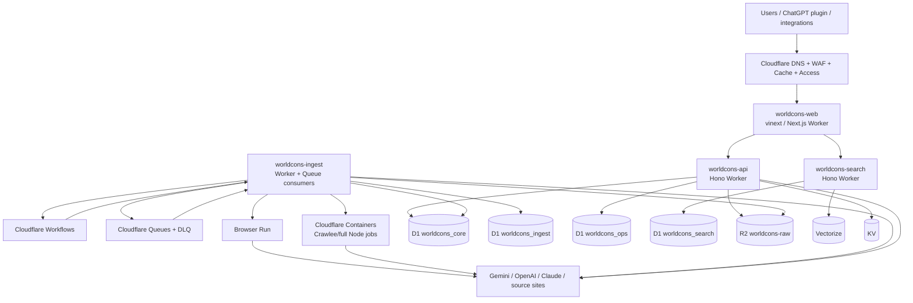

# WorldCons Full Cloudflare Migration Plan

Date: 2026-09-20
Status: Verified planning baseline; no production cutover authorized by this document
Owner direction: Evaluate and implement a full Cloudflare target for frontend, backend, database, object storage, search/vector, async jobs, crawler execution, security and observability.

## 1. Executive decision

The strategic target is **Track A: full Cloudflare consolidation**. The migration must be staged and reversible; it must not be implemented as a one-shot Vercel/Supabase replacement.

Target:

- Next.js UI/SSR/RSC: Cloudflare Workers using **vinext first**
- HTTP/API service layer: Workers; Hono for service-oriented APIs where it reduces coupling
- Relational metadata/state: multiple **D1** databases
- Object/raw storage: **R2**
- Full-text search: D1 **FTS5** projection
- Vector search: **Vectorize**
- Queueing: **Cloudflare Queues**
- Durable orchestration: **Workflows**
- Scheduling: **Cron Triggers / Workflow schedules**
- Browser-required crawling: **Browser Run** where compatible
- Existing Crawlee/Playwright/full-filesystem jobs: **Cloudflare Containers** if Browser Run rewrite is not economical
- Small configuration/cache data: **KV**
- Admin perimeter: **Cloudflare Access**
- Inter-service communication: Worker **Service Bindings**
- Observability: Workers Logs/Analytics, Queue/Workflow observability, structured operation events

**Track B: Postgres-retained hybrid** (external PostgreSQL + Hyperdrive) is a fallback only. It is selected only if D1 migration parity fails an explicit GO/NO-GO gate. It is not the default target because it leaves the database outside Cloudflare and therefore does not satisfy the owner’s consolidation objective.

The most urgent work remains storage risk. The current Vercel Blob store is suspended and existing Blob-only objects are not readable, while the Supabase database is approximately 534 MB. Therefore the migration starts with R2 and storage safety before runtime or D1 cutover.

## 2. Verification corrections to earlier proposals

Two earlier planning conclusions are superseded:

1. Current Cloudflare documentation recommends **vinext** as the default migration/deployment path for Next.js on Workers. OpenNext remains an alternate path for compatibility gaps and must not be assumed as the primary path.
2. Existing repository text that declared Cloudflare Workers/D1/R2 out of scope was an earlier architecture policy. The current owner instruction explicitly requests a full Cloudflare migration assessment and therefore supersedes that previous non-goal for this project.

The statement that Workers cannot run Next.js RSC/SSR is also obsolete. Current Cloudflare Next.js guidance supports SSR, RSC, Route Handlers and Server Actions through the supported Next.js-on-Workers path, subject to compatibility checks.

## 3. Current-state inventory

Repository evidence verified during planning:

- Next.js 15 App Router application
- 43 API route handlers under `app/api/**/route.ts`
- 15 admin pages
- 92 Supabase/PostgreSQL migrations
- 66 test files
- 87 application/script files contain Supabase `.from()` and/or `.rpc()` usage
- 29 files invoke `getSupabaseAdmin()`
- 36 files contain explicit `.rpc()` calls
- 62 migration files contain one or more PostgreSQL-specific constructs such as PL/pgSQL functions, `SECURITY DEFINER`, RLS/policies, `jsonb`, `tsvector`, pgvector, triggers or generated-column behavior

Important runtime-specific dependencies and code:

- `node:crypto` / Buffer-based hashing
- `node:fs`, `node:path`
- `node:dns/promises`, `node:net`, `node:tls`, `node:http`, `node:https`
- Crawlee
- Playwright
- jsdom
- pdf-parse
- got-scraping
- Next.js revalidation APIs

Current major DB domains include:

- public article/catalog: `articles`, `article_tags`, `tags`, `sources`, `case_identifiers_v1`, `case_metadata_v1`, catalog/publication tables
- article version/lifecycle: `article_content_versions_p3`, version/revision heads, lifecycle and publication tables
- search/vector: `article_embedding_artifacts`, PostgreSQL full-text/vector logic
- ingestion/backfill: `ingestion_runs`, `source_backfill_*`, inventory tables, source request governor/permits
- artifact/raw: `source_fetch_artifacts`, `source_normalization_artifacts`, externalization ledgers/permits, article raw ledgers/permits
- admin/ops: `admin_*`, `ops_workflow_heartbeats`, `llm_settings`, MasterDash tables
- analytics: `site_events`, `article_view_counts`
- glossary/legal concepts and US candidate review tables

Current critical storage state:

- Supabase database: about 534 MB
- `article_content_versions_p3`: about 227 MB total
- `articles`: about 141 MB total
- Vercel Blob store: suspended
- already externalized Vercel-only sample reads: failed while suspended
- France fetch artifacts currently include a substantial Blob-only population and a remaining inline population

No further broad inline clear is allowed until the replacement object store is verified.

## 4. Target architecture

### 4.1 Service boundaries


```mermaid
flowchart TD
    U[Users / ChatGPT plugin / integrations]
    CF[Cloudflare DNS + WAF + Cache + Access]
    WEB[worldcons-web\nvinext / Next.js Worker]
    API[worldcons-api\nHono Worker]
    SEARCH[worldcons-search\nHono Worker]
    ING[worldcons-ingest\nWorker + Queue consumers]
    WF[Cloudflare Workflows]
    Q[Cloudflare Queues + DLQ]
    BR[Browser Run]
    CTR[Cloudflare Containers\nCrawlee/full Node jobs]
    CORE[(D1 worldcons_core)]
    INGDB[(D1 worldcons_ingest)]
    OPS[(D1 worldcons_ops)]
    SDB[(D1 worldcons_search)]
    R2[(R2 worldcons-raw)]
    VEC[(Vectorize)]
    KV[(KV)]
    EXT[Gemini / OpenAI / Claude / source sites]

    U --> CF --> WEB
    WEB --> API
    WEB --> SEARCH
    API --> CORE
    API --> OPS
    SEARCH --> SDB
    SEARCH --> VEC
    API --> R2
    API --> KV
    ING --> INGDB
    ING --> CORE
    ING --> R2
    ING --> Q
    Q --> ING
    ING --> WF
    WF --> ING
    ING --> BR
    ING --> CTR
    BR --> EXT
    CTR --> EXT
    ING --> EXT
    API --> EXT
```

### 4.2 Why multiple Workers

Do not put all functionality into one Worker.

- `worldcons-web`: presentation, SSR/RSC, public/admin pages
- `worldcons-api`: authoritative application APIs and mutations
- `worldcons-search`: read-heavy FTS5 + Vectorize query path
- `worldcons-ingest`: scheduled/queue/workflow control plane
- crawler execution is Browser Run or Container-backed

Use Service Bindings instead of public HTTP for internal Worker-to-Worker calls.

This separates release risk, CPU limits and permissions, and prevents public search load from competing directly with ingest/admin writes.

## 5. D1 data architecture

### 5.1 worldcons_core

Authoritative public/legal metadata and publication state.

Candidate ownership:

- `articles` after raw payload extraction
- `sources`
- `tags`, `article_tags`
- `case_identifiers_v1`
- `case_metadata_v1`
- `article_revision_heads_v4`
- `article_version_heads_p3`
- publication/lifecycle metadata that must be transactionally coupled to article state
- `glossary_terms`
- `legal_concepts_v1`, aliases/alias sets
- source corpus policy metadata

Large raw/version bodies do not remain in D1. Version metadata remains in D1 and the body is addressed by R2 key/hash.

### 5.2 worldcons_ingest

High-write operational ingestion state:

- `ingestion_runs`
- `source_backfill_runs`
- `source_backfill_items`
- `source_backfill_item_events`
- inventory snapshots/supersessions/enumeration metadata
- request governor state/permits
- artifact externalization ledgers and permits
- article raw externalization ledgers/permits
- source URL candidates
- normalized crawl job state

This DB is intentionally separated from public traffic.

### 5.3 worldcons_ops

Administrative and operational state:

- `admin_commands`
- `admin_command_runs`
- `admin_command_attempts`
- `admin_command_events`
- `admin_jobs`, `admin_job_events`
- `admin_audit_logs`
- governance/compatibility/retention evidence
- `admin_ops_events`
- `ops_workflow_heartbeats`
- `llm_settings`
- MasterDash control/SSO state
- rate-limit state if it remains relational; hot rate limiting should prefer Cloudflare-native controls/Durable Object where appropriate

### 5.4 worldcons_search

Disposable/rebuildable search projection:

- denormalized `search_documents`
- exact case-number keys
- jurisdiction/source/language/content-type/date fields
- display title and short searchable text
- FTS5 virtual tables
- projection version and checksum

This DB is not source-of-truth. It is rebuilt from `worldcons_core` + R2 if necessary.

Use an outbox/event projection pipeline from core to search. Because D1 has no cross-database foreign keys or transactions, cross-DB consistency is achieved through:

1. stable IDs
2. idempotent event IDs
3. outbox rows in the owning DB
4. Queue delivery
5. projection checksum/version
6. repair/rebuild commands

### 5.5 D1 scaling assumptions

Use Workers Paid for production.

Current verified platform characteristics:

- maximum D1 DB size on Workers Paid: 10 GB per database
- Free: 500 MB per DB, 5 GB account storage
- each D1 database primary is inherently single-threaded
- D1 is designed for horizontal separation into multiple databases
- read replication is available through the Sessions API; writes still go to the primary
- `D1Database.batch()` provides transactional batch semantics
- Time Travel is always available; Paid retains 30 days

The DB split above is therefore an operational requirement, not merely organizational style.

## 6. PostgreSQL-to-D1 rewrite rules

This is an application migration, not SQL translation.

### 6.1 Type mapping

| PostgreSQL | D1/SQLite target |
| --- | --- |
| `uuid` | `TEXT`; generate UUID in application code |
| `timestamptz` | normalized UTC ISO-8601 `TEXT` unless a hot query justifies INTEGER epoch |
| `jsonb` | canonical JSON `TEXT`; queried paths promoted to generated/indexed columns |
| `boolean` | INTEGER 0/1 |
| enums | TEXT + CHECK |
| arrays | normalized join table or canonical JSON TEXT according to access pattern |
| `bigint` | INTEGER only when guaranteed JS-safe; otherwise decimal TEXT |
| `tsvector` | FTS5 projection |
| `extensions.vector(1536)` | Vectorize |
| generated columns | D1 generated columns where deterministic/compatible, otherwise app-maintained values |

### 6.2 PL/pgSQL/RPC

Do not mechanically reproduce database RPCs.

Classify each function into:

- pure read/query -> prepared D1 query in repository/service
- transactional mutation -> TypeScript service using D1 `batch()`
- lease/claim -> atomic conditional UPDATE + returned state
- audit append -> service method included in the same owner DB transaction
- cross-domain projection -> owning DB commit + outbox + Queue
- search ranking -> search Worker/FTS5/Vectorize

Maintain a migration ledger:

```text
postgres_function
current_call_sites
target_service_method
target_db
transaction_semantics
parity_tests
status
```

No RPC is retired until all call sites and parity tests are accounted for.

### 6.3 RLS and service role

The current application primarily uses server-side privileged access. D1 does not provide PostgreSQL RLS semantics.

Replacement:

- public read authorization at API/service layer
- Access identity for admin
- service-binding identity for internal calls
- explicit role/permission checks in Hono middleware/service methods
- no client-side direct D1 credentials

The Supabase service-role dependency disappears at final cutover.

### 6.4 Full-text and vector

Postgres `tsvector`, text search and `pg_trgm` ranking become:

- FTS5 BM25 or explicit ranking components in `worldcons_search`
- exact identifier/title/source/date boosts in application ranking
- Vectorize semantic candidates
- deterministic merge/re-rank layer

The current search result set becomes the parity oracle; scores need not be numerically identical, but required documents, filters, exact case-number behavior and ordering thresholds must pass a fixed regression corpus.

## 7. R2 storage architecture

### 7.1 Buckets

Start with one private Standard-class bucket:

`worldcons-raw`

Key layout:

```text
artifacts/fetch/{sourceKey}/{sha256}.json
artifacts/normalization/{sourceKey}/{sha256}.json
articles/raw/{sourceKey}/{sha256}.json
snapshots/{sourceKey}/{yyyy}/{mm}/{sha256}.{ext}
exports/{dataset}/{timestamp}/{part}
```

Keep keys content-addressed where possible.

### 7.2 Metadata integrity

Every object metadata row records:

- provider = r2
- object key
- SHA-256
- byte size
- content type
- contract version
- created/externalized timestamp
- verification timestamp/version

No signed URL, credential, token or provider secret goes into a DB ref.

### 7.3 Non-negotiable clear gate

Inline content may be cleared only after:

1. R2 PUT succeeded
2. R2 GET succeeded
3. byte size matches
4. SHA-256 matches
5. decoded document validates
6. metadata/ledger commit is complete
7. a restore rehearsal has succeeded for that storage class

No Vercel object deletion is authorized during the migration.

### 7.4 Suspended Vercel store

Existing Vercel-only objects are treated as temporarily stranded, not lost.

- do not rewrite their refs to claim R2 ownership
- when Vercel access resumes, copy object -> R2 -> verify size/hash/document -> record R2 provider -> only then remove Vercel dependency
- if Vercel remains inaccessible, retain DB metadata and recovery inventory permanently until another recovery path exists

New writes must move to R2 after canary verification.

### 7.5 Capacity

Current R2 Standard free allocation verified on 2026-09-20:

- 10 GB-month storage
- 1 million Class A operations/month
- 10 million Class B operations/month
- egress free

This is several orders of magnitude more suitable for the current corpus than the exhausted Vercel Blob Hobby operation budget.

## 8. Frontend migration: Vercel -> Workers

### 8.1 Primary path: vinext

Migrate non-destructively:

1. run `vinext check`
2. inventory every compatibility failure
3. initialize a Cloudflare Workers build alongside the existing Vercel build
4. keep `next dev` operational during the migration
5. deploy only to a non-production Workers hostname initially

Do not switch production DNS in this milestone.

### 8.2 OpenNext fallback

Use OpenNext only if:

- vinext has a confirmed blocking compatibility gap
- the gap cannot be fixed by a bounded Next.js upgrade/refactor
- OpenNext supports the exact required feature

OpenNext is not the default architecture.

### 8.3 Runtime blocker classification

- `node:crypto` / Buffer: test under `nodejs_compat`; likely retained
- `node:fs/path`: remove from request-time code; use R2/KV/D1 or isolate in Container
- low-level DNS/TCP/TLS diagnostics: move to Container or dedicated diagnostic service
- standard Playwright: migrate browser work to Browser Run or Container
- Crawlee: do not assume Workers compatibility; either rewrite the crawl adapter or retain Crawlee inside Container
- jsdom/pdf-parse: benchmark memory/CPU; move heavy extraction to Container if Workers limits are not comfortable
- Next cache/revalidation: replace platform-specific assumptions with Workers-compatible cache/invalidation strategy

## 9. Backend/API migration

Do not rewrite all 43 Next API routes simultaneously.

Three-stage path:

1. make repository/data interfaces platform-independent
2. move authoritative business logic out of Route Handlers
3. expose stable Hono services via Service Bindings, leaving thin Next route compatibility adapters until public/API parity passes

Priority API domains:

- public article/source/tag/search
- admin article/review/job/governance
- ingestion/backfill control
- cclmetasearch
- cclrag2
- MasterDash
- MCP/plugin endpoints

Keep external HTTP contracts stable unless a versioned change is explicitly approved.

## 10. Background processing

### 10.1 Queue responsibilities

Suggested queues:

- `worldcons-discover`
- `worldcons-fetch`
- `worldcons-normalize`
- `worldcons-index`
- `worldcons-embed`
- `worldcons-publish`
- dedicated DLQ(s)

Messages contain IDs/object refs, never large payloads. Current queue message limit is 128 KB; R2 holds payload bodies.

### 10.2 Workflows

Use Workflows for:

- country/year backfill orchestration
- long retry/backoff sequences
- checkpointed migration/copy jobs
- publication pipelines with several durable phases
- Vercel->R2 recovery copy when Vercel becomes readable

Individual Workflow steps have unlimited wall-clock duration but bounded CPU; heavy CPU extraction goes to Container.

### 10.3 Cron

Cron expressions use UTC. Existing KST 06:00 jobs become 21:00 UTC on the previous calendar day where appropriate.

Cron should trigger orchestration, not perform the entire crawl inline.

### 10.4 Crawling decision

| Workload | Target |
| --- | --- |
| ordinary HTTP fetch + parsing | Worker |
| browser navigation that can use Cloudflare Playwright | Browser Run |
| existing Crawlee job needing filesystem/full Node/browser bundle | Container |
| CPU/memory-heavy PDF/DOM processing | Container unless benchmarks prove Worker-safe |
| orchestration/retry/checkpoint | Workflow |
| fan-out/fan-in items | Queue |

Cloudflare Browser Run currently supports Playwright and Cloudflare Containers are GA, so a fully Cloudflare-hosted crawler stack is technically viable.

## 11. Search and AI

### 11.1 Search projection

Build `worldcons_search` as a denormalized, rebuildable projection.

FTS5 columns should include:

- title
- case number/identifier normalized text
- summary/search text
- court/source labels
- tags/legal concepts text

Normal indexed columns:

- article ID
- jurisdiction
- source key
- language
- content type
- original publication date
- publication/review state

M7.1 (code/local only) implements the deterministic builder and FTS5
synchronization plan for these exact columns; text components retain the legacy
weights' sources but FTS5 rank-weight parity is deliberately deferred to M7.2.

M7.2 (code/local only) adds the D1 equivalent foundation for
`public_fulltext_ranked_ids_v1`: a one-to-one `SearchProjectionFtsDocument`
sidecar whose FTS5 `title` encodes BOTH authoritative original and Korean titles
(so exact-title priority works for either without changing `search_documents` or
any migration), a runtime-neutral safe FTS5 MATCH compiler, one parameterized
`search_fts` JOIN `search_documents` query with bound filters/range/exact needle,
a fail-closed runtime reader and evidence-only ordered-id parity metrics. It is
not selected by `SearchRepository`, claims no query-language/rank/threshold
parity, performs no remote rebuild and keeps `search_m7` blocked. See
`docs/worldcons-cloudflare-m7.2-fts5-fulltext-foundation-20260925.md`.

### 11.2 Vectorize

Current embedding width is 1536 and fits the current Vectorize maximum of 1536 dimensions. Current Vectorize supports up to 20 million vectors per index.

Vector IDs use stable article/version identifiers, not transient row numbers.

Store provenance:

- model/provider
- dimensions
- source content hash
- generated_at
- embedding version

Do not silently reuse an embedding after source content hash changes.

M7.4 (code/local only) implements the provenance-locked Vectorize projection and
mutation *plan* from `article_embedding_artifacts` at
`lib/cloudflare/search-vector/*`, plus a structural Vectorize binding + semantic
query and a hybrid RRF orchestrator. It uses `float32` 1536 dimensions (the V2
maximum), `returnValues:false` + `returnMetadata:indexed`, a metadata pre-filter
(source/jurisdiction/contentType/language + `publishedEpoch >= threshold`) applied
before topK and omitted (never `{}`) when the request constrains nothing,
`topK = offset + limit + 1 <= 100`, and the recommended metadata
index manifest `sourceKey`/`jurisdiction`/`contentType`/`language`/`publishedEpoch`
(5 of 10; tag excluded because array metadata is not filterable). `p_tag` and
exact semantic/hybrid COUNT are deferred fail-closed. **No index, metadata index,
binding or remote rebuild is created.**

### 11.3 Ranking parity

Prepare a frozen search corpus including:

- exact case numbers
- country filters
- date ranges
- judicial complaint/recurso/amparo terms
- multilingual legal terms
- known gerrymandering and constitutional-law examples
- current cclrag2/cclmetasearch integration queries

Pass criteria are defined before changing search authority.

## 12. Security

- Cloudflare Access protects admin surface and private operational Workers
- public site remains public
- internal Workers use Service Bindings rather than public bearer endpoints where possible
- Hono middleware performs application authorization; D1 is never exposed directly to clients
- R2 bucket remains private
- secret values remain Wrangler secrets, never vars committed to source
- remove Supabase service-role usage only after final cutover
- rotate the previously exposed Supabase service-role key and DB password before/at migration shutdown; update all remaining deployments
- keep CSP/reporting and current security regression tests
- move rate limiting to Cloudflare-native controls for public endpoints where behavior matches existing semantics
- retain audit events in `worldcons_ops`

## 13. Observability and disaster recovery

Required:

- structured Worker logs with request/correlation IDs
- queue backlog/retry/DLQ metrics
- Workflow instance status and failed-step alerts
- R2 object verification reports
- D1 query/error/row-read/write monitoring
- MasterDash health adapters for each Cloudflare service
- deployment version/rollback metadata

Recovery:

- D1 Time Travel for operational rollback
- periodic `wrangler d1 export` snapshots to R2 for portable backup
- R2 inventory + checksums
- search DB rebuild procedure
- Vectorize rebuild procedure
- restore rehearsal before retiring Supabase

## 14. Track B hybrid fallback

Fallback architecture:

- Workers/vinext frontend/API
- R2 storage
- Queues/Workflows/Browser Run/Containers
- existing PostgreSQL-compatible database reached through Hyperdrive

Choose Track B only if one or more of these objective gates fails:

1. critical publication/admin RPC cannot be reproduced in D1 with correct atomicity without unacceptable complexity
2. D1 performance test at 2x expected peak load fails after indexing/query optimization/database split
3. search parity cannot reach the agreed regression threshold with FTS5 + Vectorize
4. a hard D1 SQL/size/row limitation blocks required canonical data
5. migration downtime estimate exceeds owner-approved maximum and cannot be reduced with staged sync

Track B is a risk-control option, not the preferred end state.

## 15. Milestones

### M0 — Architecture baseline and policy supersession

Objective:
- freeze current production schema/storage counts
- establish this document as the current migration baseline
- inventory all RPCs/Postgres-specific constructs and route/runtime blockers

Production mutation: none.

Acceptance:
- inventory reproducible
- all existing uncommitted changes classified
- no corpus mutation

Rollback: none required.

### M1 — R2 foundation and emergency storage exit

Objective:
- implement R2 transport behind the existing storage contract
- create private R2 bucket
- canary new object writes/reads
- do not clear inline data yet

Acceptance:
- PUT/GET/HEAD
- size/hash/document verification
- auth/network errors fail closed
- no Vercel/Supabase provider regression
- restore rehearsal passes

Rollback:
- switch primary provider back; R2 objects remain harmless.

### M2 — R2 new-write authority

Objective:
- make R2 authoritative for new fetch/normalization/article raw externalization
- migrate only inline data that can be verified on R2

Transition detail:
- Operator/backfill CLIs may use an explicit Wrangler-OAuth R2 transport during M2,
  so bounded migration batches do not require long-lived S3 credentials.
- Vercel/runtime write flags remain unchanged until the runtime moves to a supported
  R2 credential path or, preferably, a Workers `R2Bucket` binding during M3.
- Operator mode must never be silently selected by application runtime code.
- On the current Windows/DevSpace operator host, Wrangler-backed externalization is
  capped at 5 rows per invocation. A caller timeout is not permission to start a
  replacement run; process/ledger state must be checked first.

Progress (2026-09-20):
- France `fr-conseil-constitutionnel` fetch inline-only migration is complete:
  1,417/1,417 rows externalized, including 132 verified R2 dual copies and the
  existing 1,285 legacy Blob-only rows; inline-only=0, metadata errors=0, ledger
  coverage=1,417/1,417. Inline clearing remains intentionally unexecuted.
- France normalization inline-only migration is complete: 1,417/1,417 rows are
  externalized, including 1,373 R2 dual copies and 44 existing legacy Blob-only
  rows; inline-only=0, metadata errors=0, ledger coverage=1,417/1,417.
- Operator externalization now supports explicit bounded concurrency and a
  cross-process source partition lock. The stable supervisor shape on the current
  Windows/DevSpace host is 40 rows at concurrency 8.
- Article raw R2 migration has started with a France articles canary. New R2 rows
  verify cleanly, while aggregate inline-clear readiness intentionally remains
  blocked by older dual-copy rows whose objects are in the suspended legacy store.
- France articles article-raw migration is complete: 382/382 rows are externalized,
  dual-copy=382, inline-only=0, metadata errors=0, ledger coverage=382/382. Inline
  raw_text remains present on every row.
- France article_content_versions_p3 migration is complete: 808/808 rows are
  externalized, dual-copy=808, inline-only=0, metadata errors=0, ledger
  coverage=808/808. Combined France article raw is 1,190/1,190 externalized with
  no inline raw_text deletion.
- Germany de-bverfg article raw migration is complete: articles 328/328 and
  article_content_versions_p3 827/827 are externalized, combined 1,155/1,155,
  inline-only=0, metadata errors=0, and ledger coverage is complete. Inline raw_text
  remains preserved.
- Spain es-tribunal-constitucional article raw migration is complete: articles
  424/424 and article_content_versions_p3 1,340/1,340 are externalized, combined
  1,764/1,764, inline-only=0, metadata errors=0, and ledger coverage is complete.
  Inline raw_text remains preserved.
- United States us-scotus article raw migration is complete: articles 134/134 and
  article_content_versions_p3 281/281 are externalized, combined 415/415,
  inline-only=0, metadata errors=0, and ledger coverage is complete.
- Current-corpus M2 operator/backfill externalization is complete: artifact
  fetch+normalization 3,543/3,543 and article raw 4,524/4,524 are externalized with
  inline-only=0 and complete ledgers. This does not migrate the 2,038 historical
  artifact objects that remain legacy-Blob-only; legacy-provider recovery remains a
  later gate. Application-runtime R2 write authority is deferred to the M3 Workers
  R2Bucket binding path rather than adding long-lived S3 credentials to Vercel.

Acceptance:
- repeated bounded batches clean
- global readiness no metadata/hash errors
- no object deletion

Rollback:
- stop new externalization; existing inline retained where not yet safely cleared.

### M3 — Cloudflare runtime compatibility spike

Objective:
- run `vinext check`
- build/deploy non-production Worker
- enumerate Node compatibility blockers

Acceptance:
- public representative pages render
- representative API routes work
- no production DNS
- performance/error baseline recorded

NO-GO:
- unresolved vinext blocker -> test bounded Next upgrade; then OpenNext fallback.

Progress (2026-09-21, M3.1 local-runtime checkpoint):
- completed a bounded upgrade to Next.js 16.3.5 with React/React DOM/RSC pinned to
  the compatible 19.2.6 line;
- added vinext 1.0.0-beta.10, Vite 8.3.0, Cloudflare Vite plugin 1.56.0, and
  Wrangler 4.135.0 while preserving the existing Next/Vercel build path;
- final `vinext check` is 100% compatible with 0 issues;
- actual vinext build exposed Playwright/Crawlee/browser ingest as the first
  Node-only blocker; the web build now treats that package set as an explicit
  external boundary pending M3.2 Container isolation;
- `vinext build` and the existing `next build` both pass;
- a custom vinext Worker entry injects the private `WORLDCONS_RAW` R2Bucket binding
  into the shared storage runtime without long-lived S3 credentials;
- local workerd R2 put/get/head proof passed through the actual binding path, and
  the temporary proof endpoint was removed before the final build;
- representative public pages, APIs, article detail/print/source-text, and MCP
  health returned HTTP 200 in local workerd smoke testing;
- typecheck, lint, project checks, 31 storage/R2 tests, and 15 public regression
  tests pass;
- no production DNS, production authority, corpus deletion, or remote deployment
  changed during M3.1.

M3.2 / remote-canary completion (2026-09-21):
- admin ingest/job execution is now behind an explicit runtime seam; Cloudflare
  Workers fail closed before loading Node-only executors, and inline Crawlee is
  blocked as defense in depth;
- `lib/ai/gemini-router.ts` no longer imports Node filesystem/path modules;
  runtime JSON state is selected behind a platform-neutral store;
- the Next/Turbopack dynamic-filesystem whole-project tracing warnings were
  removed while preserving Node/Vercel relative-path semantics;
- focused M3.2 tests pass 9/9, and typecheck/check/lint/vinext and both build paths
  pass;
- remote non-production Worker `worldcons-m3-spike` deployed successfully with no
  Worker secrets and no production DNS or authority change;
- representative pages, public APIs, search, article detail/print/source-text and
  MCP health all returned HTTP 200 in the final remote smoke;
- the canary exposed an incorrect hard-coded `deployment: "vercel"` health field;
  commit `495d4ad` fixed it and the final Worker reports
  `deployment: "cloudflare-workers"`;
- detailed canary evidence is recorded in
  `docs/worldcons-cloudflare-m3-remote-canary-20260921.md`.

M3 GO gate: **complete**. Proceed to M4 repository/data abstraction while
Supabase remains production authority.

### M4 — Repository/data abstraction

Objective:
- eliminate direct Supabase coupling from business logic
- introduce platform-neutral repository interfaces
- map every RPC to a service operation

Acceptance:
- current Supabase implementation still passes existing tests
- D1 implementation can be added behind contract

Production authority remains Supabase.

### M5 — D1 schemas and migration converter

Objective:
- create four D1 databases
- implement Postgres export -> canonical transform -> D1 import
- no production authority switch

Acceptance:
- row counts
- canonical per-table hashes
- FK/invariant checks
- JSON/date/UUID conversion tests
- representative RPC parity

Progress (2026-09-21, M5.1 / M5.1b / M5.1c / M5.2a / M5.2b / M5.2c PART 1 / M5.2c PART 2a / M5.2c PART 2b / M5.2d):
- four D1 schemas and the Postgres -> canonical transform foundation exist as local-only,
  hand-authored D1 schema code plus a read-only Supabase-migration scanner and a
  schema/ownership/parity validator (`pnpm d1:schema`, `pnpm test:d1-schema`);
- M5.1 covered `articles`, `sources`, `tags`, `article_tags`, `glossary_terms` plus the
  ingest/ops/search foundation tables; M5.1b completed `worldcons_core` (30 covered tables);
- M5.1c completed `worldcons_ingest` and `worldcons_ops`: all four D1 databases are now fully
  modeled (77 tables, 0 `planned`), so the M5.1 D1 schema foundation is complete;
- M5.2a delivered the first two converter stages (Postgres export -> canonical transform) as a
  local, read-only seam: the `PostgresRowSource` export contract with an in-memory source and an
  operator-only read-only `pg` source, the deterministic bounded Postgres projection, and the
  canonical transform that reduces every migrated table to canonical scalar rows plus the
  per-table/per-database hashes across all 75 migratable tables (`pnpm d1:convert`,
  `pnpm test:d1-convert`);
- M5.2b delivered the D1 import stage locally: a deterministic parameterized import emitter that
  respects the D1 100-bound-parameter limit, a literal `wrangler d1 execute` script renderer, a
  transactional local `node:sqlite` apply, and an import round-trip verification that re-derives the
  M5.1 per-table/database hashes and compares them to the canonical transform (`pnpm d1:import`,
  `pnpm test:d1-import`);
- M5.2c PART 1 delivered the operator-only remote D1 bootstrap: a dry-run-by-default Wrangler seam
  that creates only the missing `worldcons_*` databases with an explicit `--apply`, refuses an
  ambiguous name, aborts the remaining creates after a failure, and re-lists plus runs `d1 info`
  to prove each create (`pnpm d1:provision`, `pnpm test:d1-provision`);
- remote D1 creation is **complete**: `pnpm d1:provision --apply --report --json` created all four
  `worldcons_*` databases in `apac` and verified each via `d1 info`; a subsequent read-only dry-run
  reports 4 existing / 0 missing / action `none`. The four UUIDs (`worldcons_core`
  `0f4c41f0-778f-4ef4-860e-b0dad05f0984`, `worldcons_ingest`
  `0ccd27ff-fd16-4071-bc94-616690708c4e`, `worldcons_ops`
  `6ecdf64b-d95a-49b2-8fc4-bdd50581a3e4`, `worldcons_search`
  `1d74ebba-918b-4f8c-9c5c-9013479df809`) are now recorded in `wrangler.jsonc`;
- M5.2c PART 2a delivered the operator-only remote D1 schema apply: a dry-run-by-default,
  fail-closed seam that applies the M5.1 DDL to the four existing `worldcons_*` databases only with an
  explicit `--apply` and verifies every expected table and index through `sqlite_master`
  (`pnpm d1:apply-schema`, `pnpm test:d1-apply-schema`). The read-only `sqlite_master` object query now
  runs BEFORE any write in both dry-run and apply mode, so an already-present schema is a true no-op
  (`state:"existing"`, `action:"none"`, `verified:true`, no DDL materialized, no `--file` call) and a
  re-apply is idempotent;
- the first real `--apply` wrote the `worldcons_core` DDL (the `--file` write succeeded; a later
  `d1 info` reports `num_tables:30`) but the operator reported a false failure because it parsed the
  `wrangler d1 execute --file` stdout as a `--json` envelope and aborted before the other three targets.
  The `--file` write is no longer parsed (accepted purely by exit status) and the read-only
  `sqlite_master` verification is the sole success criterion; `parseD1ExecuteResultsJson` is unchanged
  for the read-only `--command` path;
- remote D1 schema apply is **complete**: with the fix deployed, the second live `--apply` applied the
  remaining `worldcons_ingest`/`worldcons_ops`/`worldcons_search` DDL and all four remote schemas are
  now applied and verified (`worldcons_core` 78/78 objects, `worldcons_ingest` 43/43, `worldcons_ops`
  32/32, `worldcons_search` 2/2). A read-only dry-run now reports every target `state:"existing"`,
  `action:"none"`, `verified:true`. `worldcons_search` reports `num_tables:7` in `d1 info` because D1
  counts the FTS5 internal/shadow tables while the authored expected table objects remain 2/2; no data
  has been imported into any database. The bounded Postgres -> Cloudflare D1 *data* copy (M5.2c PART 2b)
  and shadow reads (M6) remain M5.2c+/M6 work;
- M5.2c PART 2b (2026-09-22) delivered the operator-only bounded Postgres -> remote-D1 **data** copy: a
  dry-run-by-default seam that runs only with an explicit `--apply` and reads its source solely via
  `--url`/`WORLDCONS_D1_SOURCE_URL`, emits plain `INSERT` statements only, fails closed on
  exact/prefix/mismatch chunk cases, uses deterministic chunking, and verifies each chunk's row
  count plus the final canonical hash; the core/ingest/ops scopes are covered with search deferred
  (`pnpm d1:copy-data`, `pnpm test:d1-copy-data`, 18/18 focused tests);
- PART 2b live canary is verified: the `supabase-linked` read path compared production `sources` (4 rows) against empty D1, then copied those 4 rows in one chunk; source/remote canonical hashes matched, and an immediate read-only rerun reported `existing` / `action:none` with zero writes. The broader data copy remains pending and Supabase remains the authority.
- M5.2d (2026-09-25) delivered the operator-only bounded remote D1 **reconciliation** seam for the residual mutable drift the INSERT-only copy path refuses (`pnpm d1:reconcile`,
  `pnpm test:d1-reconcile`, 29/29): dry-run by default, `--apply` requires an explicit
  `--database=` selection, plain INSERTs for source-only rows and full-row parameterized
  UPDATEs by exact primary key (PK columns excluded from SET), fail-closed refusal whenever a
  remote-only primary key exists (never a DELETE), and a post-apply source+remote re-read that
  must match on row count and canonical full-table hash. A final direct dry-run snapshot of all
  nine mutable-drift tables reported `exact` / `none` / `verified:true` with source == remote
  counts and hashes, `remoteOnly === 0` and zero planned writes; `glossary_candidates` was
  reconciled with 50 updates and the remaining eight tables with 21 inserts + 51 updates.
  M5.2d is complete; see `docs/worldcons-cloudflare-m5.2d-reconcile-completion-20260925.md`.
  Supabase remains the sole read authority and no cutover occurred.
- the bounded D1 **reference-read shadow** (M6.0 + M6.1) is now implemented but **default off**;
  see `docs/worldcons-cloudflare-m6.1-reference-read-shadow-20260925.md`. M6.0 is a planning/
  transition entry only, not a cutover. Search projection + Vectorize remain M7 and untouched.
- M6.2 (2026-09-25) expanded the same default-off shadow to every remaining reference method
  (`listTags`, `getTagBySlug`, `listIngestionRuns`, `listJurisdictionArticleCounts`) with a
  per-method `worldcons_core`/`worldcons_ingest` binding, projection-mode skips for the
  unmigrated `public_tag_projection_p3`, bounded/truncated reads and runtime-safe projection,
  `eq`/`gte` and ordered reads; see
  `docs/worldcons-cloudflare-m6.2-reference-read-shadow-20260925.md`. M6.2 does **not** claim
  `GO-D1-READ`; Supabase remains the sole read authority and no cutover occurred.
- M6.3 (2026-09-25) extended the same default-off shadow to the six-method `lib/article-reads`
  seam (`listArticles`, `listPublicSitemapArticles`, `listTopViewedArticles`,
  `listRelatedArticleIds`, `getArticleBySelect`, `getArticleSourceTextBySlug`) on the new
  `article_read` surface over `worldcons_core`. Every public caller still receives the exact
  authoritative Supabase result unchanged. Projection (`public_article_projection_p3`) and
  case-catalog V4 (`public_article_detail_v4`) public reads and every `filters.q` search path
  skip with zero D1 calls; unsupported/unbounded/ambiguous shapes and `maxRows` overflows skip
  rather than approximate. Bounded multi-read composition reuses the shared article row mapping
  and publishability semantics; the runtime read runner gained bounded `neq`/`in` predicates. No
  `GO-D1-READ` is claimed; M7 search/FTS5/Vectorize remains deferred. See
  `docs/worldcons-cloudflare-m6.3-article-read-shadow-20260925.md`.
- M6.4 (2026-09-25) extended the same default-off shadow to the two privileged
  admin seams: `AdminOpsReadRepository` (`loadArticleRows`, `loadCandidateRows`,
  `countTableRows`, `listAdminArticles`) and `AdminAnalyticsReadRepository`
  (`loadAdminAuditActionOptionRows`, `loadAdminAuditEntryRows`, `loadSiteEvents`,
  `loadIngestionRunRows`, `loadArticleSummaryRows`), on the new opt-in
  `admin_ops_read` / `admin_analytics_read` surfaces with exact per-method
  `worldcons_core`/`worldcons_ingest`/`worldcons_ops` bindings (never
  substituted). `isConfigured` stays synchronous authoritative behavior and the
  no-config mock/fail-closed adapters stay unwrapped. Both admin RPC snapshots
  (`rpc_admin_dashboard_snapshot`, `rpc_admin_analytics_health_snapshot`) have no
  migrated D1 equivalent and emit `rpc_deferred` with zero D1 calls; every admin
  `q`/full-text path is `search_deferred_m7`; bounded `maxRows` overflow and
  ambiguous/unsupported shapes skip rather than approximate. No `GO-D1-READ` is
  claimed, the RPC snapshots remain deferred to a later migration/cutover design,
  and M7 search/FTS5/Vectorize remains deferred. See
  `docs/worldcons-cloudflare-m6.4-admin-read-shadow-20260925.md`.
- M6.5 (2026-09-25) added the local, read-only **shadow parity report + gate
  tooling** (`pnpm d1:shadow-report`, `lib/cloudflare/d1/shadow/report.ts`,
  `lib/cloudflare/d1/shadow/coverage.ts`, `tests/d1-shadow-parity-report.test.ts`).
  It turns NDJSON `worldcons.d1_shadow` events into a deterministic
  machine-readable/markdown report and separates two gates: `m6EvidenceGate`
  scores only implemented comparable M6 methods against explicit
  proposed-local thresholds (`--min-compared-per-method 20`,
  `--max-mismatch-rate/--max-error-rate/--max-timeout-rate 0`), while
  `globalGoD1Read` is **always blocked** by `search_m7`,
  `rpc_admin_dashboard_snapshot` and `rpc_admin_analytics_health_snapshot`.
  Malformed/invalid input fails closed; the report never emits hashes, diff path
  values, URLs, queries, metadata, IP hashes or row content. **Current verdict:
  M6 code coverage/tooling is complete but production shadow evidence is absent,
  so M6 evidence is `insufficient_evidence` and the global `GO-D1-READ` gate is
  `blocked`.** M6 is **not** operationally proven and no `GO-D1-READ` is claimed.
  No deploy, remote mutation or authority switch occurred. See
  `docs/worldcons-cloudflare-m6.5-shadow-parity-gate-20260925.md`.
- no Worker deploy, DNS change, or Supabase authority switch occurred.

### M6 — D1 shadow-read parity

Objective:
- shadow public/admin reads against D1
- compare result sets and invariants

Acceptance:
- agreed parity threshold
- no user-visible dependency on D1 yet

Rollback:
- disable shadows.

### M7 — Search projection + Vectorize

Objective:
- build D1 FTS5 search projection
- migrate/recompute vectors into Vectorize

Acceptance:
- frozen search regression suite passes
- exact case-number/filter behavior preserved
- latency/row-read budget acceptable

M7.1 status (2026-09-25, **code/local verification only**): the deterministic,
runtime-neutral search projection foundation is implemented at
`lib/cloudflare/search-projection/*` — a P3-authority source selector (published
`article_publications_p3` joined to its authoritative
`article_content_versions_p3`, fail-closed on mismatch/duplicate authority),
deterministic title/case-number/search-text/tag/checksum mapping, a
parameterized full-rebuild + incremental FTS5 synchronization *plan* hard-scoped
to `worldcons_search.search_documents`/`search_fts` (plan only, never execute),
text-free verification helpers and a local dry-run CLI
(`pnpm d1:search-projection`). **No remote projection rebuild was executed**, no
FTS5 rank/weight parity is claimed (M7.2), no Vectorize/semantic authority, no
`SearchRepository` D1 adapter and no `GO-SEARCH`/`GO-D1-READ`. `search_m7` remains
a blocker in the M6.5 global gate. See
`docs/worldcons-cloudflare-m7.1-search-projection-foundation-20260925.md`.

M7.2 status (2026-09-25, **code/local verification only**): the D1 local
foundation for `public_fulltext_ranked_ids_v1` is implemented at
`lib/cloudflare/search-fts/*` plus the `search-projection/fts-document.ts`
sidecar. It compiles a safe, parameterized FTS5 MATCH (user text never enters
SQL), builds one bound `search_fts` JOIN `search_documents` query with
UTC-clock range thresholds and exact-title-first ordering, reads it through an
injected D1 binding fail-closed, and exposes evidence-only parity metrics. The
sidecar encodes both authoritative titles so original-title exact priority
survives a Korean title, with no schema change. **No remote rebuild is run and
no rank/threshold parity is agreed**, no query-language/rank parity is claimed, no
Vectorize or semantic/hybrid authority exists, `SearchRepository` selection is
unchanged and no `GO-SEARCH`/`GO-D1-READ` is claimed. `search_m7` remains blocked.
See `docs/worldcons-cloudflare-m7.2-fts5-fulltext-foundation-20260925.md`.

M7.3 status (2026-09-25, **code/local verification only**): the D1 local
foundation for `worldcons_ranked_search_page_v1` covers the exact-case, empty
latest and fulltext branches at `lib/cloudflare/search-ranked/*`, plus a
control-character tag exact-filter encoding in
`lib/cloudflare/search-projection/tags.ts` (still in the existing `tags_text`
column, no schema change). It resolves one primary case reference with SQL
precedence (alias first), matches `case_key` as a separator-safe exact
`case_numbers` line token, reuses the M7.2 FTS5 compiler/title/range/bm25, and
returns the RPC-shaped payload with a separate parameterized COUNT for
`count = exact` and the RPC lower bound otherwise. A non-empty, non-exact
`semantic`/`hybrid` request fails closed with `semantic_deferred` and is never
approximated with lexical search. **No remote rebuild is run**, no production
parity threshold is agreed, no Vectorize/semantic authority exists,
`SearchRepository` selection is unchanged and no `GO-SEARCH`/`GO-D1-READ` is
claimed. `search_m7` remains blocked. See
`docs/worldcons-cloudflare-m7.3-ranked-page-local-foundation-20260925.md`.

M7.4 status (2026-09-25, **code/local verification only**): the Vectorize
semantic + hybrid foundation is implemented at `lib/cloudflare/search-vector/*`.
It builds a provenance-locked Vectorize projection/mutation *plan* from
`article_embedding_artifacts` (current published P3 only; missing/stale artifacts
omitted and reported, malformed/duplicate artifacts fail closed; no vector values
in a summary), a structural Vectorize binding + semantic query (metadata
pre-filter applied before topK, `topK = offset + limit + 1 <= 100`, deterministic
`score desc, publishedEpoch desc nulls last, id asc` ordering, `tag_filter_deferred`
and `vector_exact_count_deferred` fail-closed), and a hybrid RRF orchestrator
reproducing the RPC candidate-limit formula and RRF score with bounded,
parameterized D1 metadata lookups. The recommended metadata index manifest is
`sourceKey`/`jurisdiction`/`contentType`/`language`/`publishedEpoch` (5 of 10;
tag intentionally excluded). **No Vectorize index or metadata index was created,
no binding was added, no remote rebuild is run**, no production parity threshold
is agreed, `SearchRepository` selection is unchanged and no
`GO-SEARCH`/`GO-D1-READ` is claimed. `search_m7` remains blocked. See
`docs/worldcons-cloudflare-m7.4-vectorize-semantic-hybrid-foundation-20260925.md`.

M7.5 status (2026-09-26, **bounded remote canary implemented; gate still blocked**):
the isolated remote search canary is implemented at
`lib/cloudflare/search-canary/*` + `scripts/d1-search-canary.ts` with focused
tests (`pnpm test:d1-search-canary`). The final canary uses
`worldcons-search-canary-v2` + `worldcons_search_canary_v2`, 15 current
published P3 documents/vectors, all five authored Vectorize metadata indexes and
insert-only/reuse-safe D1 population. Frozen correctness evidence passed 4/4
cases (exact-case/fulltext/semantic/hybrid) with zero result mismatch/error/
timeout; the exact-case production oracle matched. The gate nevertheless stays
blocked: (1) the current production `public_article_projection_p3` exposes
`article_content_versions_p3.embedding`, and remote evidence found NULL view
embeddings for artifact-backed semantic canary rows, so production semantic RPC
parity is not a valid oracle for those rows; (2) Wrangler D1 literalized writes
hit the 100 KB SQL-statement ceiling on larger source rows (100-document probe:
10 oversized statements, max 272,048 bytes; 15 documents is the largest tested
contiguous prefix without an oversized statement); (3) Wrangler operator latency
is not runtime binding latency and the final run measured semantic 2334 ms and
hybrid 5090 ms against provisional 2000/5000 ms thresholds. Source content was
never truncated. Supabase remains production authority, `SearchRepository` is
unchanged, and no `GO-SEARCH`/`GO-D1-READ` is claimed. M7.6 must add a
parameterized D1 write path, an actual D1+Vectorize binding/runtime canary, and a
formal resolution of semantic authority drift before the search gate can pass.
See `docs/worldcons-cloudflare-m7.5-remote-search-canary-20260926.md`.

M7.6 status (2026-09-26, **bounded remote canary evidenced through
local-runtime + remote-bindings; gate still blocked**): a parameterized D1 write
path, an isolated binding/runtime canary and explicit oracle modes are
implemented.
`workers/search-canary/*` is a separate, non-production Worker with real
`worldcons_search_canary_v2` D1 + `worldcons-search-canary-v2` Vectorize
bindings, no routes and no custom domain; the production `wrangler.jsonc` is
unchanged. `lib/cloudflare/search-canary/writer.ts` +
`operator/parameterized-writer.ts` replace the M7.5 literalized writes: the
authored `?` SQL and bound params are sent separately through either the
isolated Worker D1 binding (repository Wrangler account) or the existing D1 HTTP
query primitives, so a large `search_text` never enters SQL statement text and
source content is never truncated (the literal-size fields are diagnostics
only). **Proven remote facts (through `wrangler dev` local runtime with
`remote: true` bindings, not a deployed Worker):** the isolated canary now holds
100 `search_documents` + 100 `search_fts` rows and 100 provenance-locked
Vectorize vectors with all five metadata indexes, append-only expanded from the
verified 15-row subset with post-write verification; the previous literalized
path's 10 oversized statements / 272,048 max bytes are carried as bound
parameters with no truncation; the final rerun was a true no-op; and the latest
4-case binding latency is p50/p95 161/386 ms (operator 1943/6277 ms is evidence
only). This is explicitly **not** a deployed Worker runtime SLO. Observations
carry binding/runtime latency separate from operator wall time. Explicit oracle
modes (`production-rpc` / `artifact-reference` / `none`) resolve the M7.5
semantic authority drift without mutating Supabase or adding a migration,
recording `oracleDrift` when the artifact projection stands in for a NULL
production embedding. **Refined conservative lexical-rank gate:** M7.2 documents
that FTS5 bm25 does not reproduce Postgres `ts_rank_cd` and claims no rank
parity/threshold, so strict production-rpc top-id parity is kept only for the
deterministic `exact-case-*` cases; generic lexical (`contains`) fulltext
ordering is informational (`compareRankedIds` overlap/prefix/order/set metrics
are stored, the local frozen expectation still must pass, and a top-1 divergence
is no longer a false case mismatch), and an explicit unresolved
`fulltext_rank_threshold_unagreed` blocker keeps `GO-SEARCH` blocked instead of
inventing a threshold. **Latency gate selection:** when binding samples exist the
binding p50/p95 thresholds gate and operator wall time is evidence only; the
legacy operator thresholds gate only a no-binding run. Focused tests cover the
Worker contract, parameterized writer, strict auth/no-leak, the
artifact-reference oracle, the refined rank/latency gates and the
runtime-neutral boundary (`pnpm test:d1-search-canary-m7.6`), and the frozen M7.5
suite still passes. **No production resource was created/deleted or switched.**
The isolated non-production `worldcons-search-canary` Worker is deployed at
`worldcons-search-canary.cclib.workers.dev`; final version
`720d2c2a-e2fc-4f05-9aae-fd425b7a392a` is at 100%, and an unauthenticated
`GET /health` returns HTTP 401. The 100-row materialization and 161/386 ms
binding evidence still come from local-runtime + remote-bindings, not the
deployed Worker runtime. Supabase remains production authority,
`SearchRepository` is unchanged, `search_m7` remains blocked and no
`GO-SEARCH`/`GO-D1-READ` is claimed. `GO-SEARCH` stays blocked for (a) the
semantic authority drift and (b) the unagreed fulltext rank acceptance
threshold; remaining steps are to exercise the bearer-protected deployed canary
path for deployed-runtime latency evidence when an authorized operator provides
the canary secret, and to resolve (a)/(b). See
`docs/worldcons-cloudflare-m7.6-parameterized-writer-binding-canary-20260926.md`.

M7.7-A status (2026-09-26, **migration authored + local verification only; NOT
applied remotely**): semantic embedding-authority drift is repaired in code and a
new forward migration.
`supabase/migrations/20260926120000_m7_7a_semantic_authority_projection.sql`
(one NEW timestamp; no existing migration edited) re-creates
`public.public_article_projection_p3` with the latest gate2 column list/order/
types and the gate2 freshness/catalog eligibility predicate preserved exactly,
changing only the embedding authority to
`coalesce(article_embedding_artifacts.embedding, v.embedding)` joined on current
version/article/content_hash + `gemini`/`gemini-embedding-001`/1536, retaining
`security_barrier` and the existing grants, adding a fail-closed current-view
column preflight and `notify pgrst`. `lib/cloudflare/search-projection/source.ts`
now applies the gate2 predicate when `gate2Eligibility` rows are supplied
(accurate doc, no unconditional parity claim, no production authority switch).
A read-only counts-only audit (`pnpm audit:semantic-provenance`) sizes the drift
without selecting vectors/text/URLs. `pnpm test:m7.7a` covers migration column
stability/predicate parity/provenance join/preflight and source eligibility
parity, and the Gate 2 PostgreSQL suite adds provenance/idempotency/preflight
subtests. **The migration is authored but NOT applied to any remote Supabase
instance; no Supabase row was mutated, `SearchRepository`/`GO-SEARCH`/DNS/traffic
are unchanged and `search_m7` stays blocked.** Rollback is a future NEW migration
that restores bare `v.embedding` (never an edit of this file). The fulltext rank
policy (M7.7-B) remains open; no threshold was invented and
`fulltext_rank_threshold_unagreed` still blocks `GO-SEARCH`. See
`docs/worldcons-cloudflare-m7.7-semantic-authority-and-fulltext-rank-policy-20260926.md`.

M7.7-B status (2026-09-26, **v4 full-scope read-only evidence valid; strict
8/8 pass; generic lexical threshold still unregistered**): the M7.7-A read-only
production baseline remains `current_published_rows=1258,
projection_rows=1258, projection_embedding_null_count=872,
artifact_backed_current_published_rows=1258,
legacy_version_embedding_only_count=872` with all
provider/model/dimensions/content_hash/version mismatch counts `=0`; the M7.7-A
migration is still **unapplied**. M7.7-B now has an auditable corpus/harness
history: v1 (`62c5e359e5b9838d`) is archived scope-invalid, v2
(`26f2a4d4b03e7a90`) harness-invalid, v3 (`fb108124e7fe6ed8`)
targetset-invalid, and active v4 (`ed18add749fe4a23`) is the first valid
full-scope baseline. The v4 corpus preserves all v3
query/filter/category/limit/k shapes and freezes complete authoritative
`expectedIds` sets from public metadata before the v4 run, including the
two-document Spain `57/2025` case-key set and the three-document BVerfG
duplicate-title set. Exact-case strict cases execute through local
`runRankedSearchPage` and production `worldcons_ranked_search_page_v1`
exact-case branches and are excluded from the generic FTS rank aggregate;
exact-title/informational cases use the FTS5 vs
`public_fulltext_ranked_ids_v1` path. The operator-only paged reader remains
SELECT-only/no-embedding and fails closed unless local ids exactly equal the
full production projection set.

Final linked v4 evidence is content-free and read-only:
`productionProjectionIds=1258, sourceRowsFetched=1258, localDocuments=1258,
missingIds=0, extraIds=0, scopeValid=true, errors=0`. All strict invariants pass:
`8/8` total, `exact-case=4/4`, `exact-title=4/4`, strict pass rate `1.0`.
Generic lexical evidence compares 8/10 informational cases; the overall rank
aggregate is `overlap@K=0.3083333333, prefix=0.5333333333,
exactOrder=0.5000000000, sameSet=0.5833333333`. No threshold was inferred from
those outcomes, so the policy correctly remains `insufficient_evidence` with the
single rank-policy blocker `fulltext_rank_threshold_unagreed`. The previous
strict blocker is removed. v1/v2/v3 invalid reports are preserved alongside the
active `artifacts/cloudflare-m7/m7.7-fts-parity-report.{json,md}` v4 report.
`pnpm test:search-rank-policy` covers archive/hash stability, query-shape
preservation, multi-id exact target sets, preflight set equality, exact-case
ranked-branch routing, FTS aggregate exclusion, content-free evidence, full-scope
paging and no-threshold behavior. **At M7.7 time the M7.7-A migration was NOT
applied; it was subsequently applied in production on 2026-09-26 by the M7.8-A
rollout (see below). M7.7 itself mutated no Supabase row;
`SearchRepository`/`GO-SEARCH`/DNS/traffic are unchanged; no deployment.** See
`docs/worldcons-cloudflare-m7.7-semantic-authority-and-fulltext-rank-policy-20260926.md`.

M7.8-A status (2026-09-26, **APPLIED / VERIFIED; `status='applied'`**):
explicit semantic-authority rollout tooling for the M7.7-A forward migration.
Production is already in the desired post-state: forward migration version
`20260926120000` is present in the remote `supabase_migrations.schema_migrations`
ledger; the live `public.public_article_projection_p3` view definition contains the
`article_embedding_artifacts` join and the `coalesce(... embedding ...)` authority
over the unchanged gate2 36-column shape; the read-only counts-only semantic audit
is currentPublished=1258, projectionRows=1258, projectionEmbeddingNull=0,
artifactBacked=1258, legacyOnly=872, all mismatch counts 0; the read-only bounded
semantic/hybrid smoke is 4/4 pass with `oracleDrift=0`; the content-free projection
id count+digest is count=1258, digest=8225277ff26ba0622cecfd726a07e3b8.
`lib/cloudflare/search-authority/*` pins the migration (`20260926120000`, exact
path, SHA-256
`89159138DF2085338D6F54B3D8BA2ADBA9FE74D6F9140CC59C7C28ECBE281FE5`), the linked
`worldcons` project ref `eawgnnytdvjuwhczyhlq` and the 36-column gate2 order, and
provides a direct `schema_migrations` inventory with a reliable-where-possible CLI
cross-check, authored read-only preflight SQL (columns/order, target-version
absence, pending set exactly `[20260926120000]`, counts-only baseline
1258/1258/1258/872/872 with 0 mismatches — or `--allow-live-baseline` same-day
counts with mismatches still 0 — and a pre-id count+md5 digest), the exact-bytes
apply plan (`supabase db query --linked` only; `db push`/`migration up`/
`--include-all` denied; apply requires the explicit flag and an in-process passed
preflight), the post-apply contract (columns unchanged, embedding NULL count 0,
count+digest unchanged, artifact-backed=current=projection, mismatches 0,
`oracleDrift=0`), a bounded M7.6-seam semantic/hybrid smoke, and a content-free
evidence contract. `scripts/semantic-authority-rollout.ts` is dry-run by default
with `--preflight`/`--smoke` read-only, `--apply`, `--report` (local evidence
only), `--record-history` (POST-APPLY-ONLY remote migration-ledger repair via
exactly `supabase migration repair --linked --status applied 20260926120000`, then
a direct `schema_migrations` re-read/verify; rejected outside `--apply`; a failure
reports `history_repair_failed` and never auto-rolls back; it is never the
schema-apply mechanism), `--allow-live-baseline`, and the READ-ONLY
`--finalize-existing` recovery mode (`finalize-existing.ts`; validates linked
identity + migration SHA, the target present in direct `schema_migrations` and the
CLI list, an empty pending set excluding the target, the 36 gate2 columns, the
exact finalized counts 1258/1258/0/1258/872/0 with mismatch 0, captures the
projection id count+digest, and runs the bounded smoke requiring `oracleDrift=0`;
it NEVER executes migration SQL and NEVER runs `migration repair`, and its only
writes are the local evidence files; a source-scan test plus
`assertFinalizeExistingReadOnly` prove it). The recovery evidence marks
`recoveredExistingState=true`, `preIdentityAvailable=false`, `preIdentity=null`,
`postApply.rowCountUnchanged=idDigestUnchanged=null` and
`historyRecorded=historyVerified=true` and never fabricates a pre-apply digest
equality. A rollback candidate is staged OUTSIDE `supabase/migrations` at
`supabase/rollback-candidates/20260927120000_m7_8_rollback_semantic_authority_projection.sql`
(restores bare `v.embedding`, same predicate/columns/security/grants/notify,
fail-closed on a non-forward live state) and is never applied or moved.
`pnpm test:m7.8a` (23/23) covers the hash pin, columns, pending-set extra-file
fail, exact-file apply plan, forbidden tooling, apply gates, baseline/live
baseline, post-count+digest gates, smoke drift, rollback location, content-free
evidence, the exact migration-repair argv, the repair-only-after-validated-apply
gate, the preflight-`--record-history` rejection, the re-read/verify ledger
requirement, the safe package scripts and the finalize-existing read-only proof
(forbidden-operation guard, no-apply/no-repair source scan, exact finalized
post-state validation and recovered-state evidence).

**Rollout recovery sequence (2026-09-26):** the normal apply path failed closed
because the live embedding-null baseline changed from 872 to 0 before its internal
apply step, so the fail-closed gate rejected the apply and the tooling did not
record its own schema apply. Subsequent read-only verification showed the schema
was already at the desired view, then the migration ledger was reconciled manually
so `20260926120000` is present, and the new read-only `--finalize-existing` mode
re-read the state, ran the bounded smoke and wrote the applied evidence artifact.
This record does not assert which concurrent actor changed the view. **No further
remote mutation is performed by this record; no Supabase row was mutated, no
`migration repair` was run in this record, no
`SearchRepository`/`GO-SEARCH`/DNS/traffic change and no deploy.** See
`docs/worldcons-cloudflare-m7.8-semantic-rollout-and-rank-governance-20260926.md`.

M7.8-B status (2026-09-26, **POLICY SIGNED / V5 HOLDOUT PASS**):
the rank-policy governance and disjoint v5 holdout infrastructure is implemented,
and the product owner selected the non-numeric
`candidate-coverage-equivalence` policy with E1-E4.
The frozen v5 holdout contains 18 content-free cases with
`holdoutHash=1452c95c29fba160` and is disjoint from active v4
(`corpusHash=ed18add749fe4a23`) by normalized `(category, query, filters)`.
`decision.ts` requires a finalized, hash-bound decision record before any linked
holdout query can run; the original template remains unsigned/`undecided` and
fails closed, while the distinct finalized record is signed as `product-owner`,
with `decisionHash=82962c60e602e2fc` bound to the frozen holdout hash. The first
effective read-only holdout ran against an exact 1,258/1,258 production/local
scope and passed E1 8/8, E2 15/15, E3 18/18 and E4 18/18, with zero errors,
failures or blockers. v1/v2/v3 archives and active v4 remain byte-unchanged;
`artifacts/cloudflare-m7/m7.8b-fts-parity-holdout.{json,md}` is the content-free
evidence. Therefore `fulltext_rank_threshold_unagreed` is retired. The later
M7.9 deployed-Worker bearer-path run also passed, so `GO-SEARCH` readiness is
now recorded without changing production search authority. See
`docs/worldcons-cloudflare-m7.9-go-search-readiness-20260926.md`.

M7.9 status (2026-09-26, **GO-SEARCH READINESS PASS / NO CUTOVER**): the
authorized operator rotated the isolated canary bearer secret and ran the
deployed `worldcons-search-canary` Worker against the frozen 100-document / 100-
vector canary. Final content-free evidence has
`stableHash=cb2f07f86f76a074`, blockers=0, fulltext 4/4 at p50/p95 131/479 ms,
semantic 2/2 at 143/160 ms, and hybrid 2/2 at 453/461 ms; mismatch and error
rates are zero for every mode. The deployed version after the secret change is
`626305dd-ef8f-4a1e-99aa-a6d626c17151` at 100%. All M7 final-gate rows pass.
This records readiness only: `SearchRepository`, production authority, DNS,
routes and traffic remain unchanged, and cutover stays a separate reversible
step.

### M8 — Async pipeline migration

Objective:
- replace GitHub/Vercel scheduled operational paths with Cron + Queues + Workflows
- migrate browser jobs to Browser Run or Containers

Acceptance:
- retry/idempotency/DLQ tests
- source request governor parity
- restart/recovery tests
- no duplicate publication

M8 status (2026-09-26, **per-kind canary gate implemented + rehearsed; scheduler
restored to disabled; no cutover**): the Cron + Queue + Workflow control plane
(`workers/async-pipeline/*`, `lib/cloudflare/async-pipeline/contracts.ts`) and
the Browser Run transport (`workers/browser-run/*`,
`lib/crawler/cloudflare-browser-run-client.ts`) are implemented and deployed as
isolated resources. A prior global boolean let the scheduled `*/15` cron also
dispatch non-canary kinds, so a **per-kind allowlist `M8_ENABLED_KINDS`** (exact
`M8TaskKind` values, comma-separated; `*` only as sole entry; absent/empty/unknown
fails closed) now gates `scheduled()`, `queue()` and `Workflow.run()`. A Workflow
instance-id bug (Cloudflare rejects `:`) was fixed by mapping non
`[A-Za-z0-9_-]` to `-` and capping at 100 chars while GitHub input
`m8_idempotency_key` keeps the original colon-form key. `worldcons-ingest` resting
version `510507c0-de82-4019-a1dd-d2a1f8f37cf4` carries Cron/Queue/Workflow
bindings with `M8_SCHEDULER_ENABLED=false` and `M8_ENABLED_KINDS=admin-health`;
queues `worldcons-async-v1` and `worldcons-async-dlq-v1` exist. A controlled
canary deploy `e5f23c8f-eed1-46e3-a894-c3ef4c953d0c` (scheduler=true, allowlist
`admin-health`) produced exactly one Queue → Workflow
(`m8-admin-health-2026-09-26T09-00-00-000Z`, dispatch step `204`) → GitHub run
`36232371374`; replaying the same message produced no second Workflow instance or
GitHub run. The GitHub run failed only at the known P5 health step
(`hardViolations=lifecycle.review,publication.parity`), which is application-data,
not M8 transport. `worldcons-browser-run` version
`f324efe7-9912-4b22-8c94-74aab2a3fc6f` is deployed with the `BROWSER` binding,
a set `BROWSER_RUN_TOKEN` and an allowlisted host var. All six operational GitHub
workflows had their `schedule:` triggers removed (dispatch + optional
`m8_idempotency_key` retained) and the Vercel `crons` list in `vercel.json` was
removed; the retired expressions exactly match `M8_CRON_EXPRESSIONS`.
`pnpm test:m8` and the Worker/root verification suites pass. **GitHub Actions
remains the long-running Node compatibility executor; full Cloudflare execution
would require Containers and is explicitly deferred.** The original 2026-09-26
canary left `GO-ASYNC` open because P5 health still failed; the 2026-09-27
forward-fix follow-up described below cleared those data blockers and records
`GO-ASYNC` acceptance while keeping the scheduler disabled. Activation stays a
separate, explicitly authorized post-checkpoint step. See
`docs/worldcons-cloudflare-m8-async-pipeline-completion-20260926.md` and
`artifacts/cloudflare-m8/per-kind-canary-rehearsal-20260926.json`.

M8 GO-ASYNC acceptance follow-up (2026-09-26, base HEAD
`56fd89d02e03193b402c7da6dcba9f3be3accda4`): request-governor parity,
restart/recovery and no-duplicate-publication evidence were added without any
production data mutation and with the scheduler disabled at rest.

- **Request-governor parity:** `lib/crawler/cloudflare-browser-run-client.ts` now
  acquires/releases a per-source permit via `withCrawlerRequestPermit`, and
  `lib/ingest/fetch.ts` `fetchRawItem` no longer drops `requestGovernor` on the
  Playwright/Browser Run escalation. Limits were not weakened. Unit-proven in
  `pnpm test:m8`; no live crawler publication.
- **Restart/recovery:** `dedupeM8WorkflowCreates()` / `planM8QueueBatch()` in
  `lib/cloudflare/async-pipeline/contracts.ts` are the single tested decision
  function; `workers/async-pipeline/src/index.ts` uses them. Tests cover replay
  giving the same Workflow id, one create per identity, gate-closed ack/no-send,
  bounded malformed retry, and no second GitHub side effect on re-entry.
- **No-duplicate publication:** `lib/admin/command-control-plane/invocation-identity.ts`
  traces `m8:<kind>:<minute>` -> P1 invocation -> command `idempotencyKey` +
  active-run `dedupeKey` (`admin_submit_command_v3` unique constraints), and
  uses M8 as the stable source of truth when present while preserving the
  pre-existing GitHub/local fallback when absent; command-identity construction
  fails closed only on an invalid resolved identity. No real publication.
- **Retry -> DLQ:** read-only Cloudflare observation shows main-queue backlog
  `1 -> 0`, DLQ `2 -> 3`, and three `DeleteMessage`/`outcome=dlq` events with
  matching DLQ writes under the unchanged `max_retries=3` / `retry_delay=60`
  policy. Body-level attribution of `m8:invalid:gate-probe` remains
  `OBSERVED_ACTIVITY_UNATTRIBUTED_OPEN` because the read-only API cannot peek
  push-consumer message bodies.
- **P5 diagnosis (read-only):** the redacted artifact from run `36232371374`
  shows `lifecycle.review=1403602s` (backlog 5) and `publication.parity=26`
  (`parityMismatchCount 14` + `quarantineCount 12`); both are application-data
  backlog, with remediation recorded in
  `artifacts/cloudflare-m8/go-async-acceptance-evidence-20260926.json`.
- `pnpm test:m8` was 19/19 at this follow-up; `pnpm test:p1` is 22 pass / 1 PostgreSQL
  integration skip / 0 fail; `pnpm test:p5` is 20 pass / 1 PostgreSQL
  integration skip / 0 fail; `pnpm test:embeddings` is 10/10. Types,
  typecheck, lint and dry-run pass.

M8 P5 forward-fix + GO-ASYNC closure (2026-09-27):

- Two new timestamped migrations were added without editing existing migrations:
  `20260927023756_m8_p5_publication_parity_forward_fix` and
  `20260927025116_m8_p5_terminal_metadata_lifecycle`. Both were proven first
  in production `ROLLBACK` rehearsals, then appeared alone in successive
  `supabase db push --linked --dry-run` checks before application.
- Publication parity converged from 1272 legacy / 1258 projected / mismatch 14
  to **1272 / 1272 / mismatch 0** without weakening
  `ARTICLE_P3_FRESHNESS_UNKNOWN`. Unresolved quarantine converged **12 -> 0**.
  The 14 resulting P3 cache-outbox events were delivered by the existing bounded
  processor in one successful pass (14/14, 0 failure, 0 dead-letter).
- The five `lifecycle.review` rows were verified as terminal Spain HJ
  metadata-only records (`sourceTextStatus=not_available`, official URL
  verified, non-publishable, no error or human-review requirement). The state
  model now clears only retry attention for that general terminal predicate;
  publication/review semantics are unchanged. Lifecycle backlog converged
  **5 -> 0**.
- Final `admin:health:p5` exits 0 with
  `status=passing, hardViolationKeys=[]`. Final database read-back is mismatch
  0, unresolved quarantine 0, lifecycle backlog 0, P3 outbox pending/processing/
  dead-letter 0/0/0, and admin/legacy in-flight 0/0.
- `pnpm test:m8` is now **23/23**; P1 is 22 pass + 1 PG skip, P2 is
  15 pass + 1 PG skip, P3 is 8 pass + 1 PG skip, P5 is 20 pass + 1 PG skip,
  embeddings 10/10; Worker/root types, lint, dry-run, migration manifest, JSON
  evidence parse and diff-check pass.
- Deployed `worldcons-ingest` version
  `510507c0-de82-4019-a1dd-d2a1f8f37cf4` was re-read through Wrangler and
  still has `M8_SCHEDULER_ENABLED=false`,
  `M8_ENABLED_KINDS=admin-health`. **GO-ASYNC is recorded with one documented
  observability limitation:** the push-consumer DLQ body cannot be read through
  the read-only Cloudflare API, so the invalid probe cannot be body-attributed
  to one specific DLQ write. Retry→DLQ operation itself is already evidenced.

### M9 — API/Hono service extraction

Objective:
- move stable business APIs to `worldcons-api`/`worldcons-search`
- use Service Bindings
- preserve public contracts

Acceptance:
- API contract suite and plugin/cclrag2/cclmetasearch/MasterDash parity.

M9 completion (2026-09-27):

- Selected the cclrag2 provider as the first extraction boundary because its
  core implementation is already Web-standard `Request -> Response` and
  environment-injected.
- Added internal-only Hono Worker `worldcons-search`
  (`workers_dev=false`, no public route) using Hono 4.13.9 and the existing
  provider handler rather than duplicating search semantics.
- Added a vinext Service Binding
  `WORLDCONS_SEARCH_SERVICE -> worldcons-search` with
  `WORLDCONS_SEARCH_SERVICE_ENABLED=false` at rest.
- The current public cclrag2 route still executes `consumeRateLimit(...,
  "publicApi")` before the optional binding call; Vercel/no-binding execution
  retains the existing direct provider fallback. Explicitly enabling the
  binding without a usable target fails closed instead of hiding a failed
  canary.
- Added the cclmetasearch internal data plane and a second private
  `cclmetasearch -> worldcons-search` Service Binding seam while preserving
  its existing public token-authenticated fallback.
- Required search Worker secrets are now present. Internal secret-free readiness
  returned Supabase REST/RPC 200 and all required configuration present.
- Fixed a real vinext cross-worker response handoff defect found by canary:
  downstream Service Binding responses are materialized into a local bounded
  `Response` before the Next route returns them.
- cclrag2 fulltext parity canary returned the same single result as Vercel;
  Cloudflare hybrid executed Gemini successfully with
  `effectiveMode=hybrid`, `degraded=false`.
- cclmetasearch private canary completed with one result and Observability
  recorded `POST /internal/cclmetasearch/search` -> HTTP 200 on
  `worldcons-search`.
- Plugin tests 12/12 and live MCP health 200 ready; MasterDash tests 22/22 and
  live health preserves the established 2xx degraded contract when its
  collector DB is absent.
- `test:m9` 8/8, cclrag2 19/19, provider 20/20, security 6/6, root/Worker
  typechecks, lint, search Worker dry-run, vinext build, generated vinext Worker
  dry-run and diff-check pass.
- `worldcons-search` currently runs internal-only at
  `881574e8-f145-483b-96af-4a34a0ead469`. The main WorldCons and
  cclmetasearch binding flags both rest OFF after successful canaries; no M12
  public cutover has occurred.
- **GO-SERVICE-BINDING: PASS.**
- Detailed evidence:
  `docs/worldcons-cloudflare-m9-api-service-extraction-20260927.md`.

### M10 — D1 write canary

Objective:
- select a low-risk mutation domain
- make D1 authoritative for a bounded canary while Supabase receives comparison/shadow evidence as feasible

Acceptance:
- transactional invariants
- audit parity
- read-after-write behavior
- rollback tested

Completion (2026-09-27):

- Selected the low-risk append-only `worldcons_ops.site_events` domain.
- Recorded the pre-existing count delta separately: D1 15,516 vs Supabase
  15,581. M10 evaluates only one unique canary UUID and does not claim global
  table reconciliation.
- Wrote canary UUID `ee3ac059-01e6-4728-a627-05fe09a66919` to D1 first,
  received `changes=1`, and verified exact read-after-write.
- Inserted the same bounded row into Supabase only after D1 read-back and
  verified canonical field parity across SQLite/Postgres storage forms.
- Verified the primary-key invariant: a duplicate D1 insert was rejected with
  `SQLITE_CONSTRAINT_PRIMARYKEY` while the original row remained exactly once.
- Rolled back the D1 row and Supabase comparison row; final counts returned to
  D1 15,516 and Supabase 15,581 with canary count zero on both.
- Added a parameterized/fail-closed M10 canary contract and 5/5 focused tests;
  root typecheck/lint/diff-check pass.
- **GO-D1-WRITE-CANARY: PASS.** This is bounded operator evidence only; no
  application runtime write authority changed. M11 owns the first real
  domain-authority transition.
- Detailed evidence:
  `docs/worldcons-cloudflare-m10-d1-write-canary-20260927.md` and
  `artifacts/cloudflare-m10/go-d1-write-canary-evidence-20260927.json`.

### M11 — D1 write authority

Objective:
- transition write domains one by one: ops -> ingest -> core/publication

Each domain requires a GO gate and rollback checkpoint.

Supabase remains retained and immutable enough for rollback during the window.

M11.0 site-events runtime authority slice (2026-09-27):

- Added an explicit
  `WORLDCONS_SITE_EVENTS_WRITE_AUTHORITY=supabase|d1-canary|d1` seam.
- `d1-canary` is restricted to the M11 canary path plus
  `metadata.m11Canary=true`; full `d1` sends all Cloudflare runtime
  `site_events` writes to `worldcons_ops`.
- The first canary revealed that the Cloudflare spike has no Supabase secrets,
  so switching back to the historical direct Supabase path would be a no-op.
  Added a private Service Binding compatibility bridge through
  `worldcons-search /internal/site-events/write`, which already holds the
  temporary M9 Supabase credential. Vercel remains on its direct Supabase path.
- Live baseline under `supabase`: D1 0 / Supabase 1.
- Live selective `d1-canary`: D1 1 / Supabase 0.
- Live full `d1`: D1 1 / Supabase 0.
- Rollback to `supabase`: D1 0 / Supabase 1.
- Observability recorded two final private bridge calls at HTTP 204 /
  `outcome=ok`.
- All test rows were deleted and D1 returned to 15,516 rows.
- Current resting authority is `supabase`.
- `test:m11` 6/6, M9 8/8, Worker/root typechecks, lint, diff-check and vinext
  build pass.
- **GO-SITE-EVENTS-WRITE-AUTHORITY-CANARY: PASS.**
- This does not complete M11 globally; remaining ops writes, ingest and
  core/publication remain pending.
- Detailed evidence:
  `docs/worldcons-cloudflare-m11-site-events-write-authority-20260927.md` and
  `artifacts/cloudflare-m11/go-site-events-write-authority-canary-20260927.json`.

M11.1 admin-audit selective authority slice (2026-09-27):

- Added
  `WORLDCONS_ADMIN_AUDIT_WRITE_AUTHORITY=supabase|d1-canary|d1`.
- `d1-canary` is restricted to
  `action=m11.admin_audit_canary` and
  `redacted_metadata.m11AuditCanary=true`.
- Added an internal Supabase compatibility bridge at
  `worldcons-search /internal/admin-audit/write`; Vercel keeps the direct
  Supabase client path.
- Pre-canary counts were D1 125 / Supabase 128; the existing three-row delta was
  left untouched.
- Live Supabase baseline: D1 0 / Supabase 1.
- Live selective D1 canary: D1 1 / Supabase 0.
- Live rollback control: D1 0 / Supabase 1.
- Both private audit bridge calls were HTTP 204 / `outcome=ok`.
- The execution environment blocked the explicit full-D1 outbound canary call
  before it reached Cloudflare. The block was not bypassed, so M11.1 does not
  claim a live full-`d1` audit cutover.
- All canary rows and the temporary canary Worker were deleted; counts returned
  exactly to D1 125 / Supabase 128.
- Main and audit authorities currently rest at `supabase`.
- M11 tests are now 13/13 (11 at canary time plus two fail-closed audit
  regression tests); M9 8/8, Worker/root typechecks, lint, diff-check and
  vinext build pass.
- **GO-ADMIN-AUDIT-D1-CANARY: PASS.**
- Detailed evidence:
  `docs/worldcons-cloudflare-m11-admin-audit-write-authority-20260927.md` and
  `artifacts/cloudflare-m11/go-admin-audit-d1-canary-20260927.json`.

M11.2 admin-article-edit authority seam (2026-09-28):

- Added
  `WORLDCONS_ADMIN_ARTICLE_EDIT_WRITE_AUTHORITY=supabase|d1-canary|d1` for the
  append-only `worldcons_ops.admin_article_edit_history` surface.
- `d1-canary` is restricted to rows whose `article_slug` equals
  `m11-admin-article-edit-canary`; full `d1` routes all Cloudflare runtime
  article-edit writes to `worldcons_ops`.
- Added an internal Supabase compatibility bridge at
  `worldcons-search /internal/admin-article-edit/write`; Vercel keeps the direct
  Supabase client path.
- Selected because it is the next safest append-only ops writer already emitted
  from the Cloudflare runtime; `admin_ops_events` and `ops_workflow_heartbeats`
  were deliberately deferred because they are primarily Node/GitHub-owned and
  need a Cloudflare-native compatibility write boundary first.
- Code and 7 new focused tests complete; `test:m11` is now 20/20, M9 8/8,
  Worker/root typechecks, lint, diff-check and the controller's vinext
  production build pass.
- Controller deployed `worldcons-search`
  `1ce8b477-f8d8-40b6-a389-52630e41451d` and main Worker `worldcons-m3-spike`
  `4b6119dd-c293-44ce-9430-2b91f3d7f605`; authorities rest at
  `WORLDCONS_ADMIN_ARTICLE_EDIT_WRITE_AUTHORITY=supabase`,
  `WORLDCONS_ADMIN_AUDIT_WRITE_AUTHORITY=supabase` and
  `WORLDCONS_SITE_EVENTS_WRITE_AUTHORITY=supabase`, with the
  `WORLDCONS_SEARCH_SERVICE` binding resolving to `worldcons-search`.
- A temporary `worldcons-admin-article-edit-canary` Worker deployed
  successfully, but the outbound invocation was blocked by the execution
  environment before reaching Cloudflare; the inspection was not bypassed, so
  no live write canary is claimed. `admin_article_edit_history` counts were
  D1=0 / Supabase=0 before and after with no accidental row; the temporary
  canary Worker was deleted and its local source removed.
- M11.2 code/deployment seam is ready, but live write proof remains pending.
- Detailed evidence:
  `docs/worldcons-cloudflare-m11-admin-article-edit-write-authority-20260928.md`
  and
  `artifacts/cloudflare-m11/m11.2-admin-article-edit-authority-seam-20260928.json`.

M11.3 ops-workflow-heartbeat Node/GitHub write boundary (2026-09-28):

- Introduces the minimal safe Cloudflare-native compatibility/write boundary
  that Node/GitHub callers (which cannot use a Worker Service Binding) can
  invoke, and selects the append-only
  `worldcons_ops.ops_workflow_heartbeats` surface as the lower-risk first target
  over `admin_ops_events`.
- Adds a dedicated, publicly reachable but bearer-authenticated Worker
  `worldcons-ops-write` (`workers/ops-write`, `workers_dev=true`,
  `preview_urls=false`, no `routes`/custom domain) with two authenticated
  entries `POST /v1/ops/heartbeat` and `GET /health`, both guarded by a
  constant-time bearer `OPS_WRITE_TOKEN`. The public workers.dev endpoint exposes
  no unauthenticated write or diagnostic surface. This is required because
  Node/GitHub callers cannot use a Worker Service Binding.
- The boundary resolves D1-vs-Supabase authority independently of the caller:
  `supabase` relays through the new internal
  `worldcons-search /internal/ops-heartbeat/write` RPC bridge (the M9 Supabase
  credential stays in `worldcons-search`); `d1-canary` selects only
  `run_id=m11-ops-heartbeat-canary`; `d1` routes every heartbeat to
  `worldcons_ops` with one parameterized, RPC-equivalent upsert. A D1 failure
  fails closed (503) and is never silently downgraded.
- `lib/ops/workflow-heartbeat.ts` now routes the real Node/GitHub call path
  through the explicit seam and falls back to the existing
  `ops_workflow_heartbeat_v1` RPC only under the resting `supabase` authority.
  No schema or old migration changed; rollback is one var back to `supabase`.
- The five heartbeat-producing GitHub workflows
  (`crawlee-worker`, `summary-drain`, `embedding-backfill`, `admin-watchdog`,
  `admin-command-worker-p1`) now plumb the boundary inputs into their Node jobs
  from repository vars/secrets: the authority defaults to `supabase`, the base
  URL comes from a repo var and the token from a repo secret, so resting
  behavior is unchanged and no secret value is committed. The operator-run
  `backfill-corpus` CLI and the unchanged Vercel fallback route read the same
  process env.
- Code and 17 focused tests complete; `test:m11` is now 37/37, M9 8/8,
  `test:ops` 10/10, root/Worker typechecks, lint (0 warnings), ops-write dry-run
  and `git diff --check` pass. Resting authority is `supabase`.
- **GO-OPS-WRITE-BOUNDARY: CODE READY.** No live write canary is claimed; a
  controller with Cloudflare/DB credentials owns the live canary. `admin_ops_events`
  (M11.4) and ingest/core-publication remain pending.
- Detailed evidence:
  `docs/worldcons-cloudflare-m11-ops-heartbeat-write-boundary-20260928.md` and
  `artifacts/cloudflare-m11/m11.3-ops-heartbeat-write-boundary-20260928.json`.

M11.3R ops-workflow-heartbeat read-authority parity (2026-09-28):

- Adds the read-authority parity step M11.3 deferred for the previously
  write-only `ops_workflow_heartbeats` migration. It is **read-only** and
  resolves the read authority **independently** from the write authority, so a
  staging write canary can never silently change what a reader sees.
- New `WORLDCONS_OPS_HEARTBEAT_READ_AUTHORITY=supabase|d1` seam with a resting
  `supabase` default. There is deliberately no `d1-canary` read mode: a partial
  read is not a meaningful state. `getWorkflowHeartbeats` returns early under
  `supabase` (byte-for-byte unchanged read for `lib/ops/watchdog.ts` and
  `app/api/masterdash/health/route.ts`).
- Node/GitHub readers under `d1` deliver one authenticated
  `GET /v1/ops/heartbeats` to the existing publicly reachable but
  authenticated `worldcons-ops-write` boundary, reusing the M11.3 base URL and
  (from M11.3-OIDC) the GitHub OIDC audience; no new credential, host or
  unauthenticated surface. The Cloudflare
  runtime reader resolves the same var from its own `env` and reads the isolated
  `WORLDCONS_OPS` D1 binding directly.
- The boundary read selects exactly the Supabase reader's projection
  (`workflow_key, last_started_at, last_completed_at, last_status, run_id`) over
  the five authored keys with bound parameters; under the resting authority it
  returns a fail-closed `503` and never relays Supabase.
- **Fail closed:** a selected `d1` read with a missing URL/token, a non-2xx
  response, a malformed body, an unavailable binding or a failed query all throw,
  and a malformed D1 envelope/row throws rather than returning a silently shorter
  list. The watchdog surfaces this as `workflow-heartbeat-unavailable` and the
  masterdash route degrades.
- Code and 12 new focused tests complete; `test:m11` is 49/49, `test:ops` 10/10,
  `test:masterdash` 22/22, M9 8/8, M10 5/5, root/Worker typechecks, worker types
  check, lint, ops-write dry-run and `git diff --check` pass. Resting read
  authority is `supabase`.
- **GO-OPS-READ-AUTHORITY: CODE READY.** No live read parity is claimed; a
  controller with Cloudflare/DB credentials owns it. `admin_ops_events` (M11.4)
  and ingest/core-publication remain pending.
- Detailed evidence:
  `artifacts/cloudflare-m11/m11.3r-ops-heartbeat-read-authority-20260928.json`
  (and the M11.3R section of
  `docs/worldcons-cloudflare-m11-ops-heartbeat-write-boundary-20260928.md`).

M11.4 admin_ops_events Node/GitHub authority seam (2026-09-28, **code ready,
resting at `supabase`, no live canary**):

- Implements the bounded, fail-closed Cloudflare D1 compatibility path for
  `worldcons_ops.admin_ops_events` that M11.3 deferred, preserving the watchdog
  writer's full contract exactly: one insert, the read-before-write dedupe read
  (`detail.signature`), the 30-day retention prune, and the descending
  `created_at` limit projection the admin ops page consumes.
- Reuses the existing M11.3 private boundary rather than inventing a new one.
  The publicly reachable but authenticated `worldcons-ops-write` Worker gains
  `POST /v1/ops/admin-events`, `GET /v1/ops/admin-events/latest`,
  `POST /v1/ops/admin-events/prune` (write authority, for insert/dedupe/prune)
  and the independently resolved read path `GET /v1/ops/admin-events/list`
  (`WORLDCONS_ADMIN_OPS_EVENTS_READ_AUTHORITY`). The internal
  `worldcons-search` Worker gains the matching `/internal/admin-ops-events*`
  Supabase bridge so the service-role credential stays exactly where it already
  lives. No new credential, host or unauthenticated surface; the ops-write
  `wrangler.jsonc` was already public (workers.dev) and bearer/OIDC-gated.
- Authority: `WORLDCONS_ADMIN_OPS_EVENTS_WRITE_AUTHORITY=supabase|d1-canary|d1`
  (default `supabase`) and an independent
  `WORLDCONS_ADMIN_OPS_EVENTS_READ_AUTHORITY=supabase|d1` (default `supabase`,
  no `d1-canary`). `d1-canary` is a narrow selector: the Node writer adds the
  bounded `detail.m11AdminOpsEventsCanary=true` marker only while
  `WORLDCONS_ADMIN_OPS_EVENTS_CANARY_MARKER` is `true`/`1`, and the boundary
  accepts only that exact marker. No caller value enters SQL text; every D1
  statement is parameterized. A selected D1 write/read fails closed (503 /
  throws) and is never silently downgraded to Supabase.
- Live-canary wiring in `.github/workflows/admin-watchdog.yml`: the write and
  read authority vars are injected from repo vars with an explicit `supabase`
  fallback, and a `workflow_dispatch`-only boolean `admin_ops_events_canary`
  (default `false`) sets `WORLDCONS_ADMIN_OPS_EVENTS_CANARY_MARKER=true` for that
  dispatched run only. There is no
  `vars.WORLDCONS_ADMIN_OPS_EVENTS_CANARY_MARKER` fallback, the M11.3 heartbeat
  canary/read-parity inputs are unchanged, and the existing OIDC trust is reused
  with no shared secret.
- Resting behavior is byte-for-byte unchanged: the default `supabase` never
  touches the boundary and keeps the existing direct Supabase
  insert/dedupe-read/prune and `listAdminOpsEvents` read. Rollback is one var
  back to `supabase`; no schema or old migration was edited.
- Code and 24 new focused tests complete (including the three admin-watchdog
  env-wiring/fallback/dispatch-only-marker tests); `test:m11` is 109/109,
  `test:ops` 10/10, `test:masterdash` 22/22, `test:gate0` 4/4, M9 8/8, M10 5/5,
  admin-ops-reads 16/16, admin-ops-read-shadow 23/23, root/ops-write typechecks,
  worker types check, lint, ops-write dry-run and `git diff --check` pass.
- **GO-ADMIN-OPS-EVENTS: CODE READY.** No live canary is claimed and **M11 is not
  complete** (ingest and core/publication remain pending). A controller with
  Cloudflare/DB credentials owns the live canary.
- Detailed evidence:
  `artifacts/cloudflare-m11/m11.4-admin-ops-events-authority-seam-20260928.json`.

M11.4R read-only `admin_ops_events` list read parity (2026-09-28, **code ready,
live read parity PASS, no combined cutover**):

- Adds a strictly READ-ONLY parity gate for the `admin_ops_events` list
  projection, modeled on the M11.3R heartbeat read-parity tooling but scoped to
  the admin list. Before this step the table was safely reconciled with the
  existing operator tool: before 382 D1 vs 412 Supabase, the dry-run planned
  30 source-only / 0 remote-only / 0 updates, `--apply` inserted 30, and the final
  dry-run is exact 412/412 with 0 remote-only and 0 writes (verified true).
- The runtime-neutral comparator
  `lib/cloudflare/ops-write/admin-ops-events-read-parity.ts` compares the
  canonical Supabase `listAdminOpsEvents(limit=20)` projection against the
  boundary/D1 read for the same 20 newest rows. Because the list is arbitrary and
  ordered, the comparison is **order-aware and id-aligned** (unlike the M11.3R
  per-key heartbeat): `id`/`event_type`/`severity`/`source_key`/`summary`/`detail`
  are compared exactly, `detail` as **canonical JSON** (recursively key-sorted) so
  Supabase JSONB and the D1 TEXT copy cannot create a false difference, and
  `created_at` by **instant** (`Date.parse`) because PostgREST `timestamptz` and
  D1 canonical UTC ISO-8601 TEXT may print the same instant differently. Every
  difference carries the row `index` and `id` (or `null`).
- `readAdminOpsEventsFromSupabase(limit)` in `lib/ops/watchdog.ts` extracts the
  exact resting `listAdminOpsEvents` Supabase projection (`select("*")`,
  `order("created_at", desc)`, `limit(limit)`), so the comparison's left node is
  the canonical admin list. The probe forces the admin read authority to `d1`
  only in its own process environment; under a resting `supabase` boundary the
  endpoint returns fail-closed `503 READ_AUTHORITY_UNAVAILABLE` and the probe
  reports a mismatch, never a false pass.
- `scripts/ops-admin-events-read-parity.ts` (`pnpm
  ops:admin-events-read-parity`) is the read-only CLI (`--run`, `--report`,
  `--json`, `--no-direct-d1`, `--base-url=`; `--apply` rejected) with an optional
  parameterized direct-D1 node (`ORDER BY created_at DESC LIMIT ?`). It emits the
  machine-readable
  `artifacts/cloudflare-m11/m11.4r-admin-ops-events-read-parity-live-evidence.json`
  containing only the compared records (with `detail` canonicalized), booleans and
  counts and no credential material.
- Feature-branch dispatch caveat: a brand-new workflow cannot be
  `workflow_dispatch`-ed before it exists on the default branch (GitHub 404), so
  the already-present `admin-watchdog.yml` gains a `workflow_dispatch`-only
  boolean `admin_ops_events_read_parity_only` (default `false`). When true the
  watchdog/compensation step is skipped and only
  `pnpm ops:admin-events-read-parity -- --run --no-direct-d1 --report --json`
  runs, authenticating the boundary with the existing per-job GitHub OIDC
  `id-token` and reading Supabase only with the existing secrets. The M11.3R
  `read_parity_only` input and all normal watchdog behavior are unchanged; no
  insert, prune, heartbeat/event mutation or watchdog path is exercised.
- 11 new focused tests (`tests/m11-admin-ops-events-read-parity.test.ts`);
  `test:m11` is 120/120, `test:m8` 23/23, plus the M11.4 verification set above.
  A controller live window then ran the probe at clean HEAD
  `3f584f239b3c7f82f08b705e699a34bb8e3949d5`: baseline Supabase 412 / D1 412 with
  the latest 20 IDs/order matching; the canary Worker version
  `38b27a5b-ae1a-4d1d-94a1-49ee51236e7d` ran with `admin_ops_events` write
  `supabase`, read `d1`, heartbeat write/read `supabase`, OIDC allowed refs
  `main` + `codex/m7-go-search`, and unauthenticated
  `GET /v1/ops/admin-events/list?limit=20` returned `401`. GitHub
  `workflow_dispatch` run `36379545354` at head `3f584f23` with
  `admin_ops_events_read_parity_only=true` completed success with the watchdog
  step, the heartbeat M11.3R read probe and all write-capable work **skipped**;
  only the admin-ops-events read-only parity step and the artifact upload ran. The
  downloaded artifact reports `boundaryCount` 20, `supabaseCount` 20,
  `boundaryVsSupabase.holds=true`, `differences=[]`, `directD1` disabled in GitHub,
  `ok=true`. Because the boundary read authority was `d1`, boundary-vs-Supabase is
  itself a D1 projection comparison; the direct-D1 GitHub leg was intentionally
  skipped (`--no-direct-d1`) and independently the controller confirmed the D1
  count/top-20 identity. Cloudflare Observability saw exactly one authenticated
  `GET` (200/outcome ok, `wallTimeMs` 471, auth-failure count 0, version
  `38b27a5b`). After the run Supabase and D1 counts both stayed 412 and the
  Supabase watchdog `run_id` stayed the prior `36377461933`, proving no
  heartbeat/watchdog/admin-event write occurred. The Worker was restored to resting
  version `bc257622-da6e-45fb-9be3-46d9c0e56991` (admin write/read `supabase`, no
  temporary allowed-refs binding) and unauthenticated list `GET` returns `401`.
  This marks **M11.4R LIVE-READ-PARITY-PASS**; it does **not** claim a combined
  full-`d1` `admin_ops_events` read/write cutover or global M11 completion.
- Detailed evidence:
  `artifacts/cloudflare-m11/m11.4r-admin-ops-events-read-parity-20260928.json`
  and
  `artifacts/cloudflare-m11/m11.4r-admin-ops-events-read-parity-live-evidence-20260928.json`.

M11.4 live `admin_ops_events` write components (2026-09-28, bounded PASS; no
combined cutover; M11 still incomplete):

- Three controller-owned `admin-watchdog` dispatches at head `6c44e5b`
  live-exercised the M11.4 `admin_ops_events` D1 write paths while read authority
  rested at `supabase`. Because a selected D1 insert returns `200` only when the
  bound parameterized insert actually succeeded (the boundary fails closed with
  `503`/throws otherwise and never silently downgrades to Supabase), the `200`
  responses prove the D1 inserts executed.
- **Bounded `d1-canary` insert — PASS.** Run `36377157726` ran write
  `d1-canary` / read `supabase` / canary marker `true` on Worker version
  `cc448d9b-566c-465a-8ee9-dcfc2aef42c7` (admin write `d1-canary`, read
  `supabase`, feature allowed-refs binding). Observability recorded
  `GET /v1/ops/admin-events/latest` 200, `POST /v1/ops/admin-events` 200 and
  `POST /v1/ops/admin-events/prune` 200; the marked event landed in D1 only with
  dedupe read and prune resolving to D1.
- **D1 read-before-write dedupe — PASS.** Run `36377256343` on the same authority
  and version `cc448d9b` produced the same watchdog violation signature but
  Observability shows `GET /latest` 200 and `POST /prune` 200 with **no**
  `POST /admin-events`; the dedupe read resolved the same latest signature on D1
  and skipped the insert while prune still ran on D1.
- **Ordinary full-`d1` write — PASS.** Run `36377461933` ran write `d1` / read
  `supabase` / empty canary marker on Worker version
  `87f3acb5-6843-4118-bb7f-cc0f51a0f5e9` (admin write `d1`, read `supabase`,
  feature allowed-refs binding). Observability recorded `GET /latest` 200,
  `POST /admin-events` 200 and `POST /prune` 200, proving the ordinary full-D1
  write path (dedupe read + successful insert + prune) under full `d1`
  authority.
- **Resting/reconciled.** At 04:21 a resting Worker version
  `d9ccf235-e4c6-4e78-9fdc-fdcaec122428` carried admin write/read `supabase` with
  no feature allowed-refs binding and unauthenticated probes returned `401` as
  expected. Current/reconciled production holds Supabase and D1 both at **412**
  with matching latest-20 identity; the temporary canary/full-write D1 rows were
  cleaned/reconciled and must not be reintroduced. This `412/412` state is the
  post-live reconciled state and is explicitly **not** evidence that the
  historical inserts did not happen.
- **Not claimed.** No combined full-`d1` `admin_ops_events` read/write cutover
  (the write runs held read `supabase` and the separate M11.4R window held write
  `supabase`; the two are never combined), no live D1 fault injection, and no M11
  completion (ingest and core/publication remain pending).
- **Next gate.** The deliberate combined full-`d1` `admin_ops_events` read/write
  window using the already-proven write components (bounded `d1-canary` insert,
  D1 dedupe read, D1 prune, ordinary full-`d1` write) and the already-proven read
  component (M11.4R D1 list read parity). As of this step the combined window is
  **code-ready**: `.github/workflows/admin-watchdog.yml` gains a
  `workflow_dispatch`-only boolean `admin_ops_events_combined` (default `false`)
  so a **single ordinary dispatch** runs the watchdog write step (insert +
  dedupe read + prune under full `d1`) and then the read-only
  `pnpm ops:admin-events-read-parity` list probe in the same run. No runtime or
  authority behavior changes; scheduled and ordinary runs never set it.
- Detailed evidence:
  `artifacts/cloudflare-m11/m11.4-admin-ops-events-write-live-evidence-20260928.json`
  (and `artifacts/cloudflare-m11/m11.4-admin-ops-events-authority-seam-20260928.json`).

M11.4 combined full-`d1` `admin_ops_events` read/write window (2026-09-28,
**combined gate PASS**; M11 still incomplete):

- At clean pushed HEAD `d7e0b68000812908f0596d31092a80152d340afd` the controller
  ran exactly one ordinary `admin-watchdog` dispatch (GitHub run `36389389417`,
  job `108821626217`, branch `codex/m7-go-search`, input
  `admin_ops_events_combined=true`, completed **success**) to exercise the
  combined full-`d1` `admin_ops_events` read/write gate.
- **Boundary/Worker.** Deployment
  `7c1fd505-3929-42b3-8980-45d748197cbe` / version
  `b4230140-6954-462a-aa5d-77d9730b077c` carried admin write/read `d1`/`d1`,
  heartbeat write/read `supabase`/`supabase`, OIDC audience
  `worldcons-ops-write`, and temporary allowed refs
  `refs/heads/main,refs/heads/codex/m7-go-search`.
- **Baseline.** Supabase and D1 both count **412** with latest-20 IDs/order
  **exactly equal**; latest id `5cb358fb-a0f2-4da6-89f8-995c2716f091`
  (`watchdog_violation` warning, signature `candidate-backlog|source-outcome:de-bverfg|workflow-heartbeat:catalog_backfill|workflow-heartbeat:embedding|workflow-heartbeat:summary`).
- **Read leg (ran BEFORE write leg) — PASS.** Artifact `10955696922` / name
  `m11.4-combined-admin-ops-events-read-parity-live-evidence` reported
  `boundaryCount` 20, `supabaseCount` 20, `boundaryVsSupabase.holds=true`,
  `differences=[]`, `directD1.enabled=false`, `ok=true` (date
  `2026-09-28T07:01:36.792Z`); endpoint
  `GET /v1/ops/admin-events/list?limit=20` `200` outcome `ok` `591ms`.
- **Write leg — PASS (no-insert dedupe skip).** Observability on the canary
  version recorded `GET /v1/ops/admin-events/latest` `200` `ok` `119ms` and
  `POST /v1/ops/admin-events/prune` `200` `ok` `118ms`. **No
  `POST /v1/ops/admin-events` occurred because the current watchdog violation
  signature exactly matched the existing latest event, so the dedupe correctly
  skipped the insert**; this is explicitly an allowed successful write-path
  outcome and the actual insert path was already live-proven in the M11.4 write
  evidence. OIDC/auth failure count = **0**.
- **Post-run stores.** Supabase stayed count **412** / latest unchanged and D1
  stayed count **412** / latest unchanged, so they remained reconciled.
- **Heartbeat correction.** Because heartbeat authorities remained **Supabase**,
  the combined watchdog run **DID advance the Supabase watchdog heartbeat** to
  run_id `36389389417` (`last_started_at 2026-09-28T07:01:41.624+00`,
  `last_completed_at 2026-09-28T07:01:48.085+00`, status success). Any draft
  wording claiming the Supabase heartbeat should remain unchanged is **wrong**.
  The D1 watchdog heartbeat stayed at run_id `36384300267`
  (`last_started_at 2026-09-28T06:00:00.283Z`, `last_completed_at
  2026-09-28T06:00:10.231Z`, success).
- **Rollback.** Resting Worker deployment
  `fe26a512-b4d3-4cff-a6a8-31cf06410b6c` / version
  `1dbc2ca8-04f3-4ebb-9a3a-c30a30999116` with admin write/read `supabase`/
  `supabase` and heartbeat write/read `supabase`/`supabase`, temporary
  allowed-ref binding removed; repo admin and heartbeat vars all `supabase`;
  running/queued actions 0. Every unauthenticated endpoint returns `401`:
  `/health`; `GET /v1/ops/heartbeats`; `POST /v1/ops/heartbeat`;
  `GET /v1/ops/admin-events/list?limit=20`; `GET /v1/ops/admin-events/latest`;
  `POST /v1/ops/admin-events`; `POST /v1/ops/admin-events/prune`.
- **Not claimed.** No M11 completion: the next remaining M11 domain/gate is
  **ingest and/or core/publication** (see the checklist entry below). Live D1
  fault injection was not performed; the existing fail-closed tests are accepted
  in lieu.
- Detailed evidence:
  `artifacts/cloudflare-m11/m11.4-combined-admin-ops-events-read-write-live-evidence-20260928.json`.

M11.3-OIDC GitHub Actions OIDC trust for the ops-heartbeat boundary (2026-09-28):

- Replaces the shared `WORLDCONS_OPS_WRITE_TOKEN` repository secret for
  GitHub-hosted heartbeat auth with short-lived, per-job GitHub Actions OIDC
  JWTs. This was required because the execution environment's credential-transfer
  safety inspection blocked provisioning the shared secret.
- New runtime-neutral `lib/cloudflare/ops-write/github-oidc.ts` verifies the
  token strictly in-Worker: exact issuer
  `https://token.actions.githubusercontent.com`, discovery + JWKS fetched from
  that issuer only (a discovery doc whose `issuer`/`jwks_uri` leave the issuer
  origin is rejected), RS256 only, RSA >= 2048-bit, exact dedicated audience
  `worldcons-ops-write`, exact repository `kjw2/worldcons`, bound
  `workflow_ref`/`ref` (the workflow file must be in the per-operation allowlist
  and the embedded ref must equal the `ref` claim), required `exp`/`nbf`/`iat`
  validated with bounded skew, and a required single-use `jti`.
- **Fail closed:** any discovery/JWKS/network/parse/crypto error returns a stable
  failure code and never throws or logs token material. JWKS is cached with a
  TTL and a bounded refetch, and the anti-replay `jti` cache is bounded and
  swept. Replay prevention is best-effort within a single Worker isolate, which
  is stated explicitly rather than claimed as a global ledger.
- `workers/ops-write` now authorizes each path by **either** a verified OIDC JWT
  **or** the optional constant-time `OPS_WRITE_TOKEN` bearer (checked second).
  `OPS_WRITE_TOKEN` is no longer a required Wrangler secret and is no longer a
  required input for first Worker creation; the dedicated audience is a
  committed non-secret var.
- The five heartbeat-producing workflows (`crawlee-worker`, `summary-drain`,
  `embedding-backfill`, `admin-watchdog`, `admin-command-worker-p1`) now grant
  `id-token: write` and no longer receive `WORLDCONS_OPS_WRITE_TOKEN`. The Node
  client requests a token for the dedicated audience at runtime and never logs
  it; the audience is plumbed from a repo var defaulting to
  `worldcons-ops-write`.
- Code and 17 new focused tests (signature/issuer/audience/repository/workflow/
  ref/expiry/replay/discovery-failure/workflow wiring) complete; `test:m11` is
  now 66/66, plus M9 8/8, M10 5/5, `test:ops` 10/10, `test:masterdash` 22/22,
  `test:ingest-workflow` 18/18, root/Worker typechecks, worker types check, lint,
  ops-write dry-run (no required secret) and `git diff --check` pass. Resting
  authorities remain `supabase`.
- **GO-OPS-WRITE-OIDC: LIVE CANARY PASS (2026-09-28).** First live canary run
  `36362320031` reached `POST /v1/ops/heartbeat` but returned 401; diagnostic run
  `36363873138` logged the stable code `jwks_unavailable`. The root cause was
  reproduced under workerd — the trust config stores `fetcher: fetch` and the
  verifier invoked it as `trust.fetcher(...)`, which workerd rejects with
  `TypeError: Illegal invocation`, collapsing every discovery/JWKS stage into
  `jwks_unavailable`. The detached-fetch fix (plain local reference, plus
  per-stage failure codes and operation+code-only logging) was implemented, and
  successful live canary run `36365145716` on branch `codex/m7-go-search`
  (Worker version `0ed20eb2-e71c-46f8-aa29-26792293a3cc`) produced two
  `POST /v1/ops/heartbeat` responses with status 200.
- **What the live canary proves.** The OIDC-authenticated boundary write path
  end-to-end into the **resting Supabase** authority: the Supabase
  `ops_workflow_heartbeats` watchdog updated to run id `36365145716`
  (`last_started_at` `2026-09-28 01:13:28.847+00`, `last_completed_at`
  `2026-09-28 01:13:38.435+00`, status `success`), while the D1 watchdog stayed
  unchanged at run id `36079260476`, proving the canary Worker relayed to
  Supabase and did not write D1.
- **Not claimed: the D1 write authority was NOT switched by this canary.** Only
  OIDC auth + Supabase relay were exercised. Repo write/read authority vars were
  restored to `supabase`; the final resting `worldcons-ops-write` version
  `1024bf85-913c-4759-8d65-ea0a47cd1137` has write/read authority `supabase`,
  audience `worldcons-ops-write`, no temporary OIDC allowed-refs binding, and
  unauthenticated `/health`, `GET /v1/ops/heartbeats` and `POST /v1/ops/heartbeat`
  all return 401. A deliberate full-`d1` cutover and live read-authority parity
  remain pending. Old migrations untouched; no schema change. `admin_ops_events`
  (M11.4) and ingest/core-publication remain pending.
- Detailed evidence:
  `artifacts/cloudflare-m11/m11.3-oidc-ops-heartbeat-auth-20260928.json`
  (and the M11.3-OIDC section of
  `docs/worldcons-cloudflare-m11-ops-heartbeat-write-boundary-20260928.md`).

M11.3 real-run d1-canary live canary (2026-09-28, bounded PASS):

- Realizes the M11.3 caveat that the `d1-canary` selector keyed only on the
  fixed literal `m11-ops-heartbeat-canary` (which the real Node/GitHub writer,
  whose `run_id` is `GITHUB_RUN_ID`, can never emit) by selecting the explicit
  `detail.m11OpsHeartbeatCanary` marker pinned to a single dispatched run at
  head `1e286e2d`.
- **PASS, bounded to one run.** GitHub dispatch run `36367270071` on
  `codex/m7-go-search` with `ops_heartbeat_canary=true` completed success. The
  canary Worker `worldcons-ops-write`
  `161d73de-0ac1-436b-8392-33c5ef9adc7d` ran write authority `d1-canary`, read
  authority `supabase`, audience `worldcons-ops-write` and temporary allowed
  refs `main` + `codex/m7-go-search`. Cloudflare Observability recorded two
  `POST /v1/ops/heartbeat` calls, both **200 / outcome ok** (284ms, 182ms), with
  auth-failure count 0.
- **D1 result.** The D1 watchdog became run id `36367270071`
  (`last_started_at` `2026-09-28T01:46:50.444Z`, `last_completed_at`
  `2026-09-28T01:47:01.595Z`, status `success`, detail
  `{ "m11OpsHeartbeatCanary": true }`). The Supabase watchdog stayed **exactly**
  at baseline run id `36365145716`, proving the canary write went to D1 and not
  Supabase.
- **Restored.** Repo write/read vars back to `supabase`; Worker redeployed as
  version `2a38e10a-d329-4fa6-8017-a05f21a9f367` (write/read authority
  `supabase`, audience `worldcons-ops-write`, no temporary allowed-refs
  binding). Unauthenticated `/health`, `GET /v1/ops/heartbeats` and
  `POST /v1/ops/heartbeat` all return 401.
- **Not claimed.** This is only the bounded `d1-canary` write path on one run;
  ordinary (non-canary) heartbeats still resolve to Supabase, reads remained
  Supabase throughout (no live `d1` read parity), and M11 is not complete
  (`admin_ops_events`/M11.4, ingest and core/publication remain pending).
- **Next gate.** Move heartbeat writes fully to `d1` while reads remain
  `supabase`: coordinate both write authority vars to `d1`, verify one ordinary
  run lands in D1 (no marker, Supabase row unchanged), keep
  `WORLDCONS_OPS_HEARTBEAT_READ_AUTHORITY=supabase` on both sides, confirm a D1
  failure still fails closed (503, never downgraded), then roll back.
- Detailed evidence:
  `artifacts/cloudflare-m11/m11.3-d1-canary-live-evidence-20260928.json` (design
  preserved at
  `artifacts/cloudflare-m11/m11.3-d1-canary-real-run-design-20260928.json`) and
  the "M11.3 real-run d1-canary live result" section of
  `docs/worldcons-cloudflare-m11-ops-heartbeat-write-boundary-20260928.md`.

M11.3 full heartbeat-domain D1 WRITE live window (2026-09-28, PASS for the tested
ordinary run; M11 still incomplete):

- Executes the previous gate: the full heartbeat-domain D1 **WRITE** path was
  live-exercised for one deliberate window on one **ordinary** (non-canary)
  `admin-watchdog` dispatch run at head `fae2b83f`. Before the window all five
  heartbeat workflows had no running/queued runs.
- Safe ordering: a temporary feature-ref allowlist under the resting `supabase`
  boundary Worker version `29831266-ac98-4ac9-a45b-fa0f60792d`; repo write
  authority set to `d1` with repo read kept `supabase`; then boundary Worker
  write authority `d1` with read kept `supabase`, version
  `f943ae4f-8485-4f1e-b748-d1cfb0043bfc`.
- **PASS, ordinary run.** `admin-watchdog` run `36367859952` at head `fae2b83f`
  with **no canary input and no canary marker** completed success. The D1
  watchdog became run id `36367859952` (`last_started_at`
  `2026-09-28T01:56:23.596Z`, `last_completed_at` `2026-09-28T01:56:32.678Z`,
  status `success`, detail `{}`), while the Supabase watchdog stayed **exactly**
  at baseline run id `36365145716`, proving the ordinary write resolved to D1.
  Cloudflare Observability recorded two `POST /v1/ops/heartbeat` calls on
  `f943ae4f`, both **200 / outcome ok** (303ms, 244ms), auth-failure count 0.
- **Fail-closed.** No destructive live fault injection; the existing fail-closed
  D1 failure unit test is accepted in lieu of it.
- **Rolled back.** Boundary Worker restored **first** to `supabase`/`supabase`
  with no feature-ref binding, final version
  `7e661453-4253-4297-b508-79a7d8ca3749`; then repo write authority restored to
  `supabase` (repo read stayed `supabase`). Unauthenticated `/health`,
  `GET /v1/ops/heartbeats` and `POST /v1/ops/heartbeat` all return `401`.
- **PASS claim (bounded).** The full heartbeat-domain D1 WRITE path is marked
  live PASS for the tested ordinary run/window. **Resting authority is
  Supabase**, and **D1 READ authority/parity is still not live-proven**, so
  **M11 remains incomplete** (`admin_ops_events`/M11.4, ingest and
  core/publication remain pending).
- **Next gate.** M11.3R live D1 read parity with **no writes**: keep write
  authority `supabase`, set read authority `d1` on both the boundary Worker and
  the repo, confirm `GET /v1/ops/heartbeats` returns the same five-field records
  as the Supabase reader for the five authored keys, confirm ordinary Node/GitHub
  and Cloudflare readers resolve to D1, confirm a selected `d1` read still fails
  closed (503, never Supabase fallback), then roll the read authority back.
- Detailed evidence:
  `artifacts/cloudflare-m11/m11.3-full-d1-write-live-evidence-20260928.json` and
  the "M11.3 full heartbeat-domain D1 WRITE live result" section of
  `docs/worldcons-cloudflare-m11-ops-heartbeat-write-boundary-20260928.md`.

M11-C final status (2026-09-28, **GO-CORE-PUBLICATION PASS / M11 COMPLETE**):

- Added the shared `WORLDCONS_CORE_WRITE_AUTHORITY=supabase|d1-canary|d1`
  authority seam for the P2 lifecycle and P3 publication repositories.
  Cloudflare runtime callers use the `WORLDCONS_CORE` binding directly;
  Node/GitHub callers use the existing OIDC-authenticated
  `worldcons-ops-write` boundary at `/v1/core/lifecycle` and
  `/v1/core/publication`. Once D1 is selected, D1 failures fail closed and do
  not fall through to Supabase.
- P2 lifecycle applies the article lifecycle revision/state update and its
  append-only event in one D1 batch with optimistic revision enforcement. P3
  publication batches version/head, publication, history, hash-chained audit,
  cache outbox and request-idempotency ledger writes.
- A synthetic UUID isolated from production data was live-proven through the
  real GitHub OIDC path on workflow run `36437726625`, Worker version
  `9132a25e-1a97-4bfc-bb43-3148cfd05950`: lifecycle revision 1→2,
  processing `ready→complete`, one lifecycle event, one version/head,
  one `published` publication, one history row, two audit rows, one request
  ledger row and one outbox row. Replaying the same publication request returned
  `idempotent=true`. The same UUID remained absent from Supabase.
- Two earlier synthetic rehearsals failed closed and exposed D1 bigint/TEXT
  comparison issues; each was fully rolled back before the fix/retry. The final
  implementation normalizes revision comparisons with numeric casts and keeps
  lifecycle event creation conditional on the successful optimistic update.
- Rollback completed: the exact synthetic graph was deleted, D1 and Supabase
  both contain zero rows for the canary UUID, the boundary Worker rests at
  version `692fc591-f06b-458d-9b21-30d012b5917f` with core authority
  `supabase`, the GitHub repository authority variable is `supabase`, and an
  unauthenticated publication-boundary POST returns 401.
- Historical core drift remains explicit (for example Supabase/D1
  `articles=1277/1272`, `tags=5019/4990`, `article_tags=13176/13125` and
  P3 deltas). It was not falsified by the canary and must be reconciled before
  any later permanent D1 resting-authority switch.
- **M11-A OPS = GO/PASS, M11-B INGEST = GO/PASS, M11-C CORE/PUBLICATION =
  GO/PASS. M11 is complete.** No M12 DNS, frontend/API traffic or custom-domain
  cutover occurred. Detailed evidence:
  `artifacts/cloudflare-m11/go-core-publication-domain-acceptance-evidence-20260928.json`.

### M12 — Cloudflare production frontend/API cutover

Objective:
- switch production traffic from Vercel to Workers

Procedure:
- pre-cutover health
- reduce DNS TTL ahead of time if applicable
- deploy same release to staging and production Worker
- switch custom domain
- monitor error, latency, D1, queue and R2 metrics

Rollback:
- restore Vercel route/DNS and prior write authority while rollback window remains open.

M12 final status (2026-09-29 KST, **GO-CUTOVER PASS / M12 COMPLETE**):

- Production frontend/API Worker is now `worldcons` on
  `https://worldcons.soltera.dev`, deployed from M12 application commit
  `90ca934ce91aef88549c3e8331a2e73e29f8b47a`. The final Cloudflare
  production version is `91573b85-8952-484a-9a1b-bedf2733683b` at 100%.
- The hostname did not exist before M12, so pre-cutover TTL reduction was not
  applicable. Workers Custom Domains created the proxied DNS record and
  certificate in the active `soltera.dev` zone.
- The exact final M12 source was built with vinext and deployed first to
  `worldcons-m12-staging` version
  `d5575ec3-23ca-48f8-929a-f3379a8faa1f`, where representative UI/API,
  cclrag2, MCP/plugin, security-header and unauthenticated-admin gates passed.
  The same build was then deployed to production. The temporary staging Worker
  was deleted after the production gate.
- Production representative pages/APIs all returned 200, including
  `/api/search?q=QPC` and the fulltext cclrag2 boundary. MCP health reports
  `deployment=cloudflare-workers`, `database=ok`, `search=ok`; the plugin
  smoke exposed all five public read-only tools and returned live case results.
  A bounded `/api/articles` comparison matched Vercel on returned count and
  first article id.
- The M9 private `WORLDCONS_SEARCH_SERVICE -> worldcons-search` Service
  Binding is now enabled for production cclrag2/cclmetasearch execution.
  Supabase compatibility credentials are installed as Worker secrets, while
  M11 write authorities intentionally continue to rest at `supabase` during
  the rollback/soak window. M12 therefore moves the production compute/traffic
  boundary without pretending that M13 data-provider retirement already
  happened.
- Cloudflare production Observability is enabled with persisted invocation
  logs. All four D1 bindings answered a live `SELECT 1`; the
  `worldcons-artifacts` R2 bucket and the `worldcons-async-v1` +
  `worldcons-async-dlq-v1` Queues are present.
- The former public production alias `worldcons.vercel.app` now returns a
  reversible 307 to `https://worldcons.soltera.dev/:path*` and preserves path
  and query. The redirect is host-scoped, so Vercel deployment URLs remain
  outside the redirect rule for rollback/control-plane use.
- Rollback rehearsal completed: Vercel CLI successfully rolled the project
  back to previous READY deployment
  `dpl_2k1kmoTZcGPjbNRSk7StgFSf5VnA`, then successfully promoted current M12
  deployment `dpl_DaLK5FuU5LWeXy3PLFB145uPduQG` back to production.
  Cloudflare production remained HTTP 200 during the restore and the legacy
  alias again resolved to the intended 307 redirect afterward.
- GitHub repository `APP_BASE_URL` and `WORLDCONS_BASE_URL` now both point
  to `https://worldcons.soltera.dev`; public canonical/plugin/crawler URLs in
  the code and plugin package use the same origin.
- Cost checkpoint: the preceding 30-day Vercel production runtime-log window
  exposed only eight 200 runtime requests (not a count of all CDN/static
  traffic). Against the migration plan's Workers Paid baseline of USD 5/month
  and 10M included dynamic requests/month, current observed dynamic traffic
  gives no additional request-charge signal. Post-cutover billing still needs
  normal ongoing observation.
- Detailed evidence:
  `artifacts/cloudflare-m12/go-production-cutover-evidence-20260929.json`.
- **M12 is complete. M13 is next, but retirement remains blocked until its
  explicit D1-sole-authority soak, final export, stranded-object inventory,
  credential rotation and DR gates are all satisfied.**

### M13 — Supabase/Vercel retirement

Allowed only after:

- D1 has been sole write authority for the approved soak window
- R2 corpus verification is complete
- search/Vectorize parity stable
- all stranded Vercel objects have been recovered or explicitly inventoried as unresolved
- final Supabase export exists
- credential rotation complete
- disaster-recovery rehearsal passes

No deletion is automatic.

M13 reality (2026-09-29): M12 production compute/traffic has cut over to
Cloudflare. On 2026-09-29 the final Supabase -> D1 delta was verified **exact
across all 75 migratable tables** using three production reconciliation manifests
that share the never-delete canonical full-table logic: core 30/30 exact, ingest
26/26 exact, ops 19/19 exact, immediately before the authority switch.

**The M13 authority profile switch is COMPLETE.** All 11 M13 forward GitHub
repository variables were set to `d1` before the final deployment, and both
Workers were then deployed with the permanent D1 authority profile and verified
through Cloudflare settings as `WORLDCONS_M13_AUTHORITY_PROFILE=d1` with all
relevant leaf selectors `d1`:

- `worldcons` main Worker version `6c29ed00-cb11-4edb-bedc-8480a2772795`,
  deployment `created_on` `2026-09-29T03:19:48.565786Z`.
- `worldcons-ops-write` Worker version
  `c01d9d8d-8442-47d6-a6ee-1281fcc32c05`, deployment `created_on`
  `2026-09-29T03:20:00.23024Z` (later of the two).

A production live canary `POST /api/analytics/event` returned `204` for path
`/__m13/live-canary-6c29ed00`; the `worldcons_ops` D1 `site_events` table then
contained canary id `ed6c7a5b-77c4-44d6-8c05-813f96a6167d` at
`2026-09-29T03:21:20.419Z`, while Supabase held 0 rows for that path and stayed
frozen (see the observation paragraph below). No destructive retirement occurred.

**The 336-hour (14-day) continuous observation window is STARTED, not complete.**
The observation start is the later `worldcons-ops-write` deployment, and the
earliest possible 336h completion is:

- Observation start: `2026-09-29T03:20:00.23024Z` = `2026-09-29 12:20:00.230240 KST`.
- Earliest 336h completion: `2026-10-13 12:20:00.230240 KST`.

The observation gate remains open until that window completes. The final export,
credential rotation, the DR rehearsal, the distinct approvals and any retirement
are still **not** complete and must not be recorded as such. M13 is still the
deliberate, single, bounded operation that moves proven domains to permanent D1
authority and then runs the remaining observation, export, rotation, DR and
approval gates before any destructive retirement.

#### M13 authority profile (the single bounded switch)

A new runtime-neutral contract `lib/cloudflare/m13/authority-profile.ts` owns the
switch. It adds no parallel selector system; it sets the existing M11 env
contracts from one variable:

- `WORLDCONS_M13_AUTHORITY_PROFILE=supabase | d1` (default resting `supabase`).
- `d1` expands to **exactly** the authored per-domain selectors, each set to
  `d1` (never `d1-canary`):

  | domain | direction | existing selector |
  | --- | --- | --- |
  | ops.site_events | write | `WORLDCONS_SITE_EVENTS_WRITE_AUTHORITY` |
  | ops.admin_audit | write | `WORLDCONS_ADMIN_AUDIT_WRITE_AUTHORITY` |
  | ops.admin_article_edit | write | `WORLDCONS_ADMIN_ARTICLE_EDIT_WRITE_AUTHORITY` |
  | ops.ops_heartbeat | write | `WORLDCONS_OPS_HEARTBEAT_WRITE_AUTHORITY` |
  | ops.admin_ops_events | write | `WORLDCONS_ADMIN_OPS_EVENTS_WRITE_AUTHORITY` |
  | ingest.ingestion_runs | write | `WORLDCONS_INGEST_RUN_WRITE_AUTHORITY` |
  | core.publication | write | `WORLDCONS_CORE_WRITE_AUTHORITY` |
  | ops.ops_heartbeat | read | `WORLDCONS_OPS_HEARTBEAT_READ_AUTHORITY` |
  | ops.admin_ops_events | read | `WORLDCONS_ADMIN_OPS_EVENTS_READ_AUTHORITY` |
  | ops.rate_limit | write | `WORLDCONS_RATE_LIMIT_AUTHORITY` |

- The profile is applied in `worker/index.ts` (main Worker) and
  `workers/ops-write/src/index.ts` (the Node/GitHub boundary) before the existing
  per-domain `resolve*AuthorityConfig` reads, so the same one variable moves the
  Cloudflare runtime, the ops-write boundary and the GitHub repository vars
  together. The resting `supabase`/unset profile leaves the environment
  byte-for-byte untouched.
- **Explicit rollback:** `WORLDCONS_M13_AUTHORITY_PROFILE=supabase` (or removing
  it) restores every domain to Supabase. The exact forward and rollback maps are
  emitted by `pnpm m13:readiness --emit-authority-env` and asserted by
  `pnpm test:m13`.
- **Fail closed:** any value other than `supabase`/`d1` is a hard error
  (`m13_authority_profile.invalid_authority_profile`) and the Worker/boundary
  refuses to serve. It is never silently treated as the resting default, so a
  typo can neither start a cutover nor fall back mid-cutover. A selected `d1`
  whose D1 path fails still fails closed in the existing M11 seam code; the
  profile only resolves the selector value.

The Worker/ops-write `wrangler.jsonc` persist
`WORLDCONS_M13_AUTHORITY_PROFILE=d1` (and the exact per-domain `d1` selector
values) as the repository configuration. All 11 M13 forward GitHub repository
variables were set to `d1` before the final deployment; the forward switch was
then completed by deploying both Worker configs and was verified through
Cloudflare settings, with the production switch timestamp recorded at
`2026-09-29T03:19:48.565786Z` (`worldcons`) and `2026-09-29T03:20:00.23024Z`
(`worldcons-ops-write`). The rollback is the same operation with the value set
back to `supabase`.

##### M13 distributed rate limit (`ops.rate_limit`)

M11 deferred `security_rate_limit_buckets_v1` to Cloudflare-native controls
(plan 5.3 / 12). The M13 `ops.rate_limit` domain closes that gap. Its selector
`WORLDCONS_RATE_LIMIT_AUTHORITY` (`supabase | d1`, resting `supabase`) is owned
by the same M13 profile, so `WORLDCONS_M13_AUTHORITY_PROFILE=d1` moves it too.

- `supabase` (resting): the existing `worldcons_consume_rate_limit_v1` RPC path
  is byte-for-byte unchanged, so rollback stays explicit.
- `d1`: `lib/security/rate-limit.ts` uses a Cloudflare-only backend and **never
  calls Supabase**. Preference order: (1) the `RateLimitBucketDurableObject`
  Durable Object, one object per `profile + identifier` bucket, for atomic
  sequential consumption; (2) `worldcons_ops` `security_rate_limit_buckets_v1`
  via a single `INSERT ... ON CONFLICT DO UPDATE ... RETURNING` statement when
  the DO binding is unavailable or errors; (3) the existing process-local
  limiter only if both Cloudflare surfaces fail.
- The Durable Object namespace (`WORLDCONS_RATE_LIMIT`) and the existing
  `WORLDCONS_OPS` D1 binding are wired in `worker/index.ts`. The selector is
  decisive: the mere presence of a DO binding never changes behavior.
- Bucket semantics are preserved exactly (profile+identifier key, limit,
  windowMs, expired reset to 1 with a new `resetAt`, otherwise increment,
  `limited = count > limit`, `remaining = max(0, limit - count)`,
  `retryAfterSeconds`). Invalid inputs fail closed.

#### M13 final Supabase -> D1 delta

`lib/cloudflare/m13/final-delta.ts` wraps the existing M5.2d never-delete
reconcile (`buildD1RemoteReconcileManifest`) in a final gate over
`worldcons_ops`, `worldcons_ingest` and `worldcons_core`. It forces `apply:false`
(read-only), scans **every** migratable table, and reports `deltaClear` only when
all tables are `exact` with a matching canonical full-table hash, zero
remote-only rows and zero pending inserts/updates. It contains no DELETE,
TRUNCATE, REPLACE, UPSERT or DDL, and it never mutates. The final delta is closed
by the existing separately-authorized operator
`pnpm d1:reconcile --apply --database=<db>` (never from the readiness tool).

After the permanent D1 cutover, do **not** re-run a live `--source=` parity
against the now-authoritative D1: Supabase is frozen while D1 legitimately
receives new writes, so the live comparison diverges by design and can no longer
reproduce the pre-switch machine evidence. Instead, evaluate the immutable
PRE-SWITCH raw reconcile manifests with
`lib/cloudflare/m13/delta-manifest-evidence.ts` via
`pnpm m13:readiness --delta-manifests=<core.json>,<ingest.json>,<ops.json>`. This
reads the raw M5.2d manifests (read-only, local), requires `dryRun:true` and
`applied:false`, requires exactly one unique target for each of the three
databases (no missing/duplicate/extra), and re-evaluates them with the exact same
`evaluateM13FinalDelta` logic and per-table hash/state checks. An aggregate
boolean or user-authored summary is never accepted. `--delta-manifests=` is
mutually exclusive with `--source=`.

#### M13 read-only readiness/evidence command

`pnpm m13:readiness` (`scripts/m13-readiness.ts`) is strictly read-only. It
reports the current authority profile, the per-domain assignment verification,
the final-delta summary (live `--source=` before the cutover; immutable
`--delta-manifests=` PRE-SWITCH raw reconcile manifests after it), the 336h
observation state (via `--observation-start/--observation-end`), the P5
retirement evaluator state (via `--p5`), R2/search readiness references, stranded
Vercel inventory state, final-export/rotation/DR records and the explicit
blockers. It **cannot** claim
readiness: `destructiveRetirementAuthorized` is always `false`, and
`readyForDestructiveRetirement` is true only when every machine gate passes AND
the three explicit human attestation flags are supplied. `--report` writes the
content-free evidence to
`artifacts/cloudflare-m13/m13-readiness-evidence.json`. `--emit-authority-env`
prints the exact forward/rollback values without applying them.

#### Single M13 execution procedure

The permanent switch is allowed only after M12, and the destructive
delete/pause step is allowed only after the final gate. Every step is bounded
and reversible until the last; **destructive delete/pause is forbidden until the
final gate passes**.

1. **Reconcile (close the historical drift).** Confirm the final delta is zero:
   `pnpm m13:readiness --source=supabase-linked --json` (read-only). If any table
   is not `exact`, close it with the existing operator, one database at a time:
   `pnpm d1:reconcile --source=supabase-linked --database=<db> --apply --report`.
   Re-run the readiness check until `deltaClear=true` with zero refused tables and
   zero remote-only rows. The known M11/M5.2d drift (`articles`, `tags`,
   `article_tags`, `glossary_candidates`, `ingestion_runs`, `admin_ops_events`,
   `ops_workflow_heartbeats`, `admin_audit_logs`, `site_events`) must be closed,
   never falsified.
2. **Flip D1 sole write.** Set `WORLDCONS_M13_AUTHORITY_PROFILE=d1` on both
   Worker configs and on the GitHub repository variables, then confirm
   `pnpm m13:readiness --json` reports `authority.profile_valid` and
   `authority.d1_sole` PASS. Rollback is the same operation with `supabase`.
3. **Start the 336h observation.** From the successful switch timestamp, observe
   at least 336 continuous production hours (14 days) with zero unexplained
   legacy Supabase writes. Record the explicit window; until it completes the
   observation gate is a blocker.
4. **Final Supabase export.** Produce and record the final export (plus a
   `wrangler d1 export` snapshot to R2 for portable backup).
5. **Stranded Vercel inventory.** Recover every stranded Vercel object to R2 with
   size/hash/document verification, or explicitly inventory the unresolved set.
   No Vercel object is deleted.
6. **Credential rotation.** Rotate the exposed Supabase service-role key and DB
   password; update every remaining deployment.
7. **Isolated DR restore rehearsal.** Restore D1 (and the export) into an
   isolated environment and verify, producing current restore evidence.
8. **Distinct approvals/legal review.** Record the three distinct required owner
   approvals (operations, data, security), the legal/retention review and the
   explicit retirement approval. These are human attestations and are never
   auto-satisfied.
9. **Retirement.** Only after every gate (including `pnpm m13:readiness`
   `readyForDestructiveRetirement=true` with attestations) may the orchestrator
   delete/pause Supabase/Vercel resources. The read-only tool never authorizes
   this step.

Verified: the 2026-09-29 final Supabase -> D1 delta is exact 75/75 via the
three production reconciliation manifests (core 30/30, ingest 26/26, ops 19/19)
using the never-delete canonical full-table logic; `pnpm test:m13` and the
per-module suites pass; the repository Worker configs persist the permanent
`d1` profile. The permanent profile switch is **complete and verified**: all 11
M13 forward GitHub repository variables were set to `d1` before deployment, and
the deployed Workers (`worldcons` `6c29ed00-cb11-4edb-bedc-8480a2772795` at
`2026-09-29T03:19:48.565786Z`, `worldcons-ops-write`
`c01d9d8d-8442-47d6-a6ee-1281fcc32c05` at `2026-09-29T03:20:00.23024Z`) were
verified through Cloudflare settings with the `d1` profile. The 336h observation
is **STARTED** from `2026-09-29 12:20:00.230240 KST`, with earliest completion
`2026-10-13 12:20:00.230240 KST`, and is not complete. M13 readiness also reuses
the already-passing M7.8-A/M7.8-B/M7.9 search evidence (`r2.corpus_verified`
PASS) and now has a live Vercel-vs-R2 legacy-object inventory: 2,020 Vercel
objects / 43,758,058 bytes are fully accounted for, 125 objects / 3,339,200
bytes already exist in R2 with identical key+size, and the remaining 1,895
objects / 40,418,858 bytes are explicitly inventoried as unresolved with digest
`f27d1269704f5f93952d9efb9c895d8c22fc486438796a2a7753ff863db07548`.
No Vercel or R2 object was deleted; see
`artifacts/cloudflare-m13/vercel-stranded-inventory-20260929.json`. **Not** yet
recorded as done: the completed 336h observation, the final Supabase export,
credential rotation, the DR rehearsal, the approvals and the destructive
retirement. No destructive retirement has occurred.

## 16. Zero-downtime data cutover

Preferred sequence:

1. initial full export while Supabase is live
2. transform/import to D1
3. shadow-read comparison
4. capture ordered deltas using existing audit/events/updated timestamps plus a migration ledger
5. domain-by-domain write authority transition
6. short final write freeze only if required for the last strongly-coupled publication state
7. final delta import
8. invariant/hash verification
9. switch authority flag
10. retain Supabase for rollback soak

Do not implement unrestricted dual-write without an idempotency and reconciliation design; naive dual-write creates two competing sources of truth.

## 17. GO/NO-GO gates

GO-R2:
- canary write/read/hash/restore all clean

GO-WEB:
- vinext compatibility/build and representative runtime tests pass

GO-D1-SCHEMA:
- all critical Postgres constructs have explicit replacements

GO-D1-READ:
- data and API read parity pass

GO-SEARCH:
- FTS5 + Vectorize regression threshold passes
- an independent generic fulltext-rank acceptance policy for FTS5 bm25 vs
  Postgres `ts_rank_cd` is explicitly agreed and its disjoint holdout passes
  (M7.8-B satisfies this with the signed non-numeric E1-E4
  `candidate-coverage-equivalence` policy)
- deployed Worker bearer-path runtime evidence passes independently for
  fulltext, semantic and hybrid

GO-ASYNC:
- retry/idempotency/DLQ/recovery tests pass
- P5 health has no hard/unknown violation and async-induced outbox backlog is clear
- a provider/API observability gap may remain documented only when the underlying
  safety path is independently evidenced and the gap is not bypassed by
  weakening production policy

GO-D1-WRITE:
- transaction/audit/write-read invariants pass in canary
- M10 satisfies this gate only for the bounded `worldcons_ops.site_events`
  operator canary; M11 still requires a separate runtime authority gate before
  any production domain is switched

GO-CUTOVER:
- all above plus rollback rehearsal and observability readiness

Any failed gate keeps the current authority unchanged. Persistent D1 failure triggers Track B evaluation rather than forcing migration.

## 18. Principal risks

| Risk | Severity | Mitigation |
| --- | --- | --- |
| Vercel Blob remains suspended | critical | R2 for new writes; preserve stranded-object inventory; no deletion |
| Supabase DB already above intended free capacity | critical | R2-first payload removal; bounded verified clears only |
| PL/pgSQL/RPC semantics lost in D1 rewrite | high | function ledger, service rewrite, transaction parity tests |
| D1 single-primary write contention | high | 4-DB split, short indexed queries, isolate ingest/search/ops |
| cross-D1 atomicity unavailable | high | ownership boundaries + outbox/Queue eventual projection |
| Next/Node dependency incompatible with Workers | high | vinext spike; nodejs_compat; isolate full Node in Container; OpenNext fallback |
| crawler behavior differs after Browser Run migration | high | per-source contract tests; Container option |
| search relevance regression | high | frozen corpus and score/order acceptance thresholds |
| stale D1 replica read after write | medium | Sessions API/bookmarks where read replication is used |
| credential exposure | critical | rotate Supabase credentials; Wrangler secrets; least privilege |
| premature Supabase/Vercel shutdown | critical | explicit M13 retirement gates |

## 19. Cost/plan stance

Production should be designed on **Workers Paid**, not Free.

Verified 2026-09-20 facts:

- Workers Paid minimum: USD 5/month
- 10M dynamic Worker requests/month included
- 30M CPU ms/month included
- Workers CPU can be configured up to 5 minutes/invocation
- Queue consumers/Cron wall time: 15 minutes
- R2 Standard free allocation as listed above
- D1 Paid includes first 25B rows read/month and 50M rows written/month; first 5 GB storage included

Actual monthly cost must be recalculated from observed production traffic before M12. Containers and Browser Run can add workload-dependent cost.

## 20. Exact first implementation milestone after approval

Start **M1 only: R2 foundation**, not D1 or frontend cutover.

File-level scope:

- extend/replace current in-progress provider abstraction with first-class R2 support
- add R2-specific transport tests
- retain current `storageRef` contract
- add private bucket binding/config
- add readiness/canary procedure
- update storage runbooks
- do not delete or clear any current corpus data during implementation

Verification:

```bash
pnpm typecheck
pnpm check
pnpm test:artifact-blob
pnpm test:article-raw-blob
pnpm test:article-raw-externalize
pnpm test:article-raw-inline-clear
pnpm test:article-raw-readiness
pnpm test:article-raw-restore
```

Then run a tiny production R2 canary that preserves inline content, verify GET/hash/size, perform a restore rehearsal, and only after that authorize bounded externalization.

Do not begin M3/M5 in parallel until the current storage emergency has a safe R2 path.

## 21. External verification anchors

Reviewed against current official Cloudflare documentation on 2026-09-20:

- Next.js / vinext: https://developers.cloudflare.com/workers/framework-guides/web-apps/nextjs/
- OpenNext alternative: https://developers.cloudflare.com/workers/framework-guides/web-apps/opennext/
- D1 limits: https://developers.cloudflare.com/d1/platform/limits/
- D1 pricing: https://developers.cloudflare.com/d1/platform/pricing/
- D1 import/export: https://developers.cloudflare.com/d1/best-practices/import-export-data/
- D1 SQL/FTS5: https://developers.cloudflare.com/d1/sql-api/sql-statements/
- D1 generated columns: https://developers.cloudflare.com/d1/reference/generated-columns/
- D1 read replication: https://developers.cloudflare.com/d1/best-practices/read-replication/
- D1 Time Travel: https://developers.cloudflare.com/d1/reference/time-travel/
- R2 pricing: https://developers.cloudflare.com/r2/pricing/
- Workers limits/pricing: https://developers.cloudflare.com/workers/platform/limits/
- Queues limits: https://developers.cloudflare.com/queues/platform/limits/
- Queue DLQ: https://developers.cloudflare.com/queues/configuration/dead-letter-queues/
- Workflows limits/retries: https://developers.cloudflare.com/workflows/
- Vectorize limits: https://developers.cloudflare.com/vectorize/platform/limits/
- Browser Run: https://developers.cloudflare.com/browser-run/
- Containers: https://developers.cloudflare.com/containers/
- Cloudflare Access for Workers: https://developers.cloudflare.com/workers/configuration/cloudflare-access/

## 22. Migration checklist

- [ ] M0 inventory frozen
- [ ] prior no-Cloudflare architecture note formally superseded
- [ ] R2 private bucket created
- [ ] R2 transport unit tests
- [ ] R2 production canary
- [ ] R2 restore rehearsal
- [ ] new writes switched to R2
- [ ] inline clear only after per-object verification
- [ ] vinext compatibility report
- [ ] Worker staging deployment
- [x] Supabase coupling/RPC ledger (M4.6: `pnpm rpc:ledger`, 80 functions / 74 call sites, 0 unbounded dynamic families)
- [x] four D1 schemas
- [x] four remote D1 databases created (M5.2c PART 1: `pnpm d1:provision --apply --report --json` created `worldcons_core`/`worldcons_ingest`/`worldcons_ops`/`worldcons_search` in `apac`, all `verified:true`; post-run dry-run reports 4 existing / 0 missing / action `none`; UUIDs recorded in `wrangler.jsonc`; databases were empty at creation — schemas/data were not yet applied at creation)
- [x] remote D1 schema applied (M5.2c PART 2a: `pnpm d1:apply-schema` is dry-run by default and writes only with `--apply`; the read-only `sqlite_master` object query runs BEFORE any write in both modes, so an already-present schema is a true no-op. The first real `--apply` applied `worldcons_core` (30 tables) but a `--file` stdout-parsing bug caused a false failure; with the fix deployed the second `--apply` applied the remaining `worldcons_ingest`/`worldcons_ops`/`worldcons_search` DDL. All four remote schemas are now applied and verified, a read-only dry-run reports all four `action:"none"` / `verified:true`, and no data had been imported at PART 2a completion; PART 2b later copied only the `worldcons_core.sources` canary)
- [ ] Postgres -> canonical -> D1 converter (M5.2a: Postgres export + canonical transform with per-table/database hashes, `pnpm d1:convert`; M5.2b: D1 import emitter + local apply + round-trip hash verification, `pnpm d1:import`; M5.2c PART 1: operator-only remote D1 bootstrap, dry-run Wrangler create + verify, `pnpm d1:provision`, remote creation now complete; M5.2c PART 2a: operator-only remote D1 schema apply, dry-run by default with `--apply` to write and a read-only `sqlite_master` object query that runs before any write, `pnpm d1:apply-schema`, all four remote schemas now applied and verified (the `--file` stdout parser bug fixed); M5.2c PART 2b: operator-only bounded Postgres -> remote-D1 *data* copy, dry-run by default with `--apply` to write, source only via `--url`/`WORLDCONS_D1_SOURCE_URL`, plain `INSERT` statements only, exact/prefix/mismatch fail-closed, deterministic chunks, per-chunk count + final canonical hash verification, core/ingest/ops scope with search deferred, `pnpm d1:copy-data` with 18/18 focused tests — PART 2b operator implemented; `supabase-linked` read path verified; `worldcons_core.sources` 4-row canary copied and reverified exact; broader live copy still pending)
- [ ] data count/hash/FK invariants (M5.2d: the bounded `d1:reconcile` operator reconciled the nine mutable-drift tables — `glossary_candidates` 50 updates, the remaining eight tables 21 inserts + 51 updates — and a final direct dry-run snapshot reported all nine `exact`/`none`/`verified:true`, source == remote counts/hashes, `remoteOnly === 0`, zero planned writes; no authority switch: Supabase remains the read authority. See `docs/worldcons-cloudflare-m5.2d-reconcile-completion-20260925.md`)
- [ ] D1 shadow reads (M6.0 + M6.1 reference-read shadow implemented, default OFF: runtime D1 binding injection, `waitUntil` background scheduler, default-off shadow flags, bounded runtime-safe D1 read runner, a D1 `ReferenceReadRepository` for `listSources`/`listGlossaryTerms`/`getGlossaryTerm` only, canonical comparison with `orderMatches`, structured `worldcons.d1_shadow` events and per-isolate backpressure; the authoritative Supabase result is always returned and D1 can never replace it. See `docs/worldcons-cloudflare-m6.1-reference-read-shadow-20260925.md`. M6.2 expands the same default-OFF shadow to `listTags`/`getTagBySlug`/`listIngestionRuns`/`listJurisdictionArticleCounts` with per-method core/ingest binding, projection-mode skips, runtime-safe projection + `eq`/`gte` + ordered reads and truncation-as-skip; does not claim GO-D1-READ. See `docs/worldcons-cloudflare-m6.2-reference-read-shadow-20260925.md`. M6.3 extends the same default-OFF shadow to the six-method `lib/article-reads` seam on the `article_read` surface, with projection/V4/search zero-D1 skips, bounded `neq`/`in` runtime reads, shared article mapping/publishability reuse, truncation/ambiguity-as-skip, and unchanged authoritative Supabase results; does not claim GO-D1-READ and leaves M7 search/FTS5/Vectorize deferred. See `docs/worldcons-cloudflare-m6.3-article-read-shadow-20260925.md`. M6.4 extends the same default-OFF shadow to the privileged `AdminOpsReadRepository` (`loadArticleRows`/`loadCandidateRows`/`countTableRows`/`listAdminArticles`) and `AdminAnalyticsReadRepository` (`loadAdminAuditActionOptionRows`/`loadAdminAuditEntryRows`/`loadSiteEvents`/`loadIngestionRunRows`/`loadArticleSummaryRows`) on the opt-in `admin_ops_read`/`admin_analytics_read` surfaces with exact per-method core/ingest/ops bindings; both admin RPC snapshots emit `rpc_deferred` with zero D1 calls and every admin `q` path is `search_deferred_m7`; no mixed database substitution, no GO-D1-READ, RPC snapshots deferred to later migration/cutover design, M7 search/FTS5/Vectorize deferred. See `docs/worldcons-cloudflare-m6.4-admin-read-shadow-20260925.md`. M6.5 adds the local read-only shadow parity report + gate tooling (`pnpm d1:shadow-report`, deterministic JSON/markdown report, `m6EvidenceGate` over implemented comparable methods, always-blocked `globalGoD1Read` with `search_m7`/`rpc_admin_dashboard_snapshot`/`rpc_admin_analytics_health_snapshot`, fail-closed malformed/invalid input, safe output with no hashes/diff paths/URLs/metadata/row content). Current verdict: M6 code coverage/tooling complete but production shadow evidence absent => `m6EvidenceGate=insufficient_evidence`, `globalGoD1Read=blocked`; M6 is not operationally proven and no GO-D1-READ is claimed. See `docs/worldcons-cloudflare-m6.5-shadow-parity-gate-20260925.md`)
- [x] FTS5 parity (M7.1-M7.6 foundations/canaries remain as previously verified, including the 100-row parameterized D1/Vectorize canary and local-runtime + remote-bindings latency evidence. M7.7-B preserves v1 scope-invalid (`62c5e359e5b9838d`), v2 harness-invalid (`26f2a4d4b03e7a90`) and v3 targetset-invalid (`fb108124e7fe6ed8`) history, and promotes active v4 (`ed18add749fe4a23`) as the first valid full-scope content-free baseline. Its read-only pager materializes the exact production id set (1258/1258, missing=0, extra=0); exact-case uses local `runRankedSearchPage` plus production `worldcons_ranked_search_page_v1`; exact-title/informational cases use the FTS5 vs `public_fulltext_ranked_ids_v1` path; complete metadata-frozen `expectedIds` sets handle duplicate titles/case keys. Final v4 evidence has errors=0 and strict 8/8 pass. M7.8-B subsequently records the independently signed non-numeric `candidate-coverage-equivalence` policy (`decisionHash=82962c60e602e2fc`) and a disjoint v5 holdout PASS over the exact 1,258-document scope: E1 8/8, E2 15/15, E3 18/18, E4 18/18, errors/failures/blockers 0. `fulltext_rank_threshold_unagreed` is retired; this does not itself grant `GO-SEARCH`.)
- [x] Vectorize parity (M7.4-M7.6 foundation/canary work remains verified: isolated `worldcons-search-canary-v2` is at 100 vectors and the isolated D1 canary at 100 documents/FTS, with append-only 15->100 expansion. M7.8-A removed the former production semantic-oracle blocker: migration `20260926120000` is **APPLIED/VERIFIED**, the production projection is 1,258/1,258 with embedding NULL 0 and provenance mismatch 0, and semantic/hybrid smoke is 4/4 with `oracleDrift=0`. M7.9 then measured the actually deployed bearer path: fulltext 4/4 at p50/p95 131/479 ms, semantic 2/2 at 143/160 ms, hybrid 2/2 at 453/461 ms, with zero mismatches/errors and `stableHash=cb2f07f86f76a074`. `GO-SEARCH` readiness is PASS; no production authority, DNS, route or traffic switch has occurred.)
- [x] Queues/DLQ/Workflows migration (M8 code complete and deployed with a per-kind canary allowlist, scheduler **disabled** at rest: `worldcons-ingest` resting `510507c0-de82-4019-a1dd-d2a1f8f37cf4` has Cron/Queue/Workflow bindings, `M8_SCHEDULER_ENABLED=false` and `M8_ENABLED_KINDS=admin-health`; `worldcons-async-v1` + `worldcons-async-dlq-v1` exist; all six legacy GitHub `schedule:` triggers and the Vercel `crons` list are removed while manual dispatch + `m8_idempotency_key` remain. The controlled admin-health canary produced one Queue → Workflow → GitHub execution and replay deduplicated. Request-governor parity, restart/recovery and no-duplicate-publication are covered. On 2026-09-27 the P5 forward-fixes converged publication mismatch 14→0, unresolved quarantine 12→0, lifecycle backlog 5→0 and drained all 14 generated P3 outbox events; final `admin:health:p5` passes with `hardViolationKeys=[]`. Automatic retry→DLQ activity is observed under the unchanged retry policy. Body-level attribution of the injected probe remains an explicit read-only API observability limitation, not a safety-path failure. **GO-ASYNC is recorded; scheduler activation is intentionally separate and remains OFF.** See `docs/worldcons-cloudflare-m8-async-pipeline-completion-20260926.md` §0d and `artifacts/cloudflare-m8/go-async-acceptance-evidence-20260926.json`.)
- [ ] Browser Run/Container crawler parity (M8 Browser Run transport deployed: `worldcons-browser-run` `f324efe7-9912-4b22-8c94-74aab2a3fc6f` with the `BROWSER` binding returns a real Supreme Court discovery at HTTP/navigation 200 with 127875 HTML chars. This is transport evidence only, not per-source crawler parity; full Cloudflare execution would require Containers and is deferred. GitHub Actions remains the Node compatibility executor.)
- [x] Hono service binding migration (M9 complete: internal
  `worldcons-search` is deployed internal-only; cclrag2 and cclmetasearch
  private Service Bindings are implemented, deployed and canary-proven; the
  vinext response-handoff defect found during canary was fixed; plugin and
  MasterDash parity checks pass. Both binding flags intentionally rest OFF and
  public cutover remains M12. See
  `docs/worldcons-cloudflare-m9-api-service-extraction-20260927.md` and
  `artifacts/cloudflare-m9/go-service-binding-acceptance-evidence-20260927.json`.)
- [x] D1 bounded write canary (M10 `worldcons_ops.site_events`: D1-first
  insert/read, Supabase comparison parity, duplicate-PK rejection and full
  rollback all pass; both DBs restored to pre-canary counts. This does not
  switch runtime authority. See
  `docs/worldcons-cloudflare-m10-d1-write-canary-20260927.md` and
  `artifacts/cloudflare-m10/go-d1-write-canary-evidence-20260927.json`.)
- [x] domain-by-domain D1 authority (**M11-A OPS, M11-B INGEST and M11-C
  CORE/PUBLICATION = GO/PASS on 2026-09-28; M11 COMPLETE**;
  the OPS write/read/rollback acceptance gate is closed and recorded in
  `artifacts/cloudflare-m11/go-ops-domain-acceptance-evidence-20260928.json`.
  The ingest gate is recorded in
  `artifacts/cloudflare-m11/go-ingest-domain-acceptance-evidence-20260928.json`:
  all 26 owned ingest tables were inventoried with Supabase + Cloudflare MCP,
  25/26 had matching row counts at the gate snapshot, and the only current
  count drift was the known 12-row `ingestion_runs` historical delta
  (Supabase 539 / D1 527). The active `ingestion_runs` write surface now has a
  `supabase|d1-canary|d1` authority seam covering start, finish, summarized
  count and stale-run recovery through the authenticated
  `worldcons-ops-write` boundary and `WORLDCONS_INGEST` binding. A bounded
  live D1 start+finish canary changed exactly one row at each step, remained
  absent from Supabase, and the exact canary row was deleted; D1 returned to
  527 and Supabase remained 539. The Worker was restored to
  `WORLDCONS_INGEST_RUN_WRITE_AUTHORITY=supabase` and unauthenticated boundary
  access returns 401. The pre-existing 12-row history delta must be reconciled
  before any later permanent D1 resting-authority switch. M11-C then closed the
  final core/publication gate with an OIDC-authenticated synthetic D1
  lifecycle/publication transaction (run `36437726625`) and exact rollback;
  the core gate evidence is
  `artifacts/cloudflare-m11/go-core-publication-domain-acceptance-evidence-20260928.json`.
  The rollback-safe resting authority remains Supabase until the later
  production cutover sequence. **All three M11 domain gates now pass; M11 is
  complete and M12 is next.**
  Detailed OPS history follows. M11.0 first ops slice complete:
  `site_events` has a canary/full-D1/rollback authority seam and live proof;
  M11.1 adds the same `supabase|d1-canary|d1` seam for
  `worldcons_ops.admin_audit_logs` with a selective-action canary, a private
  `worldcons-search /internal/admin-audit/write` Supabase compatibility bridge
  and a live selective-D1 + rollback proof; full-`d1` audit cutover was not
  live-proven and is not claimed. M11.2 adds the same seam for the append-only
  `worldcons_ops.admin_article_edit_history` surface with a canary-slug
  selector and a private `worldcons-search /internal/admin-article-edit/write`
  compatibility bridge; code and tests are complete and the controller deployed
  the seam (`worldcons-search` `1ce8b477-f8d8-40b6-a389-52630e41451d`, main
  Worker `worldcons-m3-spike` `4b6119dd-c293-44ce-9430-2b91f3d7f605`). The
  temporary canary Worker deployed but the outbound invocation was blocked by
  the execution environment before reaching Cloudflare, so no live write canary
  is claimed and live write proof remains pending (`admin_article_edit_history`
  stayed D1=0 / Supabase=0). M11.3 adds the minimal Cloudflare-native
  compatibility/write boundary for the Node/GitHub-owned
  `ops_workflow_heartbeats` writer: a dedicated `worldcons-ops-write` Worker that
  is publicly reachable only through its workers.dev endpoint (`workers_dev=true`,
  `preview_urls=false`, no `routes`/custom domain), with `POST /v1/ops/heartbeat`
  and `GET /health` both authenticated (M11.3-OIDC: GitHub OIDC JWT primarily,
  optional constant-time `OPS_WRITE_TOKEN` bearer secondarily) and no
  unauthenticated write or diagnostic surface. It has an independent
  `supabase|d1-canary|d1` authority, a parameterized RPC-equivalent D1 upsert, an
  internal `worldcons-search /internal/ops-heartbeat/write` Supabase RPC bridge,
  and the real `recordWorkflowHeartbeat` call path routed through the seam with a
  `supabase` resting default. The Node-side and boundary-Worker authority vars
  must be deliberately coordinated for `d1-canary`/`d1`. The M11.3-OIDC live
  canary passed (run `36365145716`): the OIDC-authenticated boundary write path
  was proven end-to-end into the resting Supabase authority, while D1 stayed
  unchanged — **the D1 write authority itself was not switched by this canary**,
  and no full-D1 ops-heartbeat cutover is claimed. Resting authority remains
  Supabase. The subsequent bounded real-run `d1-canary` canary passed (dispatch
  run `36367270071` at head `1e286e2d`): the dispatch-pinned
  `detail.m11OpsHeartbeatCanary` marker selected exactly one `admin-watchdog`
  run, two OIDC-authenticated `POST /v1/ops/heartbeat` calls returned 200 with
  auth-failure count 0, the D1 watchdog updated to the exact GitHub run id with
  the marker while the Supabase watchdog stayed exactly at baseline run id
  `36365145716`, and all vars/bindings were restored (Worker
  `2a38e10a-d329-4fa6-8017-a05f21a9f367`, unauthenticated paths 401). This proved
  only the bounded `d1-canary` write path on one run; ordinary heartbeats still
  resolved to Supabase and reads remained Supabase.
  The subsequent full heartbeat-domain D1 WRITE window (head `fae2b83f`) then
  live-exercised the **ordinary** write path: `admin-watchdog` run `36367859952`
  with no canary input/marker landed in D1 with the real GitHub run id and empty
  detail while the Supabase watchdog stayed exactly at baseline run id
  `36365145716` (two `POST /v1/ops/heartbeat` calls 200/ok, auth-failure count 0),
  then all authority/bindings were rolled back (boundary Worker restored first to
  `supabase`/`supabase`, final version
  `7e661453-4253-4297-b508-79a7d8ca3749`; repo write restored to `supabase`).
  This marks the full heartbeat-domain D1 WRITE path **live PASS for the tested
  ordinary run/window**, but resting authority is Supabase, D1 READ
  authority/parity is **still not live-proven**, and `admin_ops_events` (M11.4),
  ingest and core/publication remain pending — so **M11 remains incomplete**.
  The next gate is M11.3R live D1 read parity with **no writes**.
  M11.3R adds the read-authority parity step: a read-only, independently
  resolved `WORLDCONS_OPS_HEARTBEAT_READ_AUTHORITY=supabase|d1` (resting
  `supabase`, no `d1-canary` read mode) that routes `getWorkflowHeartbeats`
  through a bearer-authenticated `GET /v1/ops/heartbeats` on the same boundary
  under `d1`, reads the isolated `WORLDCONS_OPS` binding directly from the
  Cloudflare runtime, and fails closed (503 / throws) rather than falling back to
  Supabase. The read authority must be coordinated with the boundary Worker's
  own read var; live read parity was subsequently proven in the bounded M11.3R
  window recorded below.
  The M11.3R reconciliation + read-only probe step (head `deb6172`) then closed
  the two gaps that gate assumed: (1) the five authored Supabase rows are
  reconciled into D1 with the existing bounded, never-delete, verify-by-hash
  `pnpm d1:reconcile --database=worldcons_ops --tables=ops_workflow_heartbeats`
  (no code change needed, run before the read switch while reads are still
  Supabase); and (2) a dedicated `workflow_dispatch`-only, OIDC-authenticated,
  read-only probe `ops-heartbeat-read-parity.yml` plus
  `pnpm ops:heartbeat-read-parity` and the runtime-neutral comparator in
  `lib/cloudflare/ops-write/read-parity.ts`, because the previous read allowlist
  trusted only `admin-watchdog.yml`, which emits heartbeat writes and so could
  not prove a no-write read. The probe issues only
  `GET /v1/ops/heartbeats` and a plain Supabase SELECT, forces the `d1` read
  authority only in its own process environment, and fails closed (503) rather
  than passing when the boundary read var is still `supabase`. See
  `artifacts/cloudflare-m11/m11.3r-reconciliation-and-read-only-probe-20260928.json`.
  M11.3R bounded live D1 read parity then completed (head `3d20579e`): after the
  pre-read reconciliation dry-run planned 4 UPDATEs / 1 unchanged / 0 inserts /
  0 remote-only and the `--apply` verified exact 5/5 (a second dry-run showed 0
  updates / 0 inserts / 5 unchanged), the boundary Worker version
  `30806ea5-2900-48c1-9ebe-c1b03d7c8097` ran with write authority `supabase` and
  read authority `d1` (audience `worldcons-ops-write`, temporary allowed refs
  `main` + `codex/m7-go-search`). Because the new dedicated
  `ops-heartbeat-read-parity.yml` is absent from the default branch (GitHub 404),
  the feature-branch fallback dispatched `admin-watchdog.yml` with
  `read_parity_only=true`; run `36370837395` completed success with the
  watchdog/compensation step skipped, the read-only compare step succeeded and the
  evidence upload succeeded (artifact id `10948798032`). The output enumerated all
  five keys with `differences: []` and `ok: true`; Cloudflare Observability
  recorded exactly one `GET /v1/ops/heartbeats` (200/outcome ok, 641ms) and no
  POSTs, auth-failure count 0; a post-run direct cross-check confirmed Supabase and
  D1 hold the same five rows by workflow key/status/run_id and timestamp instant
  (`catalog_backfill local-11948`, `collection 36216022066`, `embedding
  36223085744`, `summary 36216022066`, `watchdog 36365145716`). The Worker was then
  restored as version `a4569103-f426-4742-a1d8-c72c82ed9837` (write/read
  `supabase`, no temporary allowed-ref binding), repo write/read vars are
  `supabase`, and unauthenticated `/health`, `GET /v1/ops/heartbeats` and
  `POST /v1/ops/heartbeat` all return `401`; the existing fail-closed read tests
  are accepted instead of destructive live fault injection. This marks **M11.3R
  bounded live D1 read parity PASS**; it does **not** claim a combined full-`d1`
  read/write cutover or global M11 completion. See
  `artifacts/cloudflare-m11/m11.3r-read-parity-live-evidence-20260928.json`.
  `admin_ops_events` (M11.4) now has its own bounded code-ready authority seam
  and a live-proven **M11.4R read-only list read-parity probe** (see the M11.4 and
  M11.4R entries above): at head `3f584f23` the canary Worker version
  `38b27a5b-ae1a-4d1d-94a1-49ee51236e7d` ran admin write `supabase` / read `d1`
  with heartbeat write/read `supabase` and returned `ok:true`, `differences:[]`,
  20/20 bounded list parity on `workflow_dispatch` run `36379545354` (watchdog and
  write-capable steps skipped); counts and the Supabase watchdog run id were
  unchanged and the Worker was restored to `bc257622-da6e-45fb-9be3-46d9c0e56991`.
  The deliberate combined full-`d1` read/write window has since run to **PASS**
  at clean pushed HEAD `d7e0b68` (run `36389389417`, read leg before write leg,
  artifact `10955696922`, boundary/supabase 20/20 `holds=true` `differences=[]`,
  write leg dedupe correctly skipped the insert on a matching signature with
  prune `200`; rollback to resting version `1dbc2ca8`). M11-B ingest then
  passed its domain gate with the bounded `ingestion_runs` authority seam,
  live D1 start+finish isolation proof and rollback recorded in
  `artifacts/cloudflare-m11/go-ingest-domain-acceptance-evidence-20260928.json`.
  M11-C core/publication subsequently passed its bounded OIDC-authenticated D1
  transaction/rollback gate. **M11 is complete; M12 production frontend/API
  cutover is next.** See
  `docs/worldcons-cloudflare-m11-site-events-write-authority-20260927.md`,
  `docs/worldcons-cloudflare-m11-admin-audit-write-authority-20260927.md`,
  `docs/worldcons-cloudflare-m11-admin-article-edit-write-authority-20260928.md`
  and
  `docs/worldcons-cloudflare-m11-ops-heartbeat-write-boundary-20260928.md`.)
- [x] Workers production cutover (M12 GO-CUTOVER PASS on 2026-09-29 KST:
  `worldcons.soltera.dev` -> Worker `worldcons`, final version
  `91573b85-8952-484a-9a1b-bedf2733683b`; representative UI/API/search/MCP
  gates pass, legacy `worldcons.vercel.app` redirects 307 with path/query
  preservation, Observability is enabled, rollback+restore rehearsal succeeded,
  and Vercel/Supabase are retained for M13 rollback/retirement. See
  `artifacts/cloudflare-m12/go-production-cutover-evidence-20260929.json`.)
- [ ] Supabase final export
- [x] stranded Vercel object recovery/inventory (2026-09-29 live inventory:
  2,020 legacy Vercel objects / 43,758,058 bytes accounted for; 125 / 3,339,200
  bytes already present in R2 with matching key+size; 1,895 / 40,418,858 bytes
  explicitly inventoried unresolved; zero deletes; evidence
  `artifacts/cloudflare-m13/vercel-stranded-inventory-20260929.json`)
- [ ] credential rotation
- [ ] DR rehearsal
- [ ] explicit retirement approval
- [x] M13 authority profile switch (`WORLDCONS_M13_AUTHORITY_PROFILE=d1`; all 11 M13 forward GitHub repository variables set to `d1` before final deployment; `worldcons` version `6c29ed00-cb11-4edb-bedc-8480a2772795` at `2026-09-29T03:19:48.565786Z` and `worldcons-ops-write` version `c01d9d8d-8442-47d6-a6ee-1281fcc32c05` at `2026-09-29T03:20:00.23024Z`; both verified through Cloudflare settings with M13 profile `d1` and all relevant leaf selectors `d1`)
- [x] M13 final Supabase -> D1 delta verified exact across all 75 migratable tables (core 30/30, ingest 26/26, ops 19/19) on 2026-09-29 via three production reconciliation manifests using the never-delete canonical full-table logic (read-only)
- [ ] M13 336h continuous D1-sole-authority observation window (**STARTED, not complete**; start `2026-09-29T03:20:00.23024Z` = `2026-09-29 12:20:00.230240 KST`, earliest completion `2026-10-13 12:20:00.230240 KST`; live canary `POST /api/analytics/event` -> `204` for `/__m13/live-canary-6c29ed00`, D1 `worldcons_ops.site_events` canary id `ed6c7a5b-77c4-44d6-8c05-813f96a6167d` at `2026-09-29T03:21:20.419Z`, Supabase 0 rows for that path and frozen at `site_events` count 21395 / max `occurred_at` `2026-09-29 02:37:02.408718+00`, `security_rate_limit_buckets_v1` frozen at 26 rows / max `updated_at` `2026-09-29 01:16:00.485314+00`)
